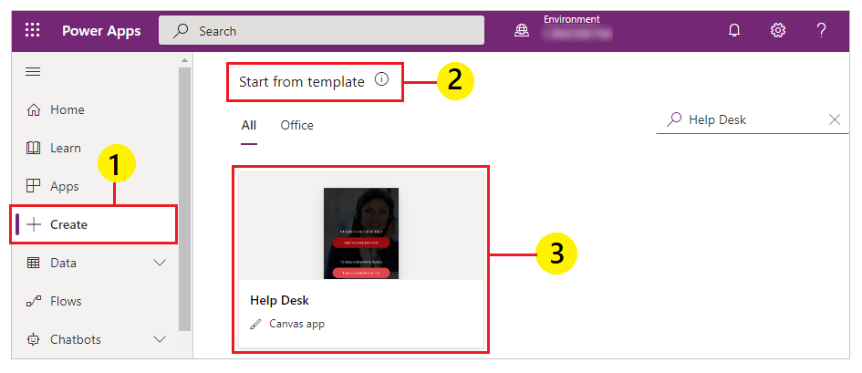

# Set up and learn about the Help Desk sample template in Power Apps

Help Desk provides a user-friendly experience to connect end users with support professionals. Quickly find answers to your most important questions, track progress of open tickets, and review details of previous requests. This app requires a small amount of setup to make it your own.

## Where can I run the app?

You can run this sample app in your browser, on a tablet, or other device that has a similar form factor.

## How do I open the template and run the app?

Help Desk sample template is available in [Power Apps](https://make.powerapps.com). Follow these steps to open the template and run the app.

1. Sign in to [Power Apps](https://make.powerapps.com).

1. On the left-pane, select **Create**.

1. On the right-side of the screen, scroll down to **Start from template** section.

1. Select **Help Desk** from the available templates.

    

1. Enter a name.

1. Select **Create**.

1. When prompted, select **Allow** to let the app use the connections.

1. Press **F5** on the keyboard, or use  to play the app.

> [!NOTE]
> Sample template includes locally saved information using [collections](create-update-collection.md). To use the app for business purpose, customize the app to store information using [connectors](/connectors/connector-reference/connector-reference-powerapps-connectors).

## How do I build the app myself?

Help Desk sample template includes the functionality commonly used in Power Apps. You can extend the app functionality by using connectors and connect the app to a data source instead of the default [collections](create-update-collection.md) used by the sample template.

[Save](save-publish-app.md#save-changes-to-an-app) the app, and update the app to use data source such as [SharePoint](connections/connection-sharepoint-online.md), or [Microsoft Dataverse](connections/connection-common-data-service.md).

You can also enable the capability to send emails or approval routing using [Power Automate flow](using-logic-flows.md) or [Approvals connector](/connectors/approvals).

## Next steps

[Share a canvas app](share-app.md)

### See also

[Formula reference](https://docs.microsoft.com/powerapps/maker/canvas-apps/formula-reference)  
[Controls reference](https://docs.microsoft.com/powerapps/maker/canvas-apps/reference-properties)

[!INCLUDE[footer-include](../../includes/footer-banner.md)]