# Example: How to create a Power App with the barcode scanner control
The barcode scanner control in Power Apps lets you use your phone or mobile device to scan barcodes of various formats, including UPC-style barcodes and QR codes. This can be very useful. Here are some common  scenarios:

-   Build an app to check in items like books into a collection

-   Create an inventory management app and use barcodes to quickly identify
    items

-   Make an employee check-in app and scan badges for security

In this topic we will create a simple canvas app with barcode scanner and display scanned items in a gallery.

## Prerequisites

-  Power Apps License ([About Microsoft 365](https://www.microsoft.com/licensing/product-licensing/microsoft-365-enterprise?activetab=m365enterprise%3aprimaryr5)

-  Before you create an app from scratch, familiarize yourself with Power Apps basics by generating an app and then customizing that app's gallery, forms, and cards.

-  To create an app, you must be assigned to the **Environment Maker** security role.

## Open a blank app 

1.  Sign in to [Power Apps](https://make.powerapps.com).

2.  Under **Make your own app**, select **Canvas app from blank**.

3.  Specify a name for your app, select **Phone**, and then select **Create**.

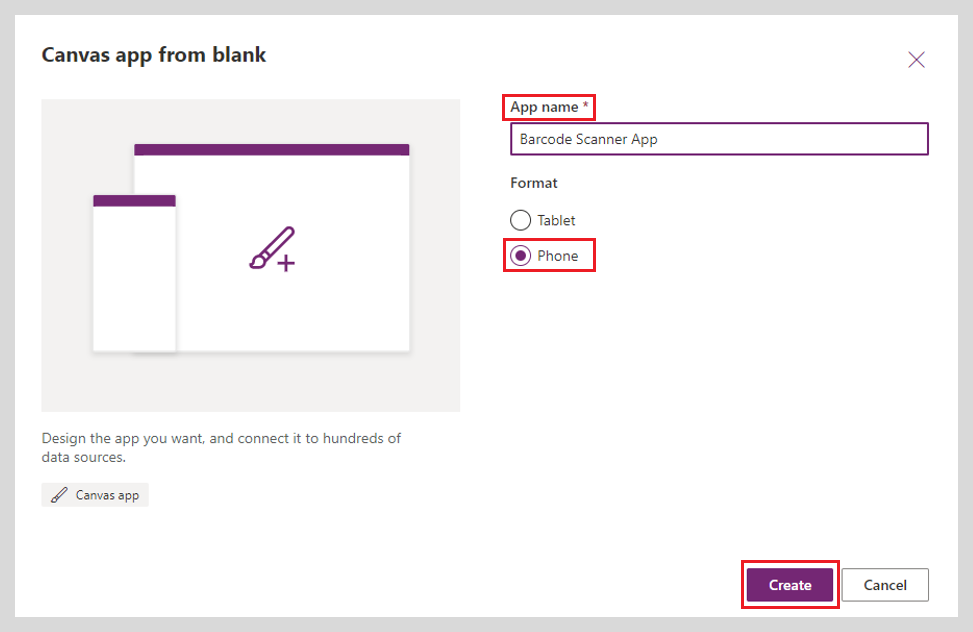

## Add barcode scanner

1.  In the left navigation bar, select **Screen1.**

2.  On the **Insert tab**, select the down-arrow next to **Media** to open a list of media types and media controls, and then select **Barcode scanner**.

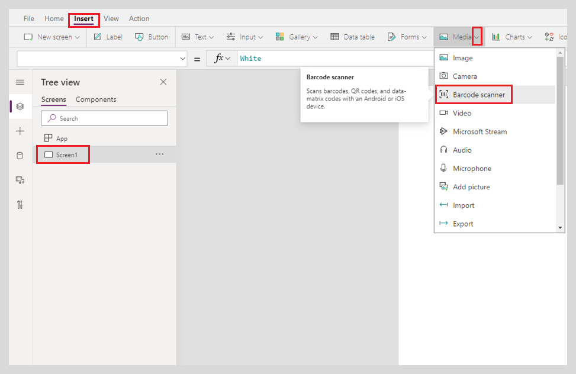

3.  On the **Advanced** tab of the right-hand pane, select **OnScan**.

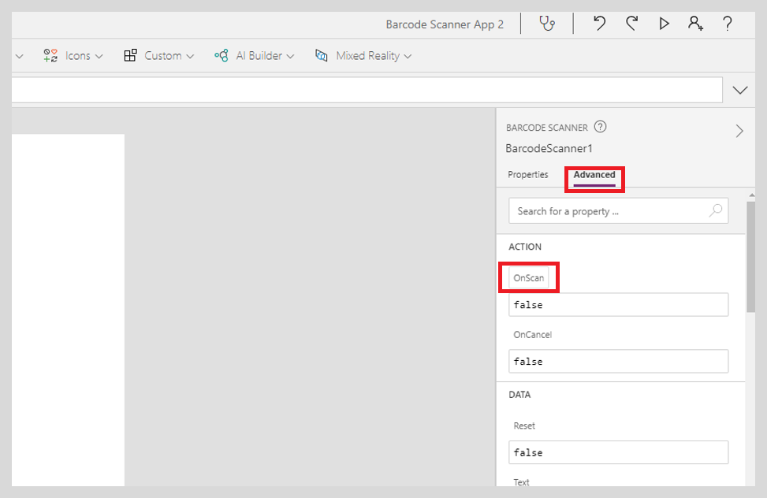

4.  Set the **OnScan** property of the Barcode scanner control to this expression by typing or pasting it in the formula bar: 

```
Collect(
    colScannedItems,
    {ScannedItem: BarcodeScanner1.Value, ScannedTime: Now()}
)
```

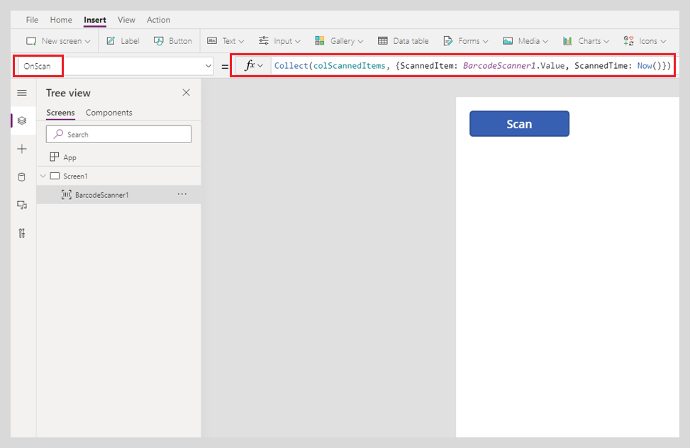

5.  On the **Properties** tab of the right-hand pane, set **X** property to 180 and the **Y** property to 1005.

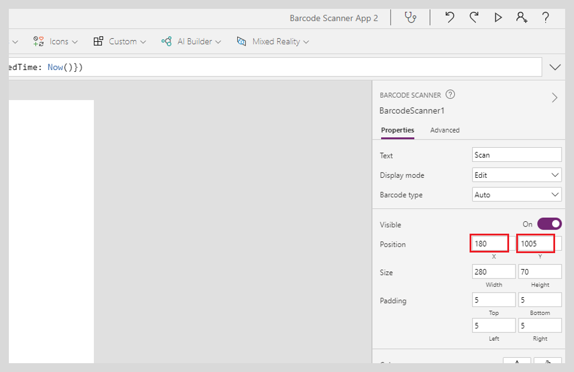

## Add gallery

1.  On the **Insert tab**, select the down-arrow next to **Gallery** to open a list of gallery types, and then select **Vertical**.


2.  On the **Properties** tab of the right-hand pane, select the down arrow for the **Layout** menu.

3.  Select **Title and subtitle**.

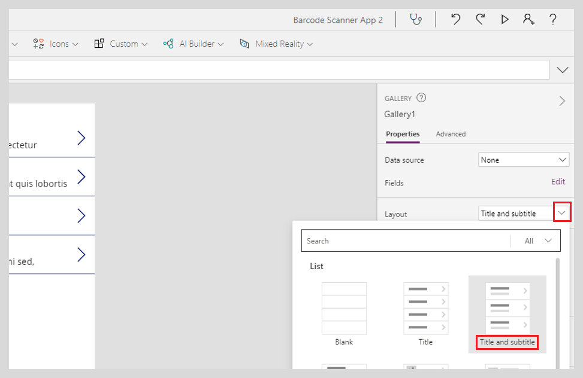

4.  On the **Properties** tab of the right-hand pane, select **Data source**.

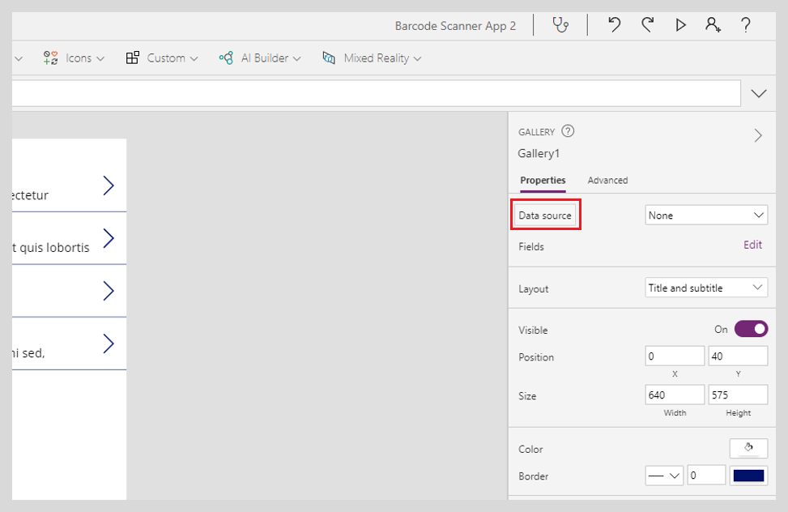

5.  Set the **Items** property of the Gallery control to this expression by typing or pasting it in the formula bar:

```
colScannedItems
```

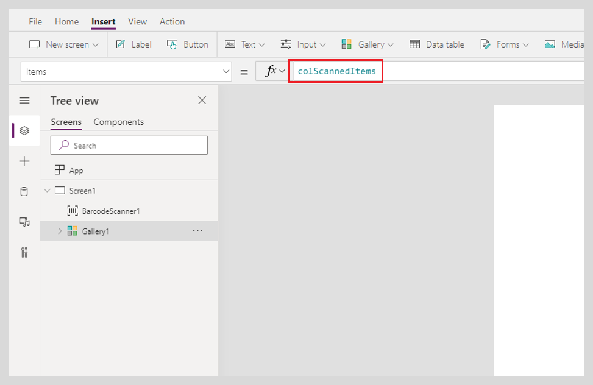

6.  In the left navigation bar, select **Title2**.

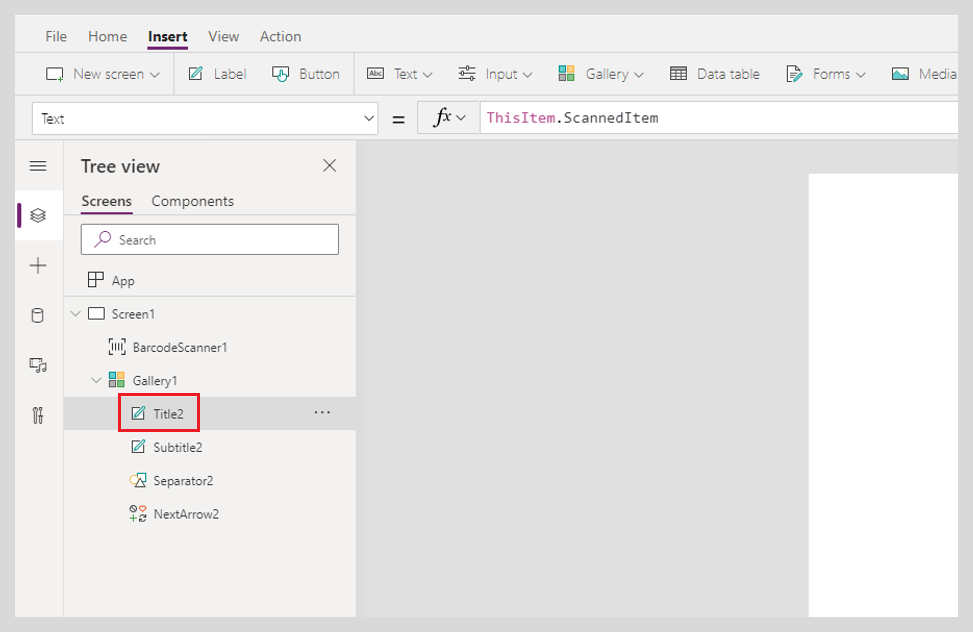

7.  On the **Properties** tab of the right-hand pane, select **Text**.


8.  Set the **Text** property of the Label control to this expression by typing or pasting it in the formula bar:

```
ThisItem.ScannedItem
```


9.  In the left navigation bar, select **Subtitle2**.


10. On the **Properties** tab of the right-hand pane, select **Text**.


11. Set the **Text** property of the Label control to this expression by typing or pasting it in the formula bar:

```
ThisItem.ScannedTime
```

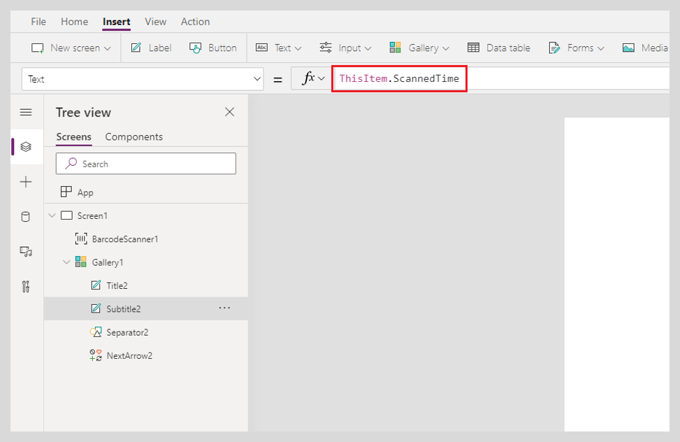

## Test the app

1.  In the left navigation bar, select **Screen1**, and then open Preview by pressing F5 (or by selecting the play icon near the upper-right corner).

2.  Exit Preview by pressing F5 (or by selecting the play icon near the upper-right corner).

3.  **Save** & **Publish** by pressing the keyboard shortcut: **Ctrl+Shift+P**.

4.  Select **Publish this version**.

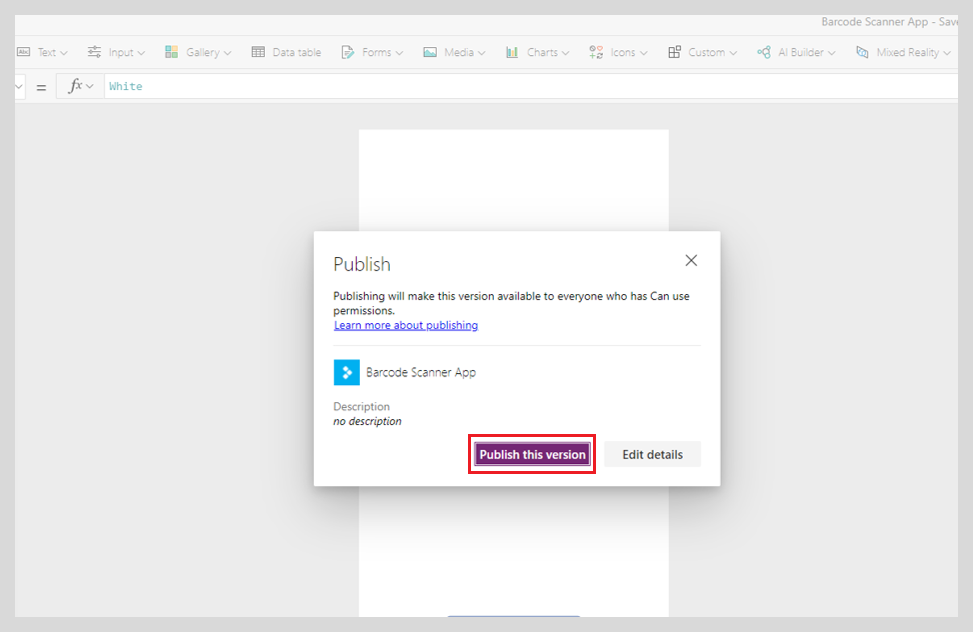

5.  Download the **Power Apps** app on your mobile device.

6.  Open the **Power Apps** app, Log in, and launch your Barcode Scanner application.


7.  Select **Scan** and scan any barcode label (example: book barcode label).

## Final Results

