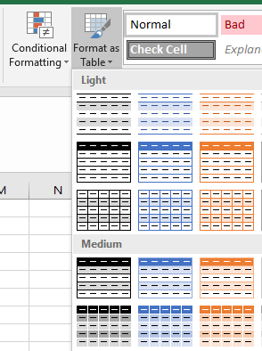
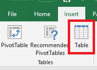

# Format a table in Excel and naming tips
In Power Apps, you can create a canvas app based on Excel data only if it's formatted as a table. By following this content, you'll learn how to format a table in Excel and some tips of naming Excel columns.

## How to format a table in Excel
You can convert your data to a table by selecting **Format as Table** in the **Home** tab of Excel.

You can also create a table by selecting **Table** on the **Insert** tab.

To find your table easily, go to **Design** under **Table Tools**, and rename your table. It's useful to give your table a meaningful name, especially when the same Excel file contains more than one table.

## Naming tips in Excel
If a column in your table contains images, include "image" in the name of that column. This keyword will bind that column to an image control in a gallery.

## Next steps
* [Generate an app from Excel in Power Apps](get-started-create-from-data.md) based on a table that you specify. The app will have three screens by default: one each for browsing records, displaying details about a single record, and creating or updating a record.
* [Create an app from scratch](get-started-create-from-blank.md) using the table you format in Excel. You can manually create and customize your app to display, browse, or edit the data in your table.

[!INCLUDE[footer-include](../../includes/footer-banner.md)]