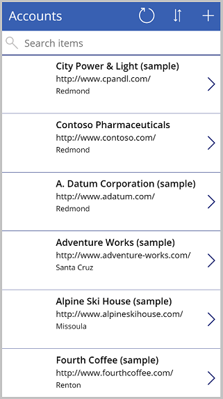

# How to build a canvas app connected to Microsoft Dataverse from scratch

Microsoft Dataverse is a premier data platform for Power Platform. Dataverse lets you securely store and manage data used by your apps within a set of tables.

In this article, we'll create an app connected to existing data in a Dataverse environment.

## Prerequisites

To complete this lesson, you'll need a Power Apps environment with a Dataverse database with at least one table containing data. If you don’t have a license, you can sign up for the [Power Apps Developer Plan](../../developer-plan.md), or use a [Power Apps trial](../../signup-for-powerapps.md).

## Create a trial environment

An environment in Power Apps is a space to store, manage, and share your organization’s business data, apps, chatbots, and flows. It also serves as a container to separate apps that might have different roles, security requirements, or target audiences. Each environment can have one Dataverse database.

To make sure that you have what you need to complete this lesson, we're going to create a new environment that includes a Dataverse database. This environment is a 30-day trial that will go away at the end of the 30 days, but you can upgrade it to a sandbox or production environment if you want to keep it.

We're going to create a trial environment that will include a Dataverse database, and the sample data used in this article.

1. Go to [Power Platform admin center](https://admin.powerplatform.microsoft.com/).

1. Select **Environments**.

1. Select **New**.

1. Name the environment **Dataverse Trial**.

1. Select **Trial** for environment type.

1. Toggle **Create Database** to **Yes**.

1. Select **Next**.

    

1. Toggle **Deploy Sample Apps and Data** to **Yes**.

1. Select **Save**.

Your trial environment will now be created, including a Dataverse database and sample data.

## Build a canvas app

In this lesson, we'll build an app to search, view, and create customer accounts using the **Accounts** table in Dataverse.

1. Sign in to [Power Apps](https://make.powerapps.com).

1. Select the **Dataverse Trial** environment.

    

1. Under **Start from data**, select **Dataverse**.

    

1. Under **Choose a table**, select the **Accounts** table.

    > [!NOTE]
    > If you don't already have a connection created to Dataverse, you'll see an option to create it first. Select **Create** in this case to create the connection before you choose the table.

1. Select **Connect**.

Power Apps will generate an app for you. This app includes the following screens:

- **Browse Screen** - a screen to search, sort, and select an account record, and launch the edit screen to create a new record.
- **Detail Screen** - a read-only screen that displays the details of the record selected on the browse screen.
- **Edit Screen** - an edit form that is used to edit the details of a selected record or create new records.

## Try the app

From Power Apps Studio, you can preview your app to try it out.

1. Select **Play** from the top-right corner of the screen.

1. From the **Account** list, select **Alpine Ski House**.

1. View the details of Alpine Ski House.

1. Select  to edit the record.

1. On edit form, remove **(sample)** from the account name field.

1. Select  to save the record changes.

1. Back on the account list screen, select **+** to launch a new record form.

1. Enter the desired fields, such as **Account name**.

1. Save the record.

1. Verify that the newly created record appears in the account list gallery.

1. To exit preview mode, select  in the upper-right corner of the screen.

## Using the Tree view

The **Tree View** is on the left-side of the screen (if you don’t see it, select ). The tree view gives you easy access to the components in your canvas app, such as screens, galleries, text input controls, and text labels.

The tree view can be collapsed or expanded by screen to make it easy to focus on the part of the app on which you're working.

Currently, the **BrowseScreen1** is expanded. To see the components for other screens, select **>** next to the name of the screen.


## Modify the gallery of accounts

A gallery in Power Apps is used to show several related items. For example, in our app, **BrowseGallery1** displays all of our account records. When one of the items is selected, a border is placed around the item to indicate that it has been selected.

By default, this gallery includes the following three fields: Account name, phone number, and city.

However, we can change the fields included in the gallery.

1. From the tree view, select **BrowseGallery1**.

1. In the property pane on the right-side of the screen, select **Edit**.

    

1. The field data panel will appear. Change Subtitle to Website.

1. Select outside of the field data panel.

1. App will now display the website fields value instead of the phone number.

    

### Update search to include the account name

When you previewed the app, you may have noticed that searching by account name didn’t work. That is because the autogenerated app search formula doesn't include the **Account name** field. In this lesson, we'll update to search formula to include the Account name field.

> [!TIP]
> The account name is stored in a column called **Name**.

1. In the tree view, select **BrowseGallery1**.

1. Verify the **Items** property is selected in the property selector.

1. In the formula bar, update the formula as follows:

   ```powerapps-dot
   SortByColumns(Search([@Accounts], TextSearchBox1.Text, "name","address1_city","address1_composite"), "name", If(SortDescending1, Descending, Ascending))
   ```

    The formula consists of [SortByColumns](../functions/function-sort.md), [Search](../functions/function-filter-lookup.md), and [If](../functions/function-if.md) functions to search the **Accounts** table with the text entered in the search box that has the matching data in the name, address1_city, and address1_composite fields, and allow sorting.

The account list can now be searched and sorted by the Account name field.

## Add fields to the account detail screen

**Datascreen1** includes a display form that displays the data of the record selected on the browse screen. Display form controls are read-only, intended to allow users to read data but not create or edit data.

1. In the tree view, expand **DetailScreen1**.

1. Select **DetailForm1**.

1. In the right-side properties pane, select **Edit Fields**.

1. Select **Add field**.

1. Select the following fields:

    - Address 1: Country
    - Address 1: State/Province
    - Address 1: Street 1
    - Address 1: ZIP/Postal Code

1. Select **Add**.

    

1. You'll now see the selected fields in the Field panel. Rearrange the fields by dragging and dropping them or by selecting **...** (ellipsis) to the right of the field name, and selecting **Move up** or **Move down.**

1. Arrange the field in the following order:

    - Account Name
    - Main Phone
    - Address 1: Street 1
    - Address 1: City
    - Address 1: State/Province
    - Address 1: Zip/Postal Code
    - Address 1: Country/Region

    

1. Select anywhere outside of the field pane to close the pane, and return to **DetailScreen1**.

You'll now see the selected fields displayed in the correct order.

## Modify account edit screen

**EditScreen1** allows users to edit or create account records. This screen includes an Edit Form control called **EditForm1**.

> [!NOTE]
> Since the edit form is one of the primary methods for creating or updating records, it should include every field that you want your users to be able to submit, and shouldn't include any fields that are read-only or the ones you don't want your users to modify.

In this lesson, we'll add the same fields that we added earlier to the display form, plus the ability to attach files.

1. In the tree view, expand **EditScreen1**.

1. Select **EditForm1**.

1. In the right-side properties panel, select **Edit Fields**.

1. Select **Add field**.

1. Select the following fields:

    - Address 1: Country
    - Address 1: State/Province
    - Address 1: Street 1
    - Address 1: ZIP/Postal Code

1. You'll now see the selected fields in the field pane. Rearrange the fields by dragging and dropping them or by selecting **...** (ellipsis) to the right of the field name, and selecting **Move up** or **Move down.**

1. Arrange the field in the following order:

    - Account Name
    - Main Phone
    - Address 1: Street 1
    - Address 1: City
    - Address 1: State/Province
    - Address 1: Zip/Postal Code
    - Address 1: Country/Region

1. Select anywhere outside of the field pane to close the field pane.

1. To minimize unnecessary scrolling in the app, we want the **Edit Form** to arrange the fields into two columns. In the properties pane on the right, select 2 in the **Columns** drop down.

1. To make the form easier to read, we want to remove **Address 1:** part of the address field labels.

    - In tree view, expand **EditForm1**.
    - Select **Address 1: City_DataCard2** control.
    - In the properties pane on right, select **Advanced**.
    - Select **Unlock to change properties**.
    - Change **DisplayName** property to **City**.
    - Follow the above steps to remove **Address 1:** from the Street 1, Country/Region, State/Province, and Zip/Postal Code fields.

**EditScreen1** should now look like the following:


## Save the app

By saving the app, your app will become available to use and share with others.

1. In Power Apps Studio, select **File**.
1. In the **Name** field, enter **Account Manager**.
1. Select an icon and background color from the **Icon** area. This will be used to identify your app in the app list.
1. Select **Save**.
1. Select **Save** in the lower right corner.
1. Once app is saved, select the back arrow to return to the Power Apps Studio.

    

## Run the app

1. Sign in to [Power Apps](https://make.powerapps.com).

1. Verify that you're in the environment you used to create the app by looking in the upper-right corner of the screen. If different, select **Environment** and select the appropriate environment.

1. Select **Apps**.

1. From the app list, select **Account Manager**.

1. When the app loads, verify the changes made.

   - Search app list for **Blue Yonder Airlines**.
   - Select the **Blue Yonder** record and verify you see the fields added to the **Display form**.
   - Select  to edit the record.
   - Verify form displays two columns of fields.
   - Verify that the field names don't display **Address 1:** in the labels.
   - Select **Attach file** in the Attachment area, select a file, and select **Open**.
   - Verify uploaded file appears in the attachment list.
   - Select  to save the record.

## Run your app on mobile

To test your Power Apps on your mobile device:

1. [Download](https://powerapps.microsoft.com/downloads) the app from your mobile app store.
1. Sign in using your work or school account.
1. Select your app from the list.

### See also

- [Create a canvas app from a template](../get-started-test-drive.md)
- [Add and configure controls in canvas apps](../add-configure-controls.md)
- [Get started with formulas in canvas apps](../working-with-formulas.md)
