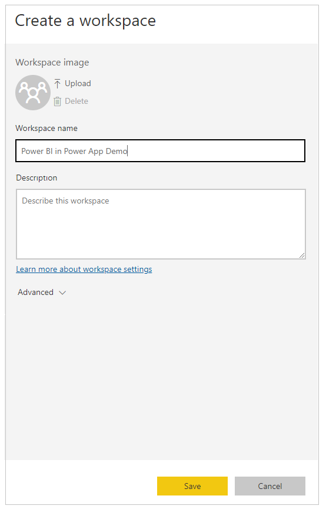
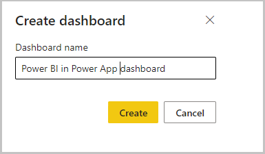

# How to build a canvas app with Power BI visual

Microsoft Power BI is a powerful analysis and visualization tool. Power Apps is great at enabling people to take action on the web and mobile. Canvas apps created using Power Apps can be embedded in a Power BI report. Similarly, a Power BI report tile can be added to a canvas app. The best of both worlds can be achieved at the same place and same time.

In this example, we'll create a quick Power BI report and a canvas app, and then see how we can add the report as a tile in the app.

## Prerequisites

To complete this lesson, we'd need the ability to create Power BI dashboards and reports.

## Sign in to Power BI

Sign in to Power BI with the same Office license as the one used for creating the Power Apps.

## Create a new workspace

1. Select **Workspaces** from the left-pane.

    

1. Select **Create a workspace**.

    

1. Enter a name for the workspace, and then select **Save**.

    

    The workspace gets created

    

1. Select **+ New**, and add a dashboard.

    

1. Add a name for the dashboard, then select **Create**.

    

    The Power BI dashboard gets created within the workspace we created

    

1. Open the workspace, select **+ New**, and then select **Dataset** to create a new dataset.

    

1. Select **Samples** under "More ways to create your own content to use sample data”.

    

1. Select **Sales and Marketing sample**. You can also select another sample of your choice.

    

1. Select **Connect** to connect to the sample data.

    

    A dataset with the Sales and Marketing sample and a report gets added to the Workspace.

    

1. From the left-pane, select the report that was created from the dataset, select **...** (ellipsis), and select then select **Pin to a dashboard**.

    

1. Select **Existing dashboard**, select the dashboard, and then select **Pin live**.

    

The report gets added to the dashboard, and is ready for use in Power Apps.

## Create a new canvas app

1. Sign in to [Power Apps](https://make.powerapps.com), and then select **Create**.

    

1. Enter a name, and select **Create**.

    

    App gets created.

    

1. Select **Insert** > **Charts** > **Power BI tile**.

    

    The Power BI Tile gets added to the screen.

    

1. Select the Workspace, dashboard and tile created earlier to add the Power BI tile to the canvas app.

    

1. [Save and publish](../save-publish-app.md) the app.

You've created a canvas app with Power BI tile.

### See also

- [Connect to Power BI from Power Apps](../connections/connection-powerbi.md)
- [Power Apps visual for Power BI](../powerapps-custom-visual.md)
- [Power BI tile control in Power Apps](../controls/control-power-bi-tile.md)
- [Tutorial: Embed a Power Apps visual in a Power BI report](/power-bi/visuals/power-bi-visualization-powerapp)
