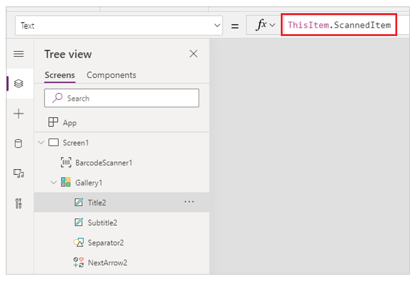
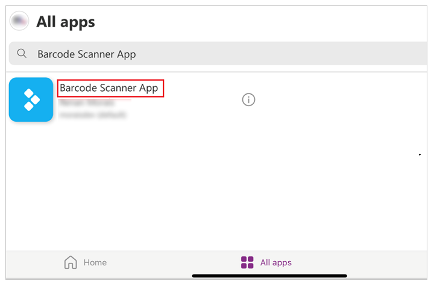

# Create a canvas app with the barcode reader control

The barcode reader control in Power Apps lets you use your phone or mobile device to scan barcodes from [various formats](../controls/control-barcodereader.md#barcode-availability-by-device).

Some of the common uses of barcode reader control in a canvas app are:

- An app to check in items like books into a collection
- An inventory management app that uses barcode to identify items
- An employee app to check in and badge scanning for security

In this article, we'll create a canvas app with barcode reader and display scanned items in a gallery.

Watch this video to learn how to create an app with barcode reader:
> [!VIDEO https://learn-video.azurefd.net/vod/player?id=8714cb52-ce37-452c-bc47-1af24b1f6b93]

## Prerequisites

- [Power Apps license](/power-platform/admin/pricing-billing-skus)
- Before you create an app from scratch, familiarize yourself with Power Apps basics by [generating an app](../get-started-test-drive.md) and then customizing that app's [controls](../add-configure-controls.md), [gallery](../add-gallery.md), [forms](../working-with-forms.md), and [cards](../working-with-cards.md).
- To create an app, you must be assigned to the [Environment Maker](/power-platform/admin/database-security) security role.

## Open a blank app

Create a [blank canvas app](../create-blank-app.md).

## Add barcode scanner

1. From the left-pane, select **Screen1**.

1. From the left-pane, select **+ Insert** > expand **Media** > select **Barcode reader** control.

    

1. From the properties list on the right-side of the screen, select **Advanced** tab, and then select the **OnScan** property.

    

1. Set the **OnScan** property of the Barcode scanner control to this expression by typing or pasting it in the formula bar.

    ```power-fx
    Collect(
        colScannedItems,
        {ScannedItem: First(BarcodeScanner1.Barcodes).Value, ScannedTime: Now()}
    )
    ```

1. From the **Properties** pane, set **X** property to "180" and the **Y** property to "1005".

    

## Add gallery

1. Select **+ Insert** > expand **Layout** > select **Vertical gallery** control.

    

1. From the properties pane, select the layout for the gallery as **Title and subtitle**.

    

1. Select the gallery control on canvas.

1. Set the **Items** property of the gallery control to this expression by typing or pasting it in the formula bar.

    ```power-fx
    colScannedItems
    ```

    

1. In the left-pane, expand the **Gallery1**, and select **Title2**.

    

1. Set the **Text** property of **Title2** to the following expression.

    ```power-fx
    ThisItem.ScannedItem
    ```

    

1. Select **Subtitle2** label, and set it's **Text** property to this expression.

    ```power-fx
    ThisItem.ScannedTime
    ```

    

## Try the app

1. To test the app, select **Screen1**, and then press **F5** on the keyboard.

1. After testing, [save and publish](../save-publish-app.md) the app.

1. Download [Power Apps Mobile](https://powerapps.microsoft.com/downloads/) on your phone.

1. Open the **Power Apps** app, and sign in.

1. Select and open the barcode reader app.

    

1. Select **Scan**, and scan any barcode label (for example, barcode label on a book).

## Final Results

You'll see the scanned barcode information is saved inside the app.


### See also

[Barcode scanner control in Power Apps](../controls/control-new-barcode-scanner.md)
