# Create an app with address input and map controls

There are many scenarios where users are expected to enter addresses in an app. Historically, there have been multiple fields capturing each element of an address where the user types in the street address, city and the postal code and can select state. Entering addresses can be frustrating and error-prone, particularly in mobile scenarios.

The address input control presents the user with dynamic address suggestions as they type. Using fuzzy matching logic, the control suggests multiple potential address matches from which the user can select—making it quicker and easier to enter accurate addresses.

The control returns the address as structured data, allowing the application to extract information like city, street, municipality, and even latitude and longitude. The data is in a format friendly to many locales and international address formats.

To use the control, you need to enable the [Geospatial Services](/../geospatial-overview.md#enable-the-geospatial-features-for-the-environment) for the environment.

- Watch this video to learn how to use the address input control:
    > [!VIDEO https://www.microsoft.com/videoplayer/embed/RWLPQg]


- Watch this video to learn how to use the map control:
    > [!VIDEO https://www.microsoft.com/videoplayer/embed/RWLAkd]

In this topic we will learn how to use the address input control in our canvas app.

## Prerequisites

To complete this lesson, you'll need a Power Apps environment with a Dataverse database. If you don't have a license, you can sign up for the [Power Apps Developer Plan](https://powerapps.microsoft.com/communityplan/) or use a Power Apps trial.

## Create a trial environment

An environment in Power Apps is a space to store, manage, and share your organization’s business data, apps, chatbots, and flows. It also serves as a container to separate apps that might have different roles, security requirements, or target audiences.

Each environment can have one Dataverse database.

To make sure that you have what you need to complete this lesson, we're going to create a new environment that includes a Dataverse database. This is a 30-day trial that will go away at the end of the 30 days, but you can upgrade it to a sandbox or production environment if you want to keep it.

We're going to create a trial environment that will include a Dataverse database, and the sample data used in this topic.

1. Go to [Power Platform admin center](https://admin.powerplatform.microsoft.com/) in a web browser.

1. Select **Environments**.

1. Select **New**.

1. Enter a name, for example "Dataverse Trial".

1. Select **Trial** for the environment type.

1. Toggle **Create Database** to **Yes**.

1. Select **Next**.

    :::image type="content" source="media/mobile-apps-address-map/create-a-trial-environment-1.png" alt-text="Create a trial environment.":::

1. Toggle **Deploy Sample Apps and Data** to **Yes**.

1. Select **Save**.

Your trial environment will now be created, including a Dataverse database and sample data in Dataverse tables.

## Enable the Geospatial Services for the environment

Before we can use the Geospatial Services in our apps, an admin must enable access to the features for the environment where we want to create our app.

Geospatial Services require additional terms of use that must be reviewed and agreed to.

To learn about how to enable **Geospatial services** in your environment, see [Enable the geospatial features for the environment](../geospatial-overview.md#enable-the-geospatial-features-for-the-environment).

## Build a canvas app

In this lesson, we'll start with creating an app and then, we'll create a header control to use within the app to standardize the look and feel of the header on different screens.

1. Sign in to [Power Apps](https://make.powerapps.com).

1. Select the environment you created [earlier](#create-a-trial-environment) from the upper right corner of the screen.

1. Under **Build business apps – Make your own app, fast** select **Canvas app from blank**.

    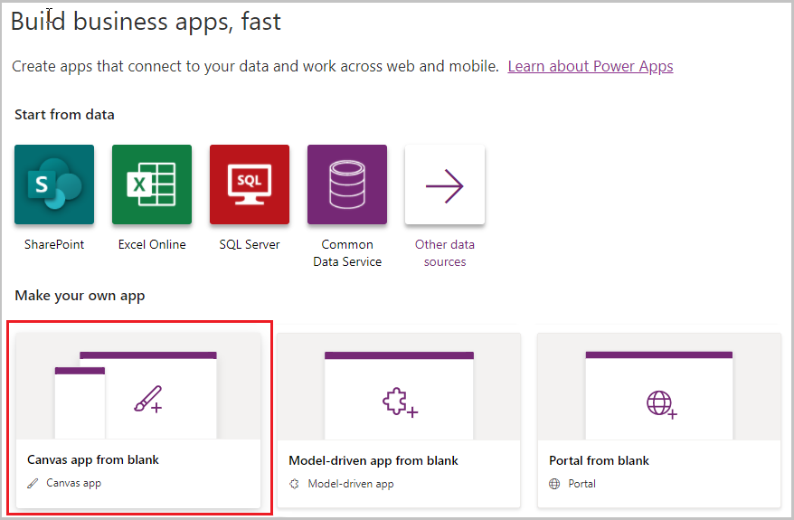

1. Enter a name, select the format, and then select **Create**.

    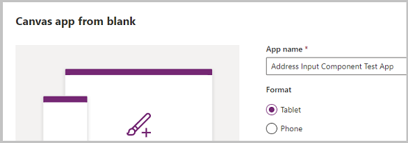

    The new app opens in Power Apps Studio to edit.

    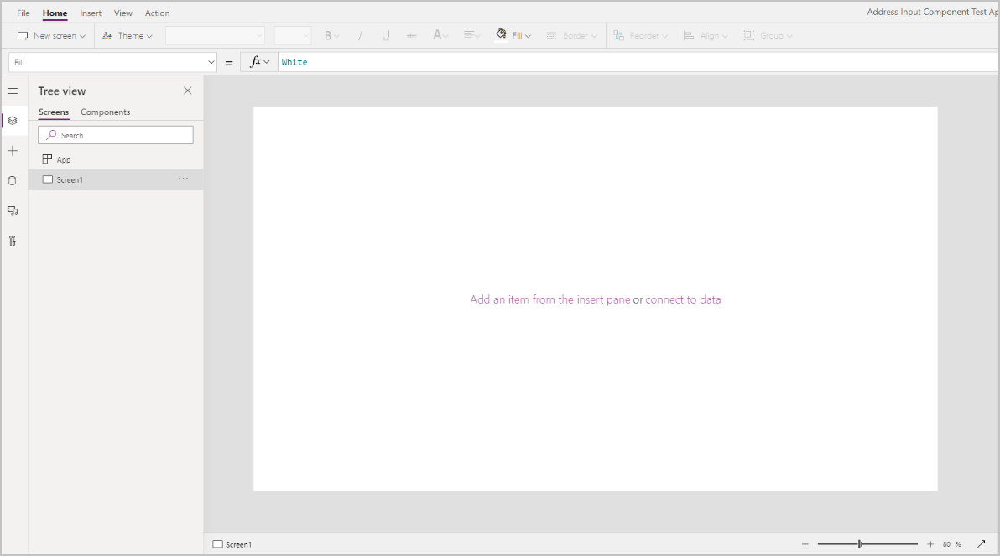

1. Select **Insert** > **New Screen** > **Scrollable** to add a new screen.

    :::image type="content" source="media/mobile-apps-address-map/build-a-canvas-app-5.png" alt-text="Select scrollable.":::

1. Change the label text to "New Account".

    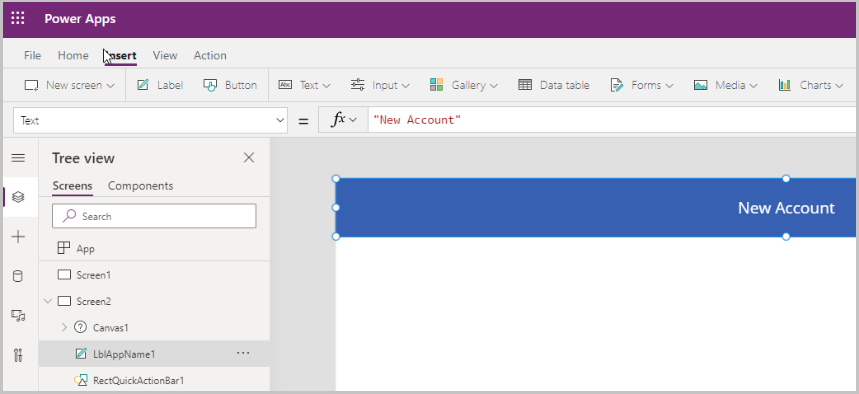

1. Select **Insert** > **Forms** > **Edit** to add a form to the screen.

    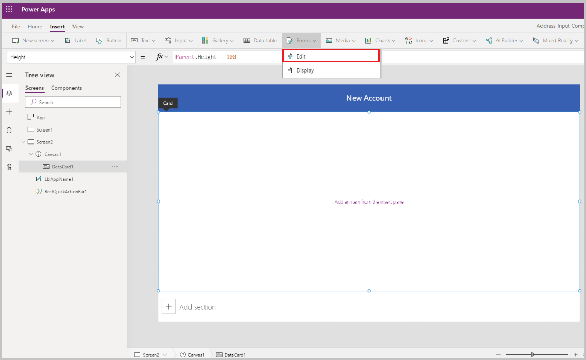

    The form control gets added

    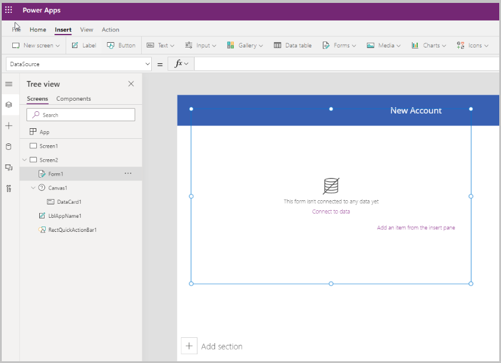

1. Update the following properties of the form:


    | Property    | Value        |
    |-------------|--------------|
    | Datasource  | Accounts     |
    | Columns     | 2            |
    | DefaultMode | FormMode.New |
    
1. Select **Edit** next to fields to add more fields to the form, and select the following address fields:

    - Address 1: Street 1
    - Address 1: City
    - Address 1: State
    - Address 1: Zip/Postal Code
    - Address 1: Country/Region
    - Address 1: Latitude
    - Address 1: Longitude

    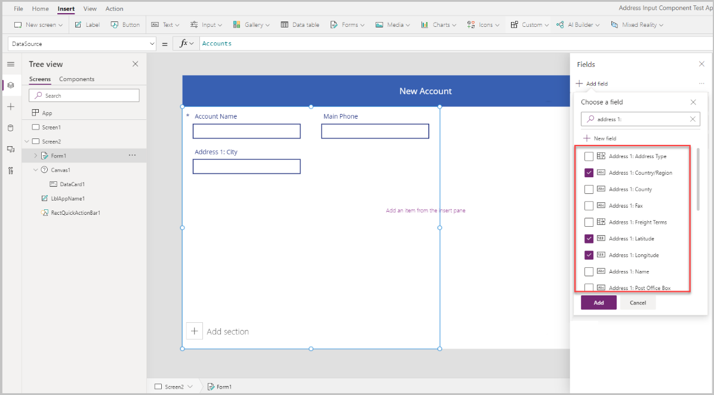

1. Adjust the order of the fields as shown below.


## Address Input control

In this section, we will add the Address control to the app

1.  Select Insert -\> Input -\> Address Input to add an Address Input control
    to the screen

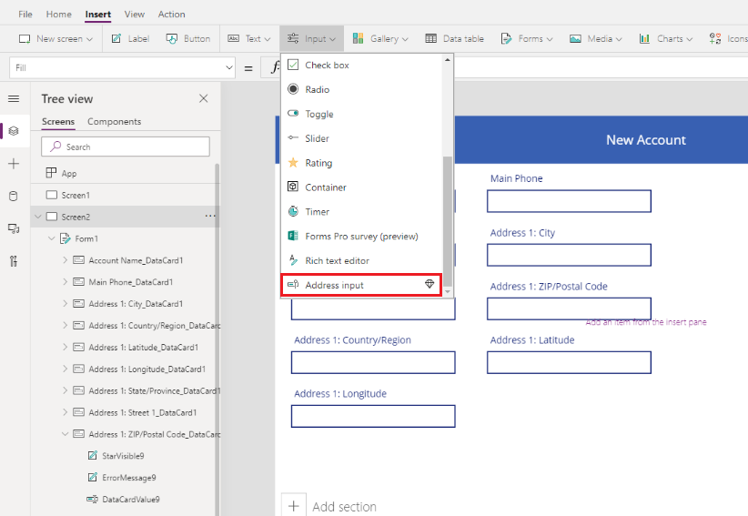

2.  The Address Input box gets added – place it on the top right side of the
    screen as shown below

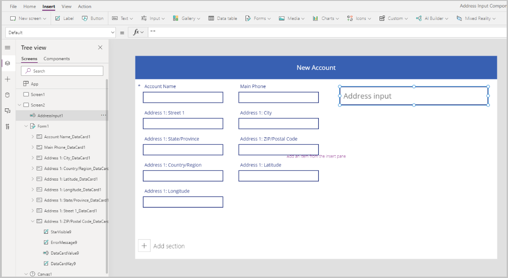

### Features

In this section we will go over various properties of the address control and
set them – there are a few Address Input specific properties as highlighted
below

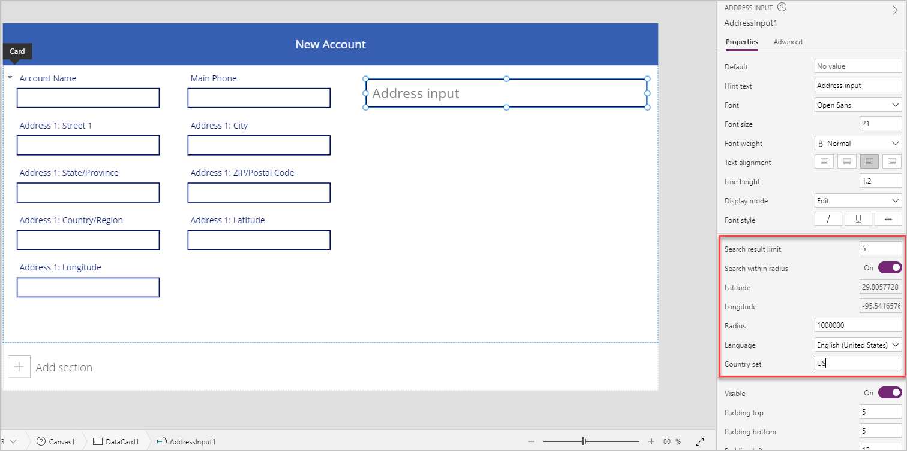

| **Property**         | **Description**                                                                                                                                                                                                                |
|----------------------|--------------------------------------------------------------------------------------------------------------------------------------------------------------------------------------------------------------------------------|
| Search result limit  | The number of suggested addresses the control displays – we set it to 5 in our example, so not more than 5 addresses will show up in our search                                                                              |
| Search within radius | Whether the control should suggest addresses within the user-defined **Radius** of the **Latitude** and **Longitude –** we set it to Yes in our example                                                                      |
| Latitude             | The latitude of the center point used to geo-bias address suggestions. Requires **Search within radius** to be on – we set it to the formula Location.Latitude in our example to return the latitude of the current location   |
| Longitude            | The longitude of the center point used to geo-bias address suggestions. Requires **Search within radius** to be on – we set it to the formula Location.Longitude in our example to return the latitude of the current location |
| Radius               | The radius, in meters, around **Latitude** and **Longitude** to constrain the address suggestions. Requires **Search within radius** to be on – we set that to 100000 in our example                                           |
| Language             | The language the address suggestions are returned in – we left it as the defaulted English (United States) option                                                                                                              |
| Country set          | Comma-separated list of countries to constrain the address suggestions to, in ISO 3166 alpha-2 country codes. For example, **US, FR, KW – we set it as US in our example**                                                     |

### Output properties

The control outputs various properties when a user interacts with it inside an app. You can use these outputs in other controls or to customize the experience.

The following table lists the output properties available.

| **Property**                | **Description**                                                                                                                                                                         |
|-----------------------------|-----------------------------------------------------------------------------------------------------------------------------------------------------------------------------------------|
| UserInput                   | Text the user has typed in the input box.                                                                                                                                               |
| SelectedLatitude            | Latitude of the user-selected address in the input field.                                                                                                                               |
| SelectedLongitude           | Longitude of the user-selected address in the input field.                                                                                                                              |
| SearchResultJson            | The search result (based on the UserInput property), displayed as a string in JSON format.                                                                                              |
| FreeformAddress             | Selected address from the list of suggested addresses.                                                                                                                                  |
| LocalName                   | An address control which represents the name of a geographic area or locality that groups multiple addressable objects for addressing purposes, without being an administrative unit. |
| PostalCode                  | Postal code.                                                                                                                                                                            |
| ExtendedPostalCode          | Extended Postal Code.                                                                                                                                                                   |
| CountryCode                 | Country code.                                                                                                                                                                           |
| Country                     | Country.                                                                                                                                                                                |
| CountryCodeISO3             | Country code in ISO alpha-3 format.                                                                                                                                                     |
| CountrySubdivisionName      | Country subdivision name.                                                                                                                                                               |
| StreetName                  | Street name.                                                                                                                                                                            |
| StreetNumber                | Street number.                                                                                                                                                                          |
| Municipality                | Municipality.                                                                                                                                                                           |
| MunicipalitySubdivision     | Municipality subdivision.                                                                                                                                                               |
| CountryTertiarySubdivision  | Country tertiary subdivision.                                                                                                                                                           |
| CountrySecondarySubdivision | Country secondary subdivision.                                                                                                                                                          |
| CountrySubdivision          | Country subdivision.                                                                                                                                                                    |

Now, when we run the app and start typing an address, it will show addresses that match the entered value and are located only within 100000 meters of the current location. Also, notice that it does not show more than 5 address suggestions at a time when you start typing in the address.

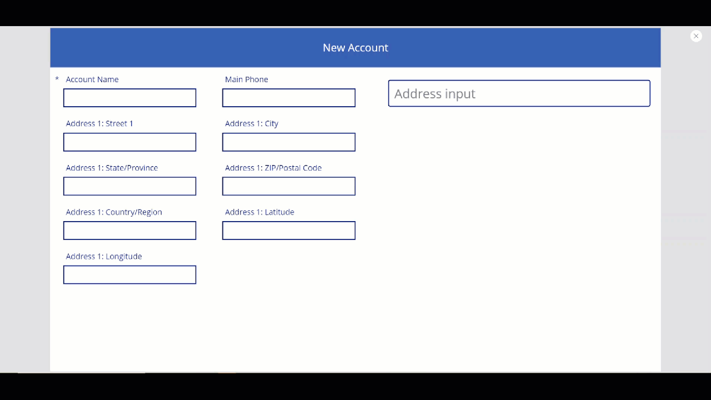

Using the above control, we will capture the address in the address fields of our form to create a new account – this is useful so that the user does not have to type in each of the address elements individually.

We will set the Datacard values to the appropriate property value from the address input.

NOTE: The default values of the datacards could be locked. To unlock them, select the data card and go to the Advanced properties and select **Unlock to change properties**

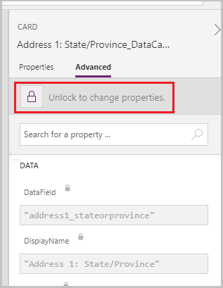

1.  Set the Address 1: Street 1 Datacard Default to AddressInput1.StreetNumber &
    " " & AddressInput1.StreetName

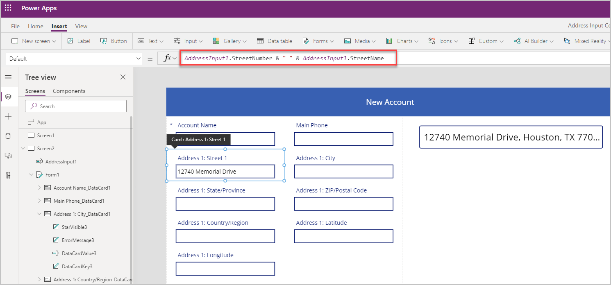

2.  Set the Address 1: City Datacard Default to AddressInput1.Municipality

3.  Set the Address 1: State/Province address property Default to
    AddressInput1.CountrySubdivision

4.  Set the Address 1: Zip/Postal Code Datacard Default to
    AddressInput1.PostalCode

5.  Set the Address 1: Country/Region Datacard Default to AddressInput1.Country

6.  Set the Address 1: Latitude Datacard Default to
    AddressInput1.SelectedLatitude

7.  Set the Address 1: Longitude Datacard Default to
    AddressInput1.SelectedLongitude

8.  Thus, the form gets populated with all the address fields when an address is
    selected in the Address Input control

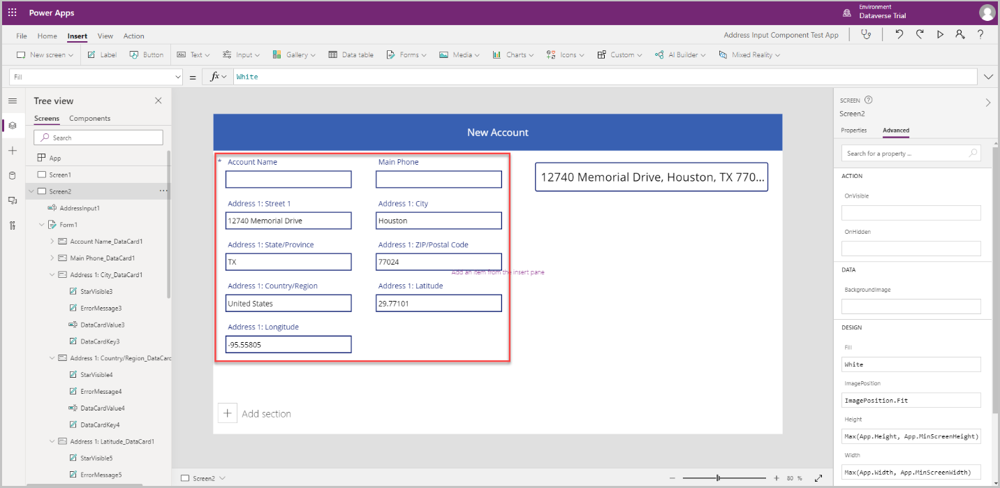

## Map control

In this section we will see how we can add the Map control to our app to show the selected location on the map

1.  Before adding the Map control, we need to create a collection to capture the address from the Address Input – this collection will be used as the data source for the Map
    
2.  On the OnAddressSelect property of the Address Input, enter the following formula to create a collection that captures the address data

```   
ClearCollect(
    colSelectedAddress,
    {
        Street: AddressInput1.StreetNumber & " " & AddressInput1.StreetName,
        City: AddressInput1.Municipality,
        State: AddressInput1.CountrySubdivision,
        Zip: AddressInput1.PostalCode,
        Country: AddressInput1.Country,
        Latitude: AddressInput1.SelectedLatitude,
        Longitude: AddressInput1.SelectedLongitude
    }
)
```

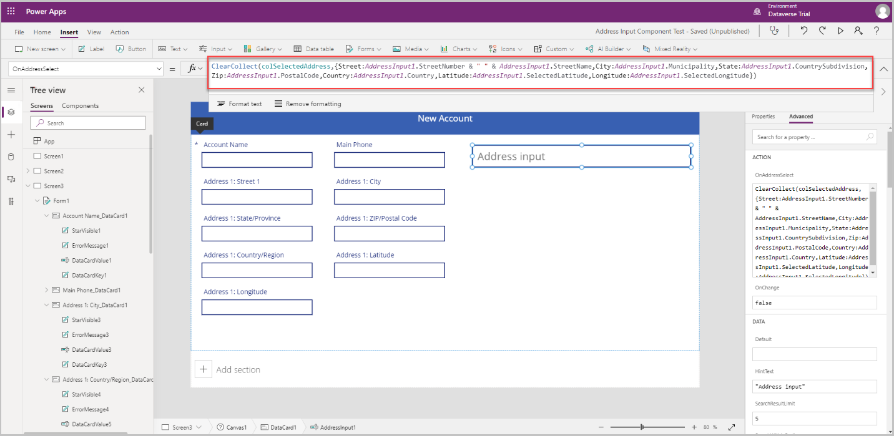

3.  Now, click outside of the address input and select **Insert** -\> **Media** -\> **Map** to add the map control to the screen

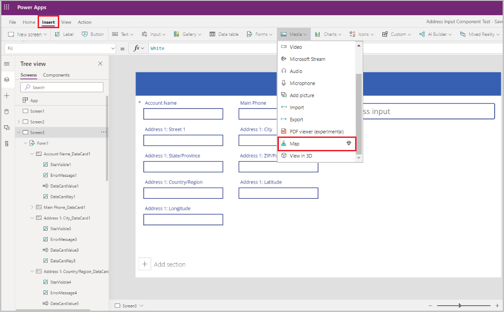

4.  Select the collection as the data source

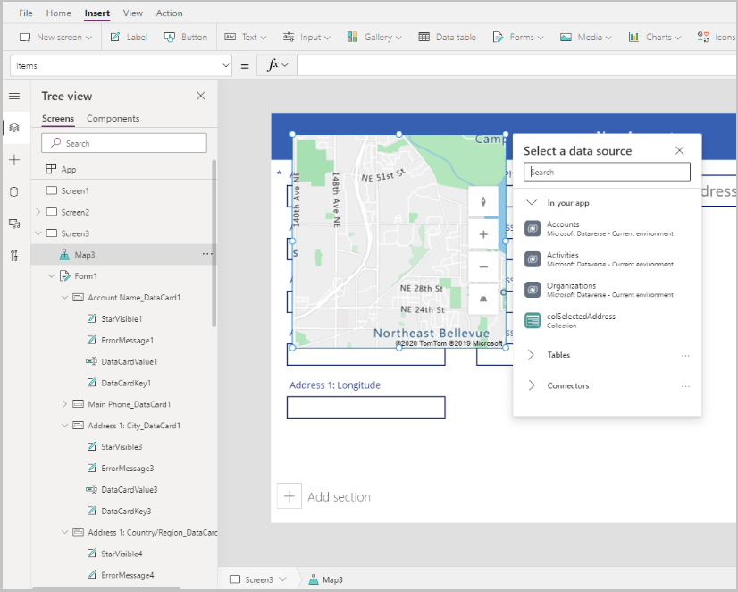

5.  Place the Map below the Address input as shown below

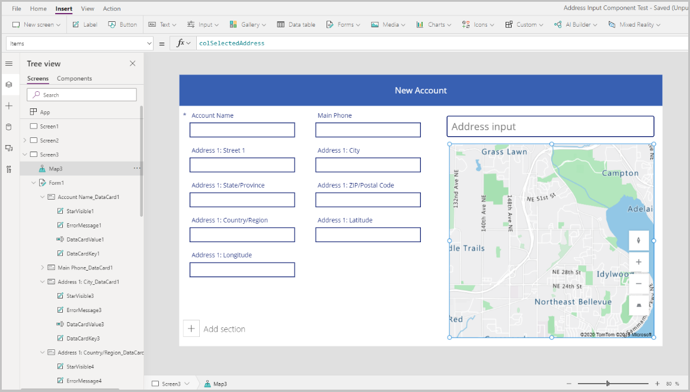

### Features

In this section we will go over the various properties of the map control and set them

Below is a list of all the input and output properties available for the Map control:

| **Property**                            | **Description**                                                                                                                                                                                                                                       |
|-----------------------------------------|-------------------------------------------------------------------------------------------------------------------------------------------------------------------------------------------------------------------------------------------------------|
| Data source(Items)                      | Data source (table) that lists a predefined set of longitudes and latitudes to display as map pin on the map when it's loaded. Map each of the columns in your data by using the *ItemAddresses*, *ItemLongitudes*, *ItemLatitudes*, and *ItemLabels* |
| Use default location                    | Whether the map initializes at a default location set by the user.                                                                                                                                                                                    |
| Default longitude                       | Longitude the map would go to when it's loaded if Use default location is enabled.                                                                                                                                                                    |
| Default latitude                        | Latitude the map would go to when it's loaded if Use default location is enabled.                                                                                                                                                                     |
| Default zoom level                      | Zoom level the map would be set to when it's loaded if Use default location is enabled.                                                                                                                                                               |
| Show current location                   | Whether the map should display the current location of the user.                                                                                                                                                                                      |
| Current location latitude               | The latitude of the current location of the user if Show Current Location is enabled.                                                                                                                                                                 |
| Current location longitude              | The longitude of the current location of the user if Show Current Location is enabled.                                                                                                                                                                |
| Satellite view                          | Whether the style of the map is a satellite view or a road view.                                                                                                                                                                                      |
| Cluster pins                            | Whether the map pins are clustered.                                                                                                                                                                                                                   |
| Zoom control                            | Whether the zoom control appears on the map.                                                                                                                                                                                                        |
| Compass control                         | Whether the compass control appears on the map.                                                                                                                                                                                                     |
| Pitch control                           | Whether the pitch control appears on the map.                                                                                                                                                                                                       |
| Pin color                               | The color of the pins.                                                                                                                                                                                                                                |
| ItemsLabels                             | A column in Items with the strings you want to use as labels for the pins.                                                                                                                                                                            |
| ItemsAddresses                          | A column in Items with the strings that represent the location of the pins.                                                                                                                                                                           |
| ItemsLongitudes                         | Name of the column in the table in your data source with floating-point numbers that represent the longitude position of the pins.                                                                                                                    |
| ItemsLatitudes                          | Name of the column in the table in your data source with floating-point numbers that represent the latitude position of the pins.                                                                                                                     |
| ItemsColors                             | Color of the pins                                                                                                                                                                                                                                     |
| ItemsIcons                              | Icon of the pins                                                                                                                                                                                                                                      |
| Items                                   | Name of the table in your data source that contains all the records that you want to plot in the map by using pins. Each row must have an entry for the label, longitude, and latitude for each row.                                                  |
| OnMapClick                              | How the map responds when any location is clicked.                                                                                                                                                                                                    |
| OnSelect                                | How the app responds when a map pin is selected.                                                                                                                                                                                                      |
| OnLoad                                  | How the app responds when the map finishes loading.                                                                                                                                                                                                   |
| OnItemsChange                           | How the app responds when the map pins change.                                                                                                                                                                                                        |
| Show info cards                         | Whether informational cards appear on the pins of the map.                                                                                                                                                                                            |
| Show shapes                             | Whether the shapes in Shapes_Items appear on the map.                                                                                                                                                                                                 |
| Show shape labels                       | Whether the labels appear on the shapes of the map.                                                                                                                                                                                                   |
| Enable shape drawing                    | Whether the drawing tools control appears on the map.                                                                                                                                                                                               |
| Enable shape deleting and label editing | Whether shapes can be deleted and their labels can be edited on the map.                                                                                                                                                                              |
| Shapes_Items                            | Name of the table in your data source that contains all the records with GeoJSON objects that you want to show in the map as shapes.                                                                                                                  |
| ShapeGeoJSONObjects                     | Name of the column in the table in your data source with strings that represent the GeoJSON objects of the shapes.                                                                                                                                    |
| ShapeLabels                             | A column in Shapes_Items with the strings you want to use as labels for the shapes.                                                                                                                                                                   |
| ShapeColors                             | Color of the shapes.                                                                                                                                                                                                                                  |
| OnShapeSelected                         | How the app responds when a shape on the map is selected.                                                                                                                                                                                             |
| OnShapeCreated                          | How the app responds when a shape on the map is created.                                                                                                                                                                                              |
| OnShapeEdited                           | How the app responds when a shape on the map is edited.                                                                                                                                                                                               |
| OnShapeDeleted                          | How the app responds when a shape on the map is deleted.                                                                                                                                                                                              |

### Output properties

The control outputs various properties when a user interacts with it inside an app. You can use these outputs in other controls or to customize the experience.

The following table lists the output properties available.

| **Property**         | **Description**                                                                                                                                                                               |
|----------------------|-----------------------------------------------------------------------------------------------------------------------------------------------------------------------------------------------|
| CenterLocation       | Center location of the map as either .Latitude or .Longitude. The output will be an integer. For example, calling Map1.CenterLocation.Latitude will output a single integer such as 47.60357. |
| Selected             | The selected pin on the map.                                                                                                                                                                  |
| SelectedItems        | The selected pin or pins of the selected cluster on the map.                                                                                                                                  |
| GeocodedItems        | The geocoded locations of the pins on the map.                                                                                                                                                |
| ClickedLocation      | The last clicked location on the map as either .Latitude or .Longitude.                                                                                                                       |
| Shapes_Selected      | The record of the selected shape from **Shapes_Items**.                                                                                                                                       |
| Shapes_SelectedItems | The records of the selected overlapping shapes from **Shapes_Items**.                                                                                                                         |
| SelectedShape        | The selected shape on the map with .Perimeter and .Area.                                                                                                                                      |
| DeletedShape         | The last deleted shape on the map with .Perimeter and .Area\`.                                                                                                                                |
| GeoJSON              | The list of shapes on the map in Feature Collection GeoJSON format.                                                                                                                           |

To drop a Pin on the address entered in our address input, we will use the collection we created on the OnAddressSelect property and use that in the map control

| Property       | Value                        |
|----------------|------------------------------|
| Items          | colSelectedAddress           |
| ItemsLatitudes | colSelectedAddress.Latitude  |
| ItemsLongitude | colSelectedAddress.Longitude |

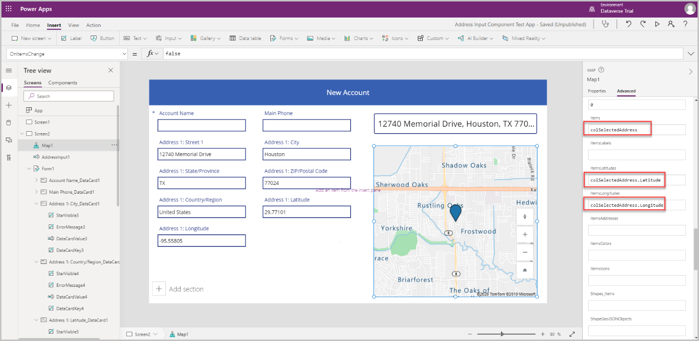

Some of the properties of the pin can be customized per location pin are as follows:

1.  **ItemsColors**: To update the color of the pin to a different color for
    each location – add a column to the collection Color: Red and use that in
    the **ItemsColors** DATA property of the Map control

2.  **ItemsLabels**: To update the label of the pin to a different label showing
    the address for each location – add a column to the collection Label:
    AddressInput1.FreeformAddress and use that in the **ItemsLabels** DATA
    property of the Map control

3.  **ItemsIcons**: To update the Icon of the pin to a different icon for each
    location – add a column to the collection and use that in the **ItemsIcons**
    DATA property of the Map control – for our example lets add a triangle icon
    thus the formula will be Icon: triangle

    NOTE: For a list of icons, please refer the following link:

    https://docs.microsoft.com/azure/azure-maps/how-to-use-image-templates-web-sdk\#list-of-image-templates

```
ClearCollect(
    colSelectedAddress,
    {
        Street: AddressInput1.StreetNumber & " " & AddressInput1.StreetName,
        City: AddressInput1.Municipality,
        State: AddressInput1.CountrySubdivision,
        Zip: AddressInput1.PostalCode,
        Country: AddressInput1.Country,
        Latitude: AddressInput1.SelectedLatitude,
        Longitude: AddressInput1.SelectedLongitude,
        Label: AddressInput1.FreeformAddress,
        Color: Red,
        Icon: Triangle
    }
);
```

After adding these to the collection, go to the Advanced tab of the Map control and update the ItemsColors, ItemsLabels and ItemsIcons properties as shown below

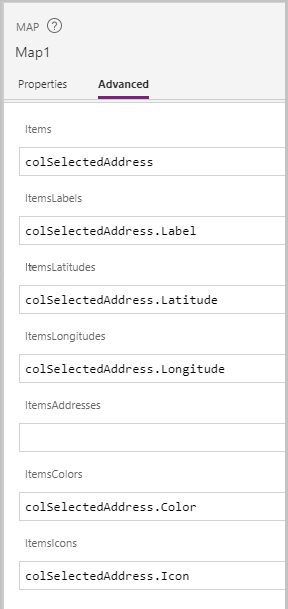

Run the app in preview mode to test it – the map shows the location selected in the address input with a triangle icon and the address shows up as a label on the map

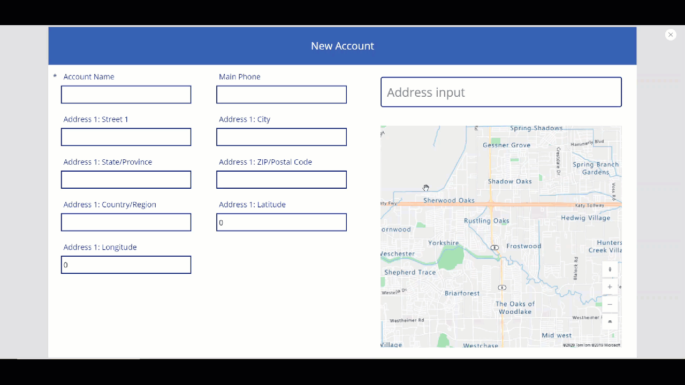