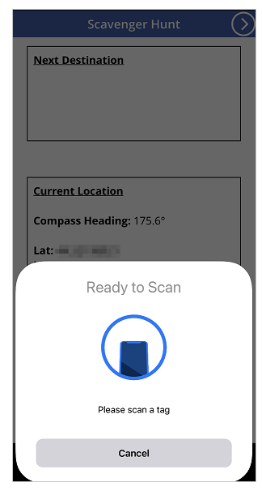

# Create an app that uses mobile sensors

Sensors enable you to add richer functionality into your apps by leveraging the capabilities of your phone. In this article, you'll learn about using sensors on your mobile device within Power Apps.

To do this, you'll be making a sample app with two screens. The first screen will display the current compass heading, latitude, longitude, altitude, and can scan NFC tags to obtain text information. The second screen will showcase how to display accelerometer data to produce the angle of the device along the X and Y axes.

To set up the scenario behind the first screen, imagine that you are building an app for an NFC-based scavenger hunt. Each participant will use the app to scan an NFC tag which will provide them with a compass heading, latitude, and longitude that will point them to their next destination. At that destination, the participant will then scan another tag and repeat the process until they reach the end of the hunt.

For the second screen, imagine needing a tool to roughly measure angles. When on the second screen, the participant will be able to place or hold their device on a surface, and get the angles on the X and Y axis of the device as well as view a visual representation of those angles.

Watch this video to learn how to build an app that uses mobile sensors:
> [!VIDEO https://www.microsoft.com/videoplayer/embed/RWLTiu]

## Prerequisites

- Any level of Power Apps license can be used for this app, as no data connections are being used.
- A mobile device such as a mobile phone or tablet with GPS and accelerometer capabilities will be needed as most PCs might not have the necessary sensors.
- An [NFC capable device](https://en.wikipedia.org/wiki/List_of_NFC-enabled_mobile_devices) is needed for the NFC scanning feature. It's also assumed that the NFC tags to be scanned have been pre-configured to produce text values in the following example format:

    ```
    "<b>Heading: </b> 80 degrees <br>
    <b>Latitude: </b> 44.4604788 <br>
    <b>Longitude: </b> -110.82813759"
    ```

    This will provide the text in an HTML-friendly format for the app. The setup of the NFC tags is beyond the scope of this article, and the NFC elements can be ignored if needed; the primary focus is using the mobile sensors in Power Apps.

## Add header and HTML text for the device sensor outputs

### Header label

With an app open for editing in [Power Apps](https://make.powerapps.com/), add a **Text label** to the screen by dragging and dropping it from the **Insert** pane. Position it at the top-left corner of the screen, and modify the following properties in the Properties pane:

| Property       | Value               |
|----------------|---------------------|
| Text           | "Scavenger Hunt"    |
| Font size      | 24                  |
| Font weight    | FontWeight.Semibold |
| Text alignment | Align.Center        |
| Width          | Parent.Width        |

Then in the **Advanced** pane, modify the following properties:

| Property       | Value                  |
|----------------|------------------------|
| Color          | RGBA(255, 255, 255, 1) |
| Fill           | RGBA(56, 96, 178, 1)   |

This will provide a header for the screen.

### HTML text for the device sensor outputs

Next, add an **HTML text** control. This will be used to display all the device sensor outputs in one place. Use this code in the **HTMLText** property:

```powerapps-dot
"<b><u>Current Location</u></b><br>  
<br>
<b>Compass Heading: </b>" & Round(Compass.Heading, 2) & Char(0176) &
"<br>
<br>
<b>Lat: </b>" & Location.Latitude & "<br>
<b>Long: </b>" & Location.Longitude & "<br>
<b>Alt: </b>" & Round(Location.Altitude, 2) & " m"
```

Change the following properties in the Advanced pane:

| Property        | Value             |
|-----------------|-------------------|
| Size            | 21                |
| BorderStyle     | BorderStyle.Solid |
| BorderThickness | 2                 |
| Width           | 560               |
| Height          | 576               |
| PaddingTop      | 16                |
| PaddingRight    | 16                |
| PaddingBottom   | 16                |
| PaddingLeft     | 16                |

If you examine what was put in the HtmlText, you may notice that there are two sensor types that are being used.

First is the **Compass** sensor, which is using the **Heading** property to provide the compass heading from the device.

Second is the **Location** sensor, which provides the **Latitude**, **Longitude**, and **Altitude**. There are two considerations about Location. First, if you use just Location without the dot operator and property, you'll get a record that has fields for Latitude, Longitude, and Altitude. Second, the Altitude property is in meters by default. If you would like to convert it to feet, replace the following formula:

Use meters:

```powerapps-dot
Round(Location.Altitude, 2) & " m"
```

Use feet:

```powerapps-dot
Round(Location.Altitude \* 3.2808, 2) & " ft"
```

> [!NOTE]
> Many sensor properties might not work correctly if you preview the app inside Power Apps Studio. To work with sensor properties for testing, prefer to use a mobile phone instead.

Now position the **Html text** control near the lower half of the screen.

## Add Button for the NFC scan and HTML text control

### NFC scan button

Add a button to the app, positioning in below the **Html text** control that you added in the last step, and change the following properties in the Advanced pane:

| Property        | Value                               |
|-----------------|-------------------------------------|
| OnSelect        | ClearCollect(colNFCScan, ReadNFC()) |
| Text            | "Scan NFC Tag"                      |

The code in the **OnSelect** property is utilizing the [ReadNFC()](../functions/function-readnfc.md) function, which activates the NFC reader. It then stores what is read from the NFC tag in a collection called **colNFCScan**. This collection will have four fields: **RTD**, **Text**, **TNF**, and **URI**. While a full explanation of these fields is beyond the scope of this article, some explanation may be helpful. **TNF** stands for **Type Name Format** and is used to define the structure of the **Record Type Definition**, or **RTD**, which in turn defines the type of record contained in the **Text** and/or **URI** fields. **URI** stands for **Uniform Resource Identifier**, which is essentially the address of a resource. For the NFC tags being used in this example, in addition to the **Text** field containing the example text from the introduction of this topic, they would contain a **TNF** value of *1*, an **RTD** value of *T*, and a blank **URI** value.

### Add Html text control to display the NFC scan information

Add a second **Html text** control and use the following formula in the **HTMLText** property:

```powerapps-dot
"<b><u>Next Destination</u></b><br>
<br>" &
First(colNFCScan).Text
```

Change the following properties in the Advanced pane:

| Property        | Value             |
|-----------------|-------------------|
| Size            | 21                |
| BorderStyle     | BorderStyle.Solid |
| BorderThickness | 2                 |
| Width           | 560               |
| Height          | 248               |
| PaddingTop      | 16                |
| PaddingRight    | 16                |
| PaddingBottom   | 16                |
| PaddingLeft     | 16                |

Without any NFC data present, the control will display **Next Destination**. When an NFC tag is scanned, it'll display **Next Destination**, and then the data from the **Text** field in the data collected from the scan.

Assuming the data for the NFC tags has been configured as described in the introduction, the user will see the next compass heading, latitude, and longitude values for the next scavenger hunt location after scanning one of those tags.


## Test the app

Save and publish the app. On a mobile device with the necessary sensors, open the app and observe the compass heading, latitude, longitude, and altitude values. Try walking around while turning in various directions to see changes in the various sensor readings.



Press the **Scan NFC Tag** button to observe the NFC reader control. If you have an NFC tag that can produce a **Text** value, scan the tag to observe the text in the app. If not, select **Cancel**.


## Add and configure second screen

Add a new **Blank screen** for the angle measurement portion of the app.

After adding the screen, go back to the first screen and add a **Next Arrow** icon from **+ Insert** > **Icons** > choose the **Next Arrow** icon. Position it in the top-right corner of the screen, and change the following properties in the Advanced pane:

| Property        | Value                  |
|-----------------|------------------------|
| OnSelect        | Navigate(Screen2)      |
| Color           | RGBA(255, 255, 255, 1) |

If you have renamed the second screen that was just added, substitute that name for **Screen2** in the **Navigate** function.

Preview the app, selecting the icon that was just added to verify that it navigates you to the blank screen that was just added.

## Add configuration for X and Y angles

Add a **Text label** to the screen by dragging and dropping it from the **Insert** pane. Position it at the top-left corner of the screen and modify the following properties in the **Properties** pane:

| Property       | Value               |
|----------------|---------------------|
| Text           | "2 Axis Level"      |
| Font size      | 24                  |
| Font weight    | FontWeight.Semibold |
| Text alignment | Align.Center        |
| Width          | Parent.Width        |

Then in the Advanced pane, modify the following properties:

| Property       | Value                  |
|----------------|------------------------|
| Color          | RGBA(255, 255, 255, 1) |
| Fill           | RGBA(56, 96, 178, 1)   |

This will provide a header for the second screen.

Next, add a **Back Arrow** icon from **+ Insert** > **Icons** > choose the **Back Arrow** icon. Position it in the top-left corner of the screen and change the following properties in the **Advanced** pane:

| Property       | Value                  |
|----------------|------------------------|
| OnSelect       | Navigate(Screen1)      |
| Color          | RGBA(255, 255, 255, 1) |

If you've renamed the first screen that was just added, substitute that name for **Screen1** in the **Navigate** function.

Finally, add an **HTML text** control. This will be used to display all the device sensor outputs in one place. Use the following formula in the HTML Text property:

```powerapps-dot
"<b><u>Angles:</u></b><br>
<br>
<table width='100%'>
<tr>
<td width='50%'><b>X: </b>" & Abs(Round(Acceleration.X * (90 / 9.81),
0)) & Char(0176) & "</td>
<td width='50%'><b>Y: </b>" & Abs(Round(Acceleration.Y * (90 / 9.81),
0)) & Char(0176) & "</td>
</tr>
</table>"
```

Change the following properties in the Advanced tab:

| Property        | Value             |
|-----------------|-------------------|
| Size            | 21                |
| BorderStyle     | BorderStyle.Solid |
| BorderThickness | 2                 |
| Width           | 560               |
| Height          | 168               |
| PaddingTop      | 16                |
| PaddingRight    | 16                |
| PaddingBottom   | 16                |
| PaddingLeft     | 16                |

Position this control near the top of the app screen.

If you examine what was put in the **HtmlText**, you may notice that it is using the **Acceleration** sensor, with **X** and **Y** properties. There is also a **Z** property that we are not using in this scenario.

This sensor detects gravitational forces on the device over three planes. Using a mobile phone as an example, imagine a line extending out of the sides of the phone. This would be the **X** plane. Lifting the right side of the phone will produce a positive value and lifting the left side will produce a negative value. A line extending out of the top and bottom of the phone would represent the **Y** plane. Lifting the top of the phone will produce a positive value and lifting the bottom will produce a negative value. Finally, a line coming out of the screen and back of the phone would represent the **Z** plane. Causing the screen to face upwards will produce a positive value and facing it downward will result in a negative value.

The accelerometer will measure forces acting on the device both in motion, such as if you dropped the device, and at rest, such as tilting the device on one or more of the axes described earlier. At rest, the theoretical values should be between 0 and +/- 9.81 m/s2, with 0 indicating that the relative axis is parallel to the Earth with no gravity acting on the sensor and a reading of 9.81 indicating that the relative axis is perpendicular to the Earth and the full force of gravity is acting on the sensor.

Looking at the code in the **Html text** control you just added, notice the following section:

```powerapps-dot
Abs(Round(Acceleration.X * (90 / 9.81), 0))
```

In this formula, from inside-out, first, the **Acceleration** on the **X** plane is being multiplied by **(90 / 9.81)**. This is using the theoretical maximum at-rest value to convert the sensor reading into degrees. The value of *90* is present because at the maximum theoretical value, the device would be perpendicular to the Earth on that plane, giving a measure of 90 degrees.

That value in degrees is then rounded to zero decimal places to provide a whole number degree value. Last, the absolute value of that rounded number is calculated to give a positive reading. This is so it will not matter if the angle is measured from one side or another.

> [!NOTE]
> The values shared above are approximates, and don't represent exact measurement.

## Add the level visuals

In this step, we're going to use some controls in unconventional ways to achieve a visual goal.

### Circular bubble level-like visual

To begin, add a **Button** control to the screen, renaming it to **btnCircleLevel** and change the following properties in the **Advanced** pane:

| Property               | Value                             |
|------------------------|-----------------------------------|
| Text                   | ""                                |
| BorderColor            | RGBA(56, 96, 178, 1)              |
| FocusedBorderThickness | 2                                 |
| Fill                   | Transparent                       |
| DisabledFill           | Self.Fill                         |
| X                      | (Parent.Width - Self.Width) / 2   |
| Y                      | (Parent.Height - Self.Height) / 2 |
| Width                  | 400                               |
| Height                 | Self.Width                        |

The result of these changes should produce a circular button in the center of the screen that cannot be pressed due to being disabled.

Next, add a **Circle** shape, set it's Border Radius to 400 and change the following properties in the **Advanced** pane:

| Property               | Value                                                                                                            |
|------------------------|------------------------------------------------------------------------------------------------------------------|
| FocusedBorderThickness | 0                                                                                                                |
| X                      | (Parent.Width - Self.Width) / 2 + (Round(Acceleration.X / 9.81 \* 90, 0) / 90 \* btnCircleLevel.Width / 2)   |
| Y                      | (Parent.Height - Self.Height) / 2 - (Round(Acceleration.Y / 9.81 \* 90, 0) / 90 \* btnCircleLevel.Width / 2) |
| Width                  | 42                                                                                                               |
| Height                 | Self.Width                                                                                                       |
| Width                  | 400                                                                                                              |
| Height                 | Self.Width                                                                                                       |

The **X** and **Y** properties allow the **Circle** shape to move about the center of the app screen, relative change in the **Acceleration** sensor values but contained within the circular area of **btnCircleLevel**.

### X and Y Axis bubble level-like visuals

Add a **Slider** control to the app, rename it to **sldXValue**, and change the following properties in the **Advanced** pane:

| Property  | Value                                         |
| --------- | --------------------------------------------- |
| Min       | -90                                           |
| Max       | 90                                            |
| Default   | Round(Acceleration.X \* (90 / 9.81), 0)       |
| ValueFill | Self.RailFill                                 |
| X         | (Parent.Width - Self.Width) / 2               |
| Y         | btnCircleLevel.Y + btnCircleLevel.Height + 30 |
| Width     | btnCircleLevel.Width                          |
| Height    | 70                                            |

This **Slider** control will display the angle similar to how a bubble level does: the **Handle** will move towards the raised side of the device, similar to the air bubble in a bubble level.

Next, copy **btnCircleLevel** by selecting it, pressing **Ctrl + C** and then **Ctrl + V**. Rename the control to **btnXValueOverlay** and change the following properties in the **Advanced** pane:

| Property | Value                                         |
|----------|-----------------------------------------------|
| X        | sldXValue.X - sldXValue.HandleSize / 2        |
| Y        | sldXValue.Y                                   |
| Width    | sldXValue.Width + sldXValue.HandleSize        |
| Height   | sldXValue.Height                              |

These changes will position it over the **sldXValue** control, preventing the user from changing its value and providing a visual border.

Copy and paste **sldXValue**, using the same method used to copy **btnCircleLevel**. Rename it to **sldYValue** and change the following properties:

| Property | Value                              |
| -------- | ---------------------------------- |
| Layout   | Layout.Vertical                    |
| X        | btnCircleLevel.X - Self.Width - 30 |
| Y        | (Parent.Height - Self.Height) / 2  |
| Width    | sldXValue.Height                   |
| Height   | sldXValue.Width                    |

Copy and paste **btnXValueOverlay**, renaming it to **btnYValueOverlay**, changing the following properties:

| Property | Value                                         |
|----------|-----------------------------------------------|
| X        | sldYValue.X                                   |
| Y        | sldYValue.Y - sldYValue.HandleSize / 2        |
| Width    | sldYValue.Width                               |
| Height   | sldYValue.Height + sldYValue.HandleSize       |

This completes the bubble level-like visuals.

## Test the level app


Save and publish the app. On a mobile device with the necessary sensors, open the app and navigate to screen with the bubble level visuals. Tilt the device from left to right, then up and down, and finally in all directions, noting the changes in angle properties as well as the changes in the visuals. Find an angled surface to place the device on and again note the angles and visuals.

### See also

- [Acceleration, App, Compass, Connection, and Location signals in Power Apps](../functions/signals.md)
- [Mixed reality components in Power Apps](../mixed-reality-overview.md)
- [Geospatial components in Power Apps](../geospatial-overview.md)
