# Work with the PDF function (experimental)

The PDF function allows you to generate a PDF document from the contents of a screen or certain types of controls. You can take the generated PDF and pass it to action connectors such as the Office 365 Outlook connector, or pass it to a Power Automate flow to achieve automation scenarios. You can also enable app users to download the generated PDF and print it or save a copy.

> [!IMPORTANT]
> - This is an experimental feature.
> - Experimental features aren't meant for production use and may have restricted functionality. These features are available before an official release so that customers can get early access and provide feedback. More information: [Understand experimental, preview, and retired features in canvas apps](../working-with-experimental-preview.md).
> - The behavior that this article describes is available only when the PDF function experimental feature in [Settings &gt; Upcoming features &gt; Experimental](../working-with-experimental-preview.md#controlling-which-features-are-enabled) is turned on (off by default).
> - Your feedback is very valuable to us - please let us know what you think in the [Power Apps experimental features community forum](https://powerusers.microsoft.com/t5/Power-Apps-Experimental-Features/bd-p/PA_ExperimentalFeatures).

In this article, we'll learn how to use the PDF function to create a PDF and use the generated PDF in several different ways.

## Prerequisites

- [Sign up](../../signup-for-powerapps.md) for Power Apps, and then [sign in](https://make.powerapps.com) by providing the same credentials that you used to sign up.
- [Create a blank canvas app from scratch](../create-blank-app.md) 

## Enable the PDF feature

Since the PDF function is an experimental feature, it's disabled by default. To use the PDF feature, you'll need to turn it on manually.

1. To enable the PDF function, open a [new](../data-platform-create-app.md) or an [edit an existing app](../edit-app.md)  app in Power Apps Studio. <br> [Learn more about creating apps](../create-blank-app.md) or [create an app from a template](../get-started-test-drive.md).

2. Select **Settings** at the top.

3. Select **Upcoming features**.

4. On the **Experimental** tab, set the toggle to **On** for **PDF function**.

   > [!div class="mx-imgBorder"] 
   > 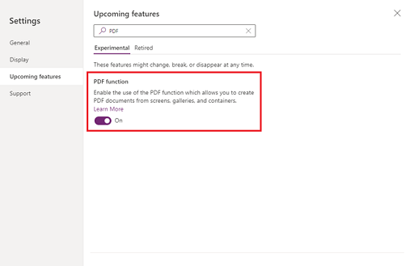


## Use the PDF function to generate a PDF

You can use the PDF function in any [behavior property](../working-with-formulas-in-depth.md) to generate a PDF. In the example below, we'll use the PDF function in the `OnSelect` property of a button, but you can also use `OnVisible`, `OnHidden`, or any other behavior property.

1. Select an existing button or add a new button to your canvas app.

2. In the `OnSelect` property of the button, enter the PDF function and enter the target of the PDF function as a parameter. In this example, we'll target the screen.    In our example, the name of the Screen is `SubmitInspectionScreen`. The name of your screen may be different. Enter the formula:

   `PDF(SubmitInspectionScreen);`

   > [!div class="mx-imgBorder"] 
   > 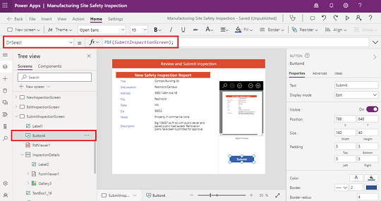

3. Save and publish the app.

4. Play the app.

5. Select the button you added. When you select the button, the PDF is generated and stored in memory for future use.

   The PDF function can only target content on the currently visible screen. You can pass in the entire screen as we're doing in this example, or you can limit what content you pass in by specifying a container or gallery. More information: [PDF function in Power Apps (experimental).](https://learn.microsoft.com/power-platform/power-fx/reference/function-pdf#syntax)

  > [!NOTE]
  > - These examples work best when using an app with multiple controls.
  > - `SubmitInspectionScreen` is the name of the screen in this example. If the name of the screen where you've placed your button is not `SubmitInspectionScreen`,  enter the name of the screen where you've added the button.
  > - To see the generated PDF, additional steps must be taken. See the steps below.

## Work with the generated PDF

### Method 1: Using the PDF Viewer control

In this example, we'll view the generated PDF using the PDF Viewer control.

1. In the canvas app used in the previous example, select the button created in the previous steps or add a new button.

2. In the button's `OnSelect` property, enter the formula:

   `Set(myPDF, PDF(SubmitInspectionScreen));`

   > [!div class="mx-imgBorder"] 
   > 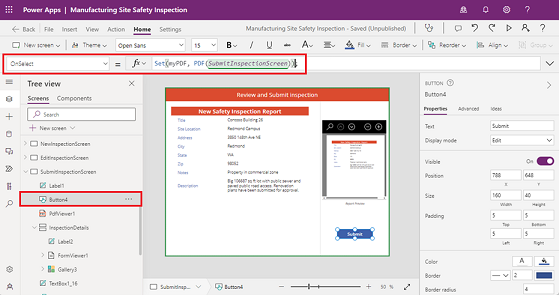
   
6. Select the Insert menu and add a PDF Viewer control.

7. Select the **Document** property from the properties drop down menu and enter **myPDF** in the formula bar.

   > [!div class="mx-imgBorder"] 
   > 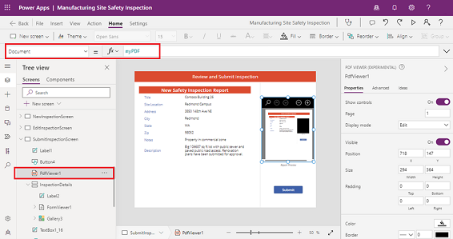

8. Save and publish the app.

9. Play the app.

10. Select the button you added. When you select the button, the PDF is generated and stored in the variable, and is visible in the PDF viewer control.

    > [!NOTE]
    > The PDF viewer control will appear as a black shape inside the generated PDF. To exclude the PDF Viewer control from the generated PDF, place the desired PDF content inside of a container or gallery and target that instead of the screen. For example, *PDF(Container1)* or*PDF(Gallery1).*

### Method 2: Use an action connector 

In this example, we'll generate a PDF that we then attach and send as an email. In this example, we use the Office 365 Outlook connector to send the email. More information: [365 Outlook connector](/connectors/office365)

1. In the canvas app used in the previous example, select the button created in the previous steps or add a new button.

2. In the button's `OnSelect` property, enter the formula:

   ```
   Office365Outlook.SendEmailV2( 

      "sample@email.com", 

       "New Safety Inspection" 

       "A new safety inspection has been submitted for your review. Please see attached.", 

       { 

           Attachments: Table( 

                { 

                    Name: "submittedInspection.pdf", 

                    ContentBytes: PDF(SubmitInspectionScreen) 
  
                } 

            ) 

       } 

    ); 
   ```
   
   > [!div class="mx-imgBorder"] 
   > 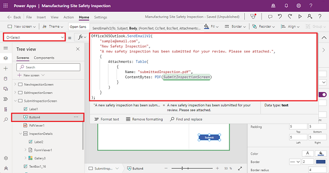

3. Save and publish the app.

4. Play the app.

5. Select the button you added. When you select the button, the PDF is generated, and an email is sent to the specified email address with the generated PDF included as an attachment.

  > [!NOTE]
  > A sample email address has been included in this formula example.

### Method 3: Use in a Power Automate flow

In this example, we'll generate a PDF that then gets passed to a Power Automate flow for storage. In this example, we use the SharePoint connector to store the PDF in a document library. More information: [SharePoint connector.](/connectors/sharepointonline)

1. In the canvas app used in the previous example, select the button created in the previous steps or add a new button.

2. From the left pane, select the Power Automate button and select **Create new flow**.

   > [!div class="mx-imgBorder"] 
   > 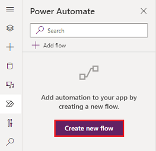

3. Select **Create from blank**.

   > [!div class="mx-imgBorder"] 
   > 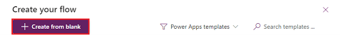

4. For this example, we'll need the Power Apps V2 trigger. To add it, select the ellipses on the right side of the Power Apps trigger and select Delete.
   
   > [!div class="mx-imgBorder"] 
   > 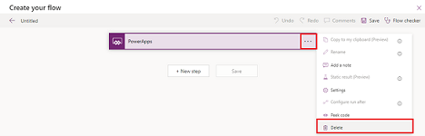

5. Search for PowerApps (V2) and select the trigger to add it.

   > [!div class="mx-imgBorder"] 
   > 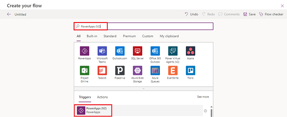

6. Select the Power Apps V2 trigger to expand the flow node. Select **Add an input**.

   > [!div class="mx-imgBorder"] 
   > 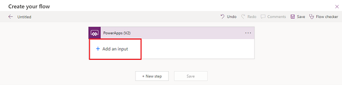

7. Choose the File type.

   > [!div class="mx-imgBorder"] 
   > 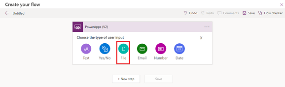

8. Select **Add an input** and choose the Text type. Rename the input to File name and update the description to "Please enter the name of the file." 

   > [!div class="mx-imgBorder"] 
   > 

9. Select **+New step** to add an action, and search for SharePoint. In the list of available SharePoint actions, select **Create file**.
   
   > [!div class="mx-imgBorder"] 
   > 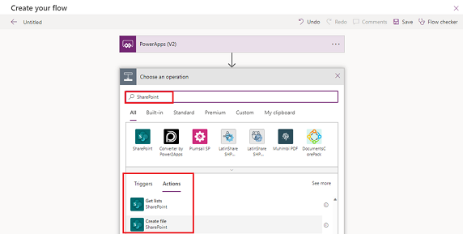

10. Choose a site from the Site Address drop down or select Enter custom value to paste the URL to a site you have permission to add files to. Select the folder icon on the right for Folder Path and select a document library from the list, which you have permissions to add files to.

11. In the File Name input area, select File name from the Dynamic Content menu, under PowerApps (V2). In the File Content input area, select File Content.

    > [!div class="mx-imgBorder"] 
    > 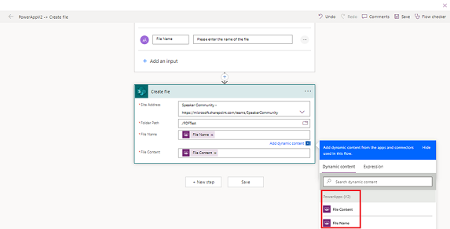

12. Select Save.

13. Select the X in the upper right corner of the dialog to close the modal.

    > [!div class="mx-imgBorder"] 
    > 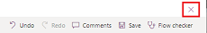

14. The Power Automate pane refreshes, and the newly created flow now appears.

    > [!div class="mx-imgBorder"] 
    > 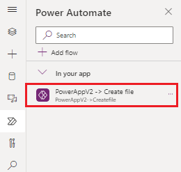

15. Select the button on the canvas. In the button's `OnSelect` property, enter the formula:

    ```
    'PowerAppV2->Createfile'.Run( 

       "NewInspectionReport.pdf", 

        {         

           file: { 

                name: "NewInspectionReport.pdf", 
  
                contentBytes: PDF(InspectionDetails) 

            }               

        } 

    );  
    ```

    > [!div class="mx-imgBorder"] 
    > 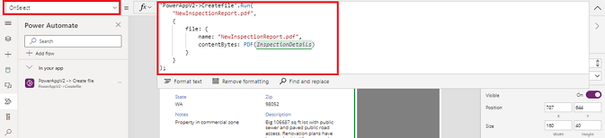

16. Save and publish the app.

17. Play the app.

18. Select the button you added. When you select the button, the Power Automate flow runs and adds the generated PDF into the document library.

### See also

[PDF function in Power Apps (experimental)](/power-platform/power-fx/reference/function-pdf)
