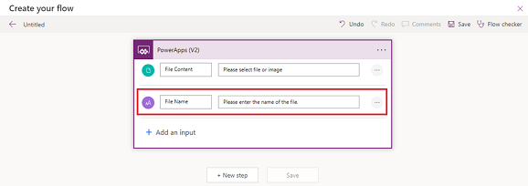

# Work with the PDF function (experimental)

The PDF function allows you to generate a PDF document from the contents of a screen or certain types of controls. You can take the generated PDF and pass it to action connectors such as the Office 365 Outlook connector, or pass it to a Power Automate flow to achieve automation scenarios.

> [!IMPORTANT]
> - This is an experimental feature.
> - Experimental features aren't meant for production use and may have restricted functionality. These features are available before an official release so that customers can get early access and provide feedback. More information: [Understand experimental, preview, and retired features in canvas apps](../working-with-experimental-preview.md).
> - The behavior that's described in this article is only available when the PDF function (experimental) feature is turned on in [Settings &gt; Upcoming features &gt; Experimental](../working-with-experimental-preview.md#controlling-which-features-are-enabled). 
> - Send your feedback in the [Power Apps experimental features community forum](https://powerusers.microsoft.com/t5/Power-Apps-Experimental-Features/bd-p/PA_ExperimentalFeatures).

In this article, we'll learn how to use the PDF function to create a PDF and use the generated PDF in several different ways.

## Prerequisites

- [Sign up](../../signup-for-powerapps.md) for Power Apps.  
- [sign in](https://make.powerapps.com) and create a canvas app. More information: [Create a blank canvas app from scratch](../create-blank-app.md) 

## Enable the PDF feature

Since the PDF function is an experimental feature, it's disabled by default. To use the PDF feature, you'll need to turn it on manually.

1. To enable the PDF function, open a [new](../data-platform-create-app.md) or [edit an existing app](../edit-app.md) in Power Apps Studio. 

  > [!TIP]
  > [Learn more about creating apps](../create-blank-app.md) or [create an app from a template](../get-started-test-drive.md).

2. On the command bar, select **Settings**.

3. Select **Upcoming features**.

4. On the **Experimental** tab, set the toggle to **On** for **PDF function**.

   > [!div class="mx-imgBorder"] 
   > 


## Use the PDF function to generate a PDF

You can use the PDF function in any [behavior property](../working-with-formulas-in-depth.md) to generate a PDF. In the example below, we'll use the PDF function in the `OnSelect` property of a button. You can also use `OnVisible`, `OnHidden`, or any other behavior property.

1. Select an existing button or add a new button to your canvas app.

2. In the `OnSelect` property of the button, enter the PDF function and enter the target of the PDF function as a parameter. <br> In this example, we'll target the screen. In our example, the name of the Screen is `SubmitInspectionScreen`. The name of your screen may be different. Enter the formula:

   `PDF(SubmitInspectionScreen);`

   > [!div class="mx-imgBorder"] 
   > 

3. In the upper-right corner, select [**Save and publish**](../power-apps-studio.md#save).

4. Play the app.

5. Select the button you added. When you select the button, the PDF is generated and stored in memory for future use.

   The PDF function can only target content on the screen that is currently visible. You can pass in the entire screen as we're doing in this example, or you can limit what content that you want to pass by specifying a container or gallery. More information: [PDF function in Power Apps (experimental).](/power-platform/power-fx/reference/function-pdf#syntax)

  > [!NOTE]
  > - These examples work best when using an app with multiple controls.
  > - `SubmitInspectionScreen` is the name of the screen in this example. If the name of the screen where you've placed your button is not `SubmitInspectionScreen`,  enter the name of the screen where you've added the button.
  > - To see the generated PDF, see the next steps below.

## Work with the generated PDF

There's many different methods to work with a generated PDF such as using the PDF Viewer control, use an action connector, and use in a Power Automate flow.

### Method 1: Using the PDF Viewer control

In this example, we'll view the generated PDF using the PDF Viewer control.

1. In the canvas app that you created, select the button that you created in the previous steps or add a new button.

2. In the button's `OnSelect` property, enter the following formula:

   `Set(myPDF, PDF(SubmitInspectionScreen));`

   > [!div class="mx-imgBorder"] 
   > 
   
6. On the command bar, select **Insert** > **PDF viewer (experimental)**.

7. From the [properties  list](../power-apps-studio.md#3--properties-list), select the **Document** property and then enter **myPDF** in the formula bar.

   > [!div class="mx-imgBorder"] 
   > 

8. In the upper-right corner, select [**Save and publish**](../power-apps-studio.md#save).

9. Play the app.

10. Select the button you added. When you select the button, the PDF is generated and stored in the variable, and is visible in the PDF viewer control.

    > [!NOTE]
    > The PDF viewer control will appear as a black shape inside the generated PDF. To exclude the PDF Viewer control from the generated PDF, place the desired PDF content inside of a container or gallery and target that instead of the screen. For example,`PDF(Container1)` or `PDF(Gallery1).`

### Method 2: Use an action connector 

In this example, we'll generate a PDF that we then attach and send as an email. In this example, we'll use the Office 365 Outlook connector to send the email. More information: [365 Outlook connector](/connectors/office365)

1. In the canvas app that you created, select the button that you created in the previous steps or add a new button.

2. In the button's `OnSelect` property, enter the following formula:

   ```
   Office365Outlook.SendEmailV2( 

      "sample@email.com", 

       "New Safety Inspection" 

       "A new safety inspection has been submitted for your review. Please see attached.", 

       { 

           Attachments: Table( 

                { 

                    Name: "submittedInspection.pdf", 

                    ContentBytes: PDF(SubmitInspectionScreen) 
  
                } 

            ) 

       } 

    ); 
   ```
   
   > [!div class="mx-imgBorder"] 
   > 

   > [!NOTE]
   > A sample email address has been included in this formula example.
   
3. In the upper-right corner, select [**Save and publish**](../power-apps-studio.md#save).

4. Play the app.

5. Select the button that you added. When you select the button, the PDF is generated, and an email is sent to the specified email address with the generated PDF included as an attachment.


### Method 3: Use in a Power Automate flow

In this example, we'll generate a PDF that then gets passed to a Power Automate flow for storage. In this example, we use the SharePoint connector to store the PDF in a document library. More information: [SharePoint connector.](/connectors/sharepointonline)

1. In the canvas app that you created, select the button that you created in the previous steps or add a new button.

2. From the [app authoring menu](..//power-apps-studio.md#5--app-authoring-menu), select **Power Automate** > **Create new flow**.

   > [!div class="mx-imgBorder"] 
   > 

3. Select **Create from blank**.

   > [!div class="mx-imgBorder"] 
   > 

4. For this example, we'll use the **Power Apps V2 trigger**. To add it, select **Menu for Power Apps** (...) and then select, **Delete**.
   
   > [!div class="mx-imgBorder"] 
   > 

5. In the search box, enter **PowerApps(V2)** and then select the trigger to add it.

   > [!div class="mx-imgBorder"] 
   > 

6. Select the **PowerApps V2** trigger to expand the flow node and then select, **Add an input**.

   > [!div class="mx-imgBorder"] 
   > 

7. Select **File** for type of user input.

   > [!div class="mx-imgBorder"] 
   > 

8. Select **Add an input** and choose the **Text** for type of user input. Rename the input to **File Name** and update the description to **Please enter the name of the file**.

   > [!div class="mx-imgBorder"] 
   > 

9. Select **+New step** to add an action. In the search box, enter **SharePoint**. In the list of available SharePoint actions, select **Create file**.
   
   > [!div class="mx-imgBorder"] 
   > 

10. Choose a site from the **Site Address** drop down or select **Enter custom value** to enter a URL for a SharePoint site that have permission to add files to.

11. For **Folder Path** select the **Show Picker** folder icon and then select a document library from the list. You need to you have permissions to add files to this folder.

12. Select the **File Name** input. From the **Dynamic Content** tab, select a file name under **PowerApps (V2)**. 

13. Select the **File Content** input and then select, **File Content** from the list.

    > [!div class="mx-imgBorder"] 
    > 

14. Select **Save**.

15. Select the **Close** to close the dialog box.

    > [!div class="mx-imgBorder"] 
    > 

16. The Power Automate pane refreshes, and you'll see the flow that you created.

    > [!div class="mx-imgBorder"] 
    > 

17. Select the button on the canvas. In the button's `OnSelect` property, enter the formula:

    ```
    'PowerAppV2->Createfile'.Run( 

       "NewInspectionReport.pdf", 

        {         

           file: { 

                name: "NewInspectionReport.pdf", 
  
                contentBytes: PDF(InspectionDetails) 

            }               

        } 

    );  
    ```

    > [!div class="mx-imgBorder"] 
    > 

18. In the upper-right corner, select [**Save and publish**](../power-apps-studio.md#save).

19. Play the app.

20. Select the button you added. When you select the button, the Power Automate flow runs and adds the generated PDF into the document library.

### See also

[PDF function in Power Apps (experimental)](/power-platform/power-fx/reference/function-pdf)
