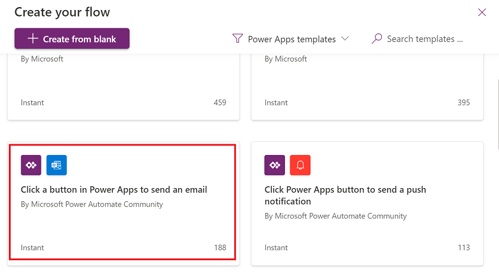
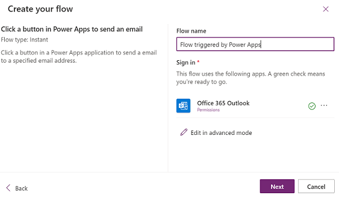
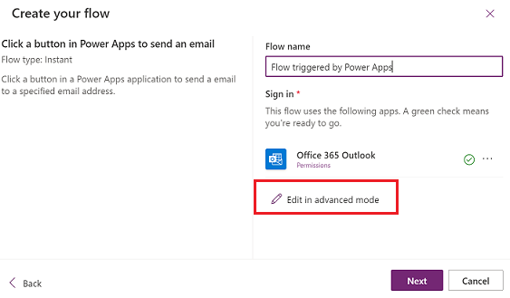
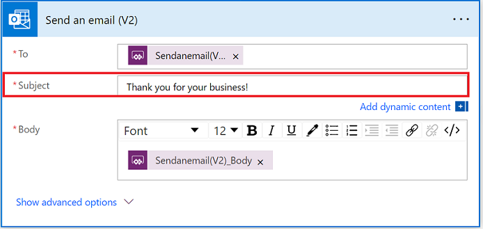
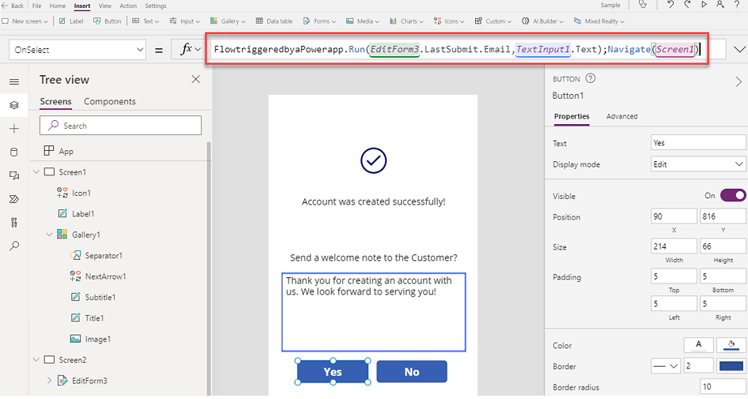

# Create a canvas app that can trigger a Power Automate flow

Power Automate can be used to create logic that performs one or more tasks when an event occurs in a canvas app. For example, a button can be configured so that, when a user selects it, an item is created in a list, an email, or meeting request is sent, a file is added to the cloud, or all of these. Any control in the app can be configured to start the flow, that continues to run even if you close the app.

In this article, we'll learn how create and trigger a flow using canvas apps.

Watch this video to learn how to create a canvas app that can trigger a flow:
> [!VIDEO https://learn-video.azurefd.net/vod/player?id=97f1d303-9f0d-4817-9f9d-c899d023d9b1]

## Prerequisites

To complete this lesson, you'll need Power Automate and Power Apps environment with a Dataverse database. If you don't have a license, you can sign up for the [Power Apps Developer Plan](../../developer-plan.md) or use [Power Apps trial](../../signup-for-powerapps.md).

## Create a trial environment

An environment in Power Apps is a space to store, manage, and share your organization’s business data, apps, chatbots, and flows. It also serves as a container to separate apps that might have different roles, security requirements, or target audiences. Each environment can have one Dataverse database.

To make sure that you have what you need to complete this lesson, we're going to create a new environment that includes a Dataverse database. This is a 30-day trial that will go away at the end of the 30 days, but you can upgrade it to a sandbox or production environment if you want to keep it.

We're going to create a trial environment that will include a Dataverse database, and the sample data used in this article.

1. Go to [Power Platform admin center](https://admin.powerplatform.microsoft.com/).

1. Select **Environments**.

1. Select **New**.

1. Name the environment **Dataverse Trial**.

1. Select **Trial** for environment type.

1. Toggle **Create Database** to **Yes**.

1. Select **Next**.

1. Toggle **Deploy Sample Apps and Data** to **Yes**.

1. Select **Save**.

Your trial environment will now be created, including a Dataverse database and sample data.

## Create a canvas app

In this lesson, we'll create an app to search, view, and create customer accounts using the **Accounts** table in Dataverse.

1. Start by creating a [blank canvas app](../create-blank-app.md).

1. Select **Create a gallery**.

    

1. Select **Accounts** table.

1. Stretch the gallery to the bottom of the screen, and add a label to the top with the text **Accounts**. And then, update the other properties as listed below.

    | Property | Value |
    | - | - |
    | Font | Open Sans |
    | Font size | 21 |
    | Font weight | Bold |
    | Text alignment | Center |
    | Auto height | Off |
    | Line height | 1.2 |
    | Overflow | Hidden |
    | Display mode | Edit |
    | Visible | On |
    | Position (X, Y) | 0, 0 |
    | Size (Width, Height) | 640, 71 |
    | Padding | 5 Top, 5 Bottom, 5 Left, 5 Right |

    

1. Add an **Add** icon to the top-right of the screen by selecting **Insert** > **Icon** > **Add**. And then, update the properties of the icon to color white and padding of 5 from all sides.

    

1. From the top-left side of the screen, select **New screen** > **Form**.

    

1. Update the title of the form to **New Account**, and select the data source as **Accounts** from the pane on the right-side of the screen.

    

1. Select **Edit fields** on the right-pane.

    :::image type="content" source="media/trigger-flow/build-a-canvas-app-10.png" alt-text="Select edit fields.":::

1. Select **Add field** and add **Email** to the form.

    :::image type="content" source="media/trigger-flow/build-a-canvas-app-11.png" alt-text="Add email field.":::

    The email field gets added to the form.

    :::image type="content" source="media/trigger-flow/build-a-canvas-app-12.png" alt-text="The email field gets added.":::

1. Set the default mode of the form to **New**.

    

1. Select Screen1 that has the accounts gallery, and set the **OnSelect** property of the **+** icon to `Navigate(Screen2)`.

    

1. Select **Insert** > **New screen** > **Blank screen** to add a new screen to the app.

1. Select **Insert** > **Icon**, and then select the Check (badge) icon to add it to the screen.

    

1. Move the icon to the top center of the canvas.

    

1. Add a label with text **Account was created successfully!**, and move it under the icon added in the earlier step.

    

1. Add an additional label below the label added in the previous step with text **Send a welcome note to the Customer?**.

    

1. Add a **Text Input** box by selecting **Insert** > **Input** > **Text Input**. Set the **Mode** of the control to **Multiline**, and default text to **Thank you for creating an account with us. We look forward to serving you!**. And move the control below the label added in the previous step.

    

1. Set the **OnVisible** property of **Screen3** to `Reset(TextInput1)`.

    

1. Add two buttons to the screen with text **Yes** and **No**, and place them below the input text box added in the previous step.

    

1. Go to the **New Account** form screen, and set the **OnVisible** property of the screen to `ResetForm(EditForm3)`.

    

1. Select the check icon on the top-right, and set the **OnSelect** property to `SubmitForm(EditForm3);Navigate(Screen3)`.

    

1. Select the X button on the top-right, and set the **OnSelect** property to `Back()`.

    

1. Go back to **Screen3** by selecting **Screen3** in the tree view.

    

1. Select the **No** button, and set the button's **OnSelect** property to `Navigate(Screen1)`.

    

1. Select the **Yes** button, on the app authoring menu select **Power Automate**.

    

1. Select **Create a new flow** to create a new Power Automate flow.

    

## Create the Power Automate Flow

1. On the **Create your flow** screen, from the list of instant templates, select **Click a button in Power Apps to send an email**.

   > [!div class="mx-imgBorder"]
   > 

1. Enter a name for the flow as "Flow triggered by Power Apps", and select **Power Apps** as the trigger.
    
   > [!div class="mx-imgBorder"]
   > 

1. Select **Edit in advanced mode** and then select, **Continue**.
     
   > [!div class="mx-imgBorder"]
   > 

1. The **To** field and the **Body** field are automatically auto-populated with the following:
  
   - To: **Sendanemail(V2)_To**.
   - Body: **Sendanemail(V2)_Body**


1. In **Subject** field, delete **Sendanemail(V2)_To** and enten **Thank you for your business!** in the **Subject** field.

    

1. Select **Save** to save the flow.

## Trigger the flow from within the canvas app

1. Select the **Yes** button > in the **OnSelect** property enter the two parameters for the To email address and the Body of the email as follows:

    ```power-fx
    FlowtriggeredbyaPowerapp.Run(
       EditForm3.LastSubmit.Email,
       TextInput1.Text
    );
    Navigate(Screen1);
    ```

    > [!NOTE]
    > The email address is picked up from the new account record created on the previous screen. and the body for the email is picked from the text box text captured on this screen.

    
   > [!div class="mx-imgBorder"]
   > 

## Test the app

Run the app in preview mode. In this test, we'll create a new account by entering details like account name, phone number, city, and email address on the **New Account** screen. On saving the new account details, we'll be prompted to send an email to the customer where we can update the verbiage of the email, and then select **Yes** to send the email. This will trigger the flow, and email will be sent to the email address on the account.


An email like this should appear in your inbox


### See also

[Use Power Automate pane](../working-with-flows.md)
