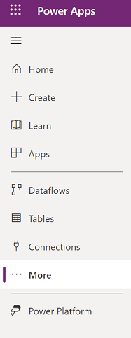

# Navigate the Power Apps home page 

The [Power Apps](https://make.powerapps.com?utm_source=padocs&utm_medium=linkinadoc&utm_campaign=referralsfromdoc) home page offers you various options for creating your own apps, opening apps that you or others have created, and performing related tasks. These tasks range from the most simple, such as identifying the license or licenses that give you access, to more advanced capabilities like creating custom connections to specific data sources.

You can select options in three general areas:

- The left navigation pane 

    
    
- The header along the top of the page

    

- The large icons that feature prominently in the middle of the page

    :::image type="content" source="media/intro-maker-portal/center-area.png" alt-text="Center area of the home page.":::

For best results, start by ensuring that the home page is set to the right environment.

## Left navigation pane (preview)

Find what you need with the new left navigation experience. If this is the first time you're signing in to the [Power Apps home page](https://make.powerapps.com) the default left navigation pane will show the menu items:

- **Home**: Takes you to the Power Apps home page.
- **Create**: This is where you create apps.
- **Learn**: The [learn hub](../common/learn-hub.md) lets you explore documents, training material, get help from the Power Apps community, and other resources that will help you to create and build Power Apps.
- **Apps**: If you've created an app (or someone else has created one and shared it with you), you can play or edit it.
- **More**: Pin your most-used items to the left navigation such as tables, flows, and more.
- **Power Platform**: Takes you to Power Platform admin centers.

> [!div class="mx-imgBorder"]
> 

### Pin and unpin

You can pin your most used pages in the navigation pane so you quickly access features that you use frequently. Links to other pages are available through the **More** link. When you pin an item it appear in the middle section, aboce the **More** menu. 

When you sign in for the first with the new navigation, the system will automatically pin your most and recently used pages on the left navigation pane. However, you can customize the middle section of the left navigation pane to your preference. 

> [!div class="mx-imgBorder"]
> 

To pin a page to the left navigation pane, select **More** and then choose the page that you want to pin.

> [!div class="mx-imgBorder"]
> 

To unpin a page, from the left navigation menu select the more button next to the page that you want to unpin and then select **Unpin**.

### Move up or move down

Once you pinned a few items you can also move them up or down them up or down the list.

To move an item up or down, select the more button next to the page that you want to move, and then select **Move up** or **Move down**.

> [!div class="mx-imgBorder"] 
> 

