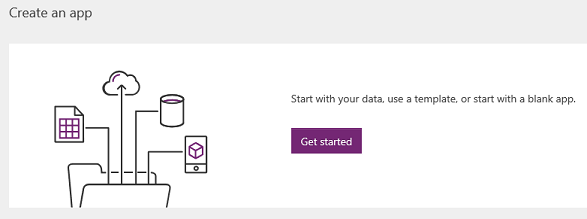
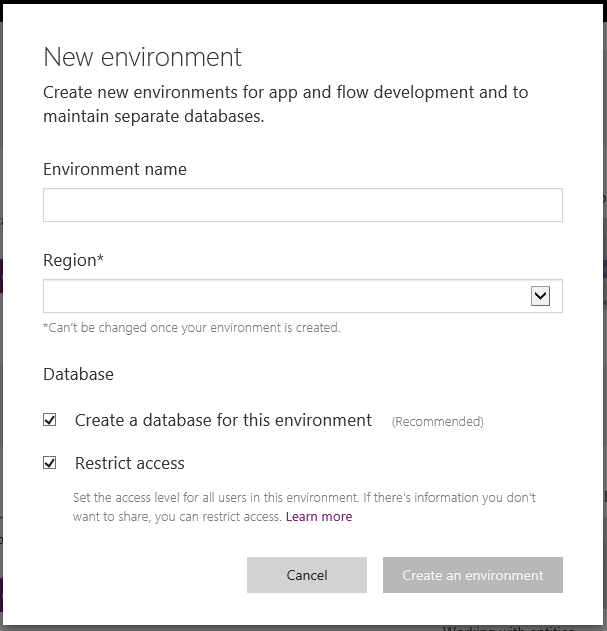
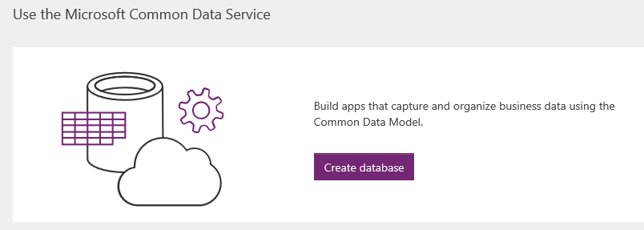
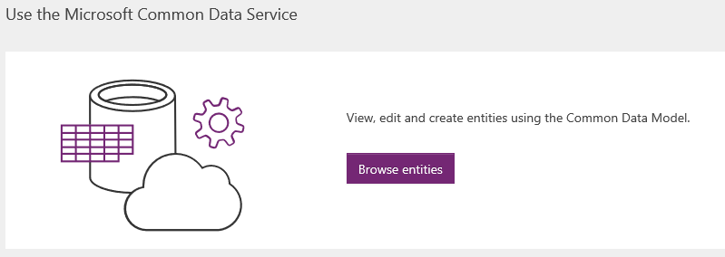
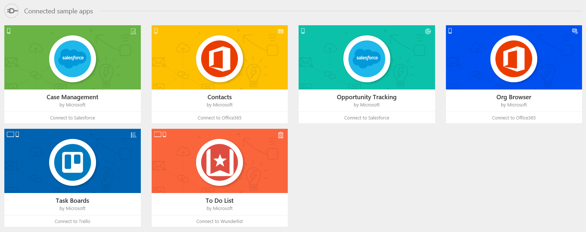
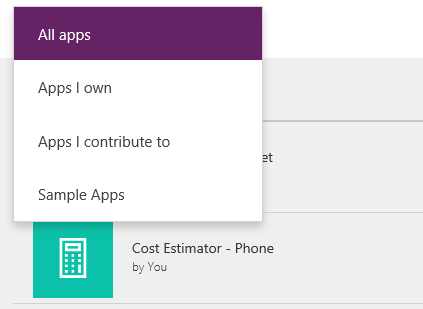

# Sign in to PowerApps for the first time

When you sign in to [PowerApps](https://web.powerapps.com?utm_source=padocs&utm_medium=linkinadoc&utm_campaign=referralsfromdoc), the site offers you a variety of options for creating your own apps and opening apps that you or others have created, and performing related tasks. These tasks range from the most simple, such as identifying the license or licenses that give you access, to more advanced capabilities, such as creating custom connections to specific data sources.

You can select options in three general areas:

- the header along the top of the page

    

- the navigation bar along the left edge of the page

    

- the large icons that feature prominently in the middle of the page

    

For best results, start by ensuring that the home page is set to the right environment.

## Choose an environment

Whether you're creating an app, a flow, a data connection, or an entity in the Common Data Service for Apps, much of what you do in PowerApps is contained in a specific environment. Environments create boundaries between different types of work; for example, an organization might have separate environments for different departments. Many organizations use environments to separate apps that are still being developed from those that are ready for widespread use. You might have access to multiple environments or only one and, if you have appropriate permissions, you might be able to create your own environments.

To verify which environment you're in, find the environment switcher near the right side of the header.

If you create an app in one environment, you won't be able to see it from another environment. In addition, people who want to run your app must have access to the environment in which you created it.

> [!IMPORTANT]
> Make sure that you're in the right environment *before* you create an app, a flow, or a similar component.

For more information about environments, see [Environments overview](../../administrator/environments-overview.md).

## Open an app

If you've already created an app (or someone else has created one and given you permission to edit it), you can open the app from either the home page or the **Apps** tab.

- On the home page, you can open apps under the **Recent apps** heading. If you hover over an app's tile, you can select the play icon to run the app or the pencil icon to edit it.

    

- On the **Apps** tab, you can filter the list of apps in multiple ways, such as by whether you opened them recently.

    

    You can also search for an app by typing one or more characters in the search box near the upper-right corner.

Download clients for running apps
Connect to data
Identify your plan/s
Open the Admin center
Perform advanced customizations
Get more info

Create an app from scratch
Create an app from data
Customize a pre-built app

Open an app that you or someone else created

Create and update entities in the Common Data Service
Create or update a flow in Microsoft Flow

Next to settings, you will see a question-mark icon for help. Click or tap this icon to display links to Guided learning, Documentation, Support, Community, Blogs, Legal and Privacy.

## Homepage
After you sign in to [powerapps.com](http://web.powerapps.com?utm_source=padocs&utm_medium=linkinadoc&utm_campaign=referralsfromdoc), you'll land on the homepage by default. We have changed the layout of this homepage to help you get started quickly, whether you're creating apps or want to explore the Common Data Service.

If you've signed in to PowerApps before and run or created some apps, the first section you will see on your homepage is a list of **Recent apps**. They are sorted by the date on which they were most recently opened.

Near the upper-right corner, an arrow is labeled **Apps** and links to the **Apps** page directly so you can see all of your apps.

If you've never signed in, created an app, or run an app before, you won't see the **Recent apps** section. Instead you'll see the banner **Create an app**.

Click or tap **Get started** on this banner to display options for creating an app using **PowerApps Studio**.

Next to **Get started**, you can find links to our tutorial videos on how to quickly create an app from data (in either SharePoint or PowerApps) and then share the app. The **Learn more** arrow link will take you to a topic about how to create an app from existing data.

Below the **Create an app** banner is the **Use the Microsoft Common Data Service** banner.

Under **Common Data Service**, a different button will appear, depending on your license or permission.

* If the **Start trial** button appears, you don't have a PowerApps P2 license, which the Common Data Service requires. Click or tap this button to open the page where you can sign up for a free, 90-day trial of this license. [Learn more about PowerApps licenses](../signup-for-powerapps.md).
* If the **Get started** button appears, you're in an environment that doesn't have a Common Data Service database or you don't have access to it. Click or tap this button to create an environment and database at once, so you can start to use Common Data Services for your apps. [Learn more about creating environments](../../administrator/environments-administration.md).
  
    
  
    If you don't want to create an environment, you can always switch to an environment to which you have access.
* If the **Create database** button appears, you're in an environment that doesn't have a Common Data Service database but you have permission to create one.
  
    
  
    Clicking or tapping this button will provision a database for this environment.
  
    
* If the **Browse entities** button appears, you're in an environment that has a Common Data Service database provisioned already and you have access to it. Click or tap that button to open the **Entities** page.
  
    

Below the **Use the Microsoft Common Data Service** banner, you'll see a set of sample apps and connected sample apps that we created for you to use.

* **Sample apps** - Sample apps were built for different business scenarios in either phone or tablet layout. You can click an app to quickly view a description of what the app does, what layout the app was built for, and what capabilities the app showcases such as camera, GPS, or radio buttons. It's a quick way for new users to learn capabilities of PowerApps, and you can use a template to create an identical app in PowerApps Studio.
  
    
* **Connected sample apps** - These apps connect to your data via a data connection such as Office 365, Salesforce, Trello, and Wunderlist. This set of apps is different from the sample apps above. When you click or tap a connected sample app, you actually provision a new instance of the app (think of it as a template). It will prompt you to enter your credentials to connect to your data. The beautiful thing about a connected sample app is that an instance is provisioned for you right here, and you can open it in PowerApps Studio to learn how the corresponding app was built. The downside is that it can take pretty long (up to a minute) to create. So please be patient and let the browser open when you click or tap a connected sample app.
  
    

## New Apps page
You can access the **Apps** page via the left navigation bar on [powerapps.com](http://web.powerapps.com?utm_source=padocs&utm_medium=linkinadoc&utm_campaign=referralsfromdoc).

The **Apps** page previously allowed you to switch between tile view and list view. After October 26, 2016, it supports only list view.

Please note that the list view shows only apps in the selected environment. To view apps in a different environment, switch to it by using the environment switcher in the header. [Learn more about switching environments](working-with-environments.md).

## What's new?

* Clicking or tapping an app now opens it in PowerApps Studio in a new tab.
* By default, the **Apps** page shows all apps that you have permission to edit. To view **All apps** (including apps you can only use), select the **All apps** filter.
  
   

We also have:

* **Apps I can use**, which lists all apps that have been shared with you with User permission (can only run the app). Please note that you can also acquire these apps in [Dynamics 365](http://home.dynamics.com).
* **Apps I own**, which lists all apps you have authored.
* **Apps I contribute to**, which lists all apps that have been shared with you with Contributor permission.
* **Sample apps**, which lists all sample apps (not connected sample apps).

If you click or tap the information circle, the app details page opens.

If you click the ellipsis for an app, options such as Play, Edit, Share, and Details appear.

That is mainly what's new on powerapps.com, which is geared toward app makers. We hope this is helpful to you. Please leave comments on what you like so far and would like to see. We'd love to hear your feedback!

