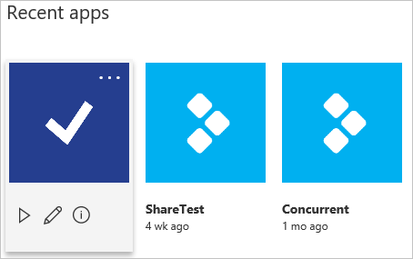
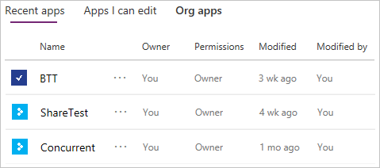
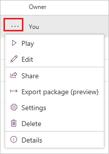

# Sign in to PowerApps for the first time

When you sign in to [PowerApps](https://web.powerapps.com?utm_source=padocs&utm_medium=linkinadoc&utm_campaign=referralsfromdoc), the site offers you a variety of options for creating your own apps and opening apps that you or others have created, and performing related tasks. These tasks range from the most simple, such as identifying the license or licenses that give you access, to more advanced capabilities, such as creating custom connections to specific data sources.

You can select options in three general areas:

- the header along the top of the page

    

- the navigation bar along the left edge of the page

    

- the large icons that feature prominently in the middle of the page

    

For best results, start by ensuring that the home page is set to the right environment.

## Choose an environment

Whether you're creating an app, a flow, a data connection, or an entity in the Common Data Service for Apps, much of what you do in PowerApps is contained in a specific environment. Environments create boundaries between different types of work; for example, an organization might have separate environments for different departments. Many organizations use environments to separate apps that are still being developed from those that are ready for widespread use. You might have access to multiple environments or only one and, if you have appropriate permissions, you might be able to create your own environments.

To verify which environment you're in, find the environment switcher near the right side of the header.

If you create an app in one environment, you won't be able to see it from another environment. In addition, people who want to run your app must have access to the environment in which you created it.

> [!IMPORTANT]
> Make sure that you're in the right environment *before* you create an app, a flow, or a similar component.

For more information, see [Environments overview](../../administrator/environments-overview.md).

## Open an app

If you've already created an app (or someone else has created one and shared it with you), you can open the app from either the **Home** page or the **Apps** page.

- On the home page (which appears by default), you can open apps under the **Recent apps** heading. If you hover over an app's tile, you can select the play icon to run the app or the pencil icon to edit it.

    

- On the **Apps** page (which you can open from the left navigation bar), you can filter the list of apps in multiple ways, such as by whether you opened them recently.

    

    You can also search for an app by typing one or more characters in the search box near the upper-right corner. When you find the app you want, select the ellipsis icon to show the play icon for running the app and the pencil icon for editing the app.

    

## Create an app

From the home page, you can create an app from a blank screen, you can generate an app automatically from your data, or you can customize a pre-built app. Each of these options appears under **Make apps like these**.

- If you've already made one or more apps and explored how they're constructed, you probably have enough familiarity to try creating your own app from a blank screen. With this approach, you'll connect to data, add UI elements (which are called controls), and specific behavior by configuring controls with formulas. To start, hover over the **Start from blank** tile, and then specify whether you want to build an app for a phone or another device, such as a tablet. When you select **Make this app**, PowerApps Studio opens and shows you a welcome screen.

Download clients for running apps
Connect to data
Identify your plan/s
Open the Admin center
Perform advanced customizations
Get more info

Create and update entities in the Common Data Service
Create or update a flow in Microsoft Flow