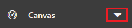
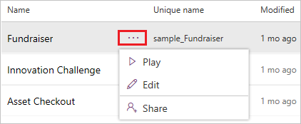

# Sign in to PowerApps for the first time

When you sign in to [PowerApps](https://web.powerapps.com?utm_source=padocs&utm_medium=linkinadoc&utm_campaign=referralsfromdoc), the site offers you a variety of options for creating your own apps, opening apps that you or others have created, and performing related tasks. These tasks range from the most simple, such as identifying the license or licenses that give you access, to more advanced capabilities, such as creating custom connections to specific data sources.

You can select options in three general areas:

- the header along the top of the page

    

- the navigation bar along the left edge of the page

    

- the large icons that feature prominently in the middle of the page

    

For best results, start by ensuring that the home page is set to the right environment.

## Choose an environment

Whether you're creating an app, a flow, a data connection, or an entity in the Common Data Service for Apps, much of what you do in PowerApps is contained in a specific environment. Environments create boundaries between different types of work; for example, an organization might have separate environments for different departments. Many organizations use environments to separate apps that are still being developed from those that are ready for widespread use. You might have access to multiple environments or only one and, if you have appropriate permissions, you might be able to create your own environments.

To verify which environment you're in, find the environment switcher near the right side of the header.

If you create an app in one environment, you won't be able to see it from another environment. In addition, people who want to run your app must have access to the environment in which you created it.

> [!IMPORTANT]
> Make sure that you're in the right environment *before* you create an app, a flow, or a similar component. You can't easily move components from one environment to another.

For more information, see [Environments overview](../../administrator/environments-overview.md).

## Choose an app type

In PowerApps, you can create and run these types of apps:

- **Canvas apps** support designing custom UI and connecting to a data from a variety of sources.
- **Model-driven apps** have a standard UI and connect to data only in Common Data Service (CDS) for Apps. However, you can more easily create other elements such as views, dashboards, and different types of business logic.

By default, the **Home** page shows options for creating and running canvas apps. To show model-driven options instead, choose an environment that has a CDS for Apps database, and then open the menu in the lower-left corner.

## Play or edit an app

If you've already created an app (or someone else has created one and shared it with you), you can play or edit it from the **Apps** page.

- You can find a canvas app by filtering based on criteria such as whether you opened it recently.

    

    You can also search for an app or by typing one or more characters in the search bar, which appears near the upper-right corner. When you find the app you want, select the ellipsis icon to show options for playing or editing the app.

    

- You can't filter the list of model-driven apps, but you can search for an app by typing one or more characters in the search bar, which appears near the upper-right corner. When you find the app you want, select the ellipsis icon to show options for playing or editing the app.

    

## Create an app

From the **Home** page, you can create apps in several ways:

- [generate a canvas app automatically from a set of data](data-platform-create-app.md)
- [customize a pre-built sample of a canvas app](open-and-run-a-sample-app.md)
- [build a canvas app from a blank screen](data-platform-create-app-scratch.md)
- [create your own model-driven app](../model-driven-apps/overview-model-driven-samples.md)
- [customize a pre-built sample for a model-driven app](../model-driven-apps/build-first-model-driven-app.md)

## Learn more

## Other common tasks

Download clients for running apps
Connect to data
Identify your plan/s
Open the Admin center
Perform advanced customizations
Get more info

Create and update entities in the Common Data Service
Create or update a flow in Microsoft Flow