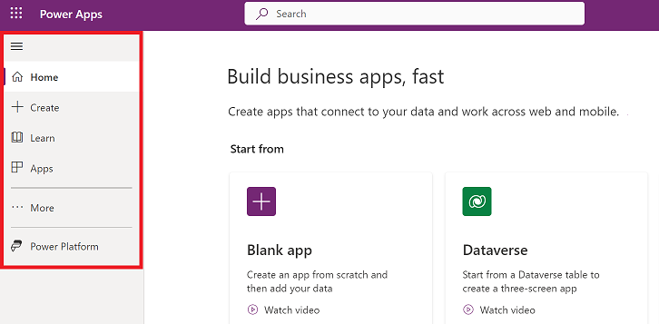

# How to navigate the Power Apps home page (preview)

Find what you need in the [Power Apps home page](https://make.powerapps.com) with the new navigation experience. The default menu on the left navigation pane 
has the follwoing options:

- **Home**: Takes you to the Power Apps home page.
- **Create**: Create you apps
- **Learn**:
- **Apps**:
- **More**:
- **Power Platform**: 

> [!div class="mx-imgBorder"] 
>  

## Left navigation pane

You can pin your most used pages in the navigation pane so you quickly access features that you use frequently. Links to other pages are availiable through the **More** link.

When you sign in for the first time to the new navigation experience, you'll see a dialog box that helps you set up your left naviagtion pane. 

To configure the navigation pane, select one of the following options:

- **Your most used pages**: These are the pages that you used used in the last 28 days.
- **Most populat**: These are the most used Power Apps pages by your organizations.
- **Choose my own**: Choose the pages that you want to pin.

[TBD- add screenshot]

### Pin 
