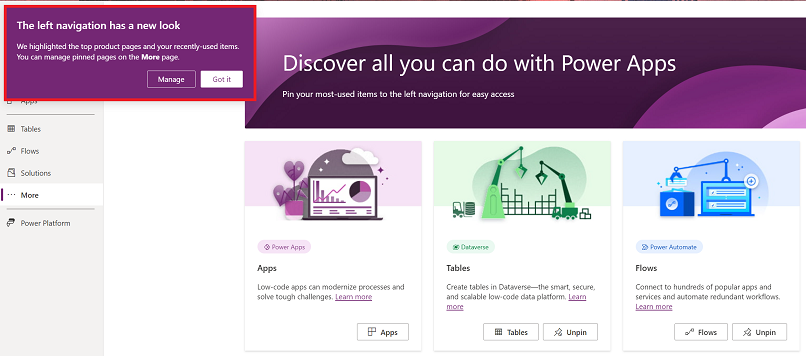
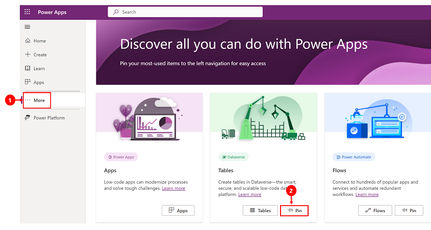
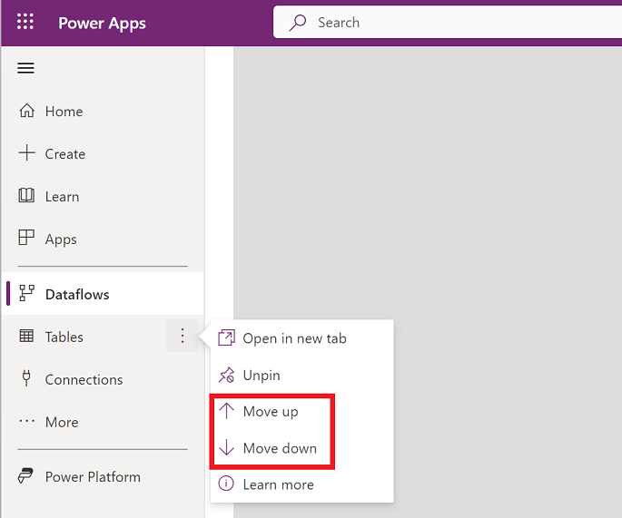

# How to navigate the Power Apps home page (preview)

Find what you need in the [Power Apps home page](https://make.powerapps.com) with the new navigation experience. The default menu on the left navigation pane 
has the follwoing options:

- **Home**: Takes you to the Power Apps home page.
- **Create**: This is where you create apps.
- **Learn**: The [learn hub](../common/learn-hub.md) lets you explore documents, training material, get help from the Power Apps community, and other resources that will help you to create and build Power Apps.
- **Apps**: If you've created an app (or someone else has created one and shared it with you), you can play or edit it. 
- **More**: Pin your most-used items to the left navigation such as tables, flows, and more.
- **Power Platform**: Takes you to Power Platform admin centers.

> [!div class="mx-imgBorder"] 
>  

## Left navigation pane

You can pin your most used pages in the navigation pane so you quickly access features that you use frequently. Links to other pages are availiable through the **More** link.

When you sign in for the first time to the new navigation experience the system will automatically pin your most and recently used pages on the navigation pane. 

> [!div class="mx-imgBorder"] 
>  

### Pin and unpin

To pin a page to the left navigation pane, select **More** and then choose the page that you want to pin.

> [!div class="mx-imgBorder"] 
>  

To unpin a page, from the left navigation menu select **More** and for the page that you want to unpin select, **Unpin**.

### Move up or move down

Once you pinned a few items you can also move them up or down them up or down the list. 

To move an item up or down, select the more button next to the page that you want o move and then select **MOve up** or **Move down**.

> [!div class="mx-imgBorder"] 
>  

