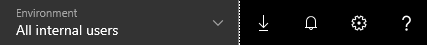
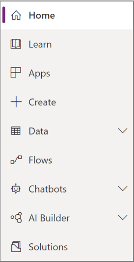
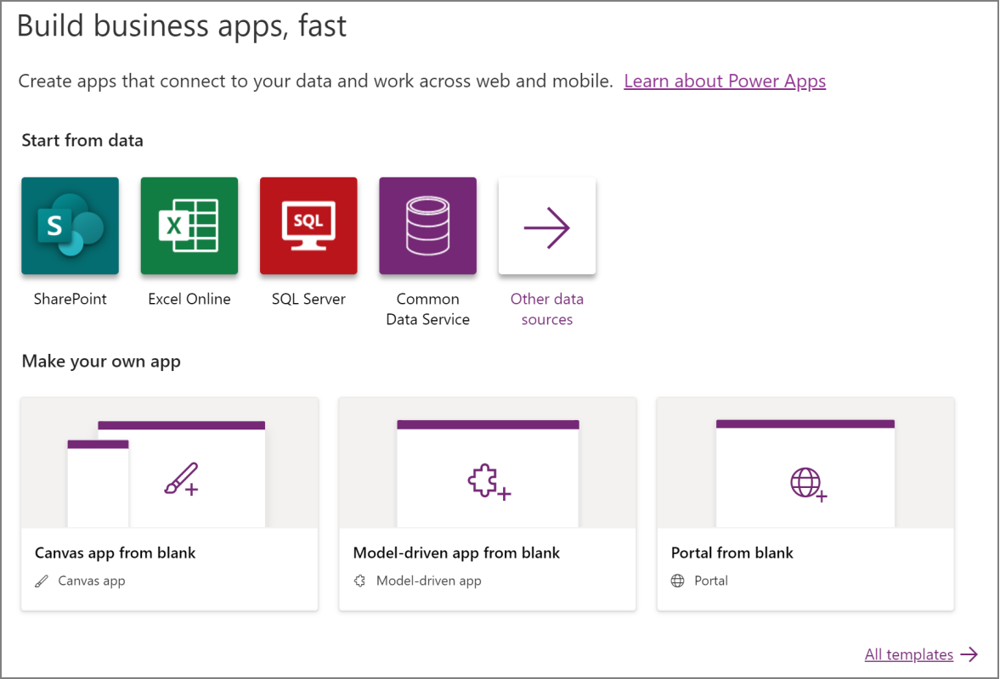
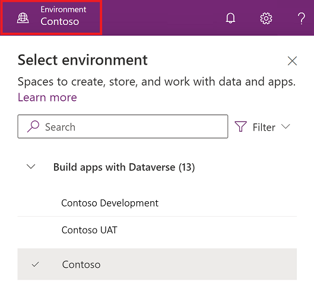
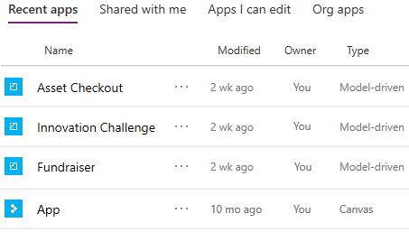
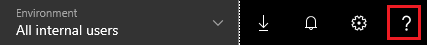

# Sign in to PowerApps for the first time

When you sign in to [PowerApps](https://web.powerapps.com?utm_source=padocs&utm_medium=linkinadoc&utm_campaign=referralsfromdoc), the site offers you a variety of options for creating your own apps, opening apps that you or others have created, and performing related tasks. These tasks range from the most simple, such as identifying the license or licenses that give you access, to more advanced capabilities, such as creating custom connections to specific data sources.

You can select options in three general areas:

- the header along the top of the page

    

- the navigation bar along the left edge of the page

    

- the large icons that feature prominently in the middle of the page

    

For best results, start by ensuring that the home page is set to the right environment.

## Choose an environment

Whether you're creating an app, a flow, a data connection, or an entity in the Common Data Service for Apps, much of what you do in PowerApps is contained in a specific environment. Environments create boundaries between different types of work; for example, an organization might have separate environments for different departments. Many organizations use environments to separate apps that are still being developed from those that are ready for widespread use. You might have access to multiple environments or only one and, if you have appropriate permissions, you might be able to create your own environments.

To verify which environment you're in, find the environment switcher near the right side of the header.

If you create an app in one environment, you won't be able to see it from another environment. In addition, people who want to run your app must have access to the environment in which you created it.

> [!IMPORTANT]
> Make sure that you're in the right environment *before* you create an app, a flow, or a similar component. You can't easily move components from one environment to another.

For more information, see [Environments overview](../../administrator/environments-overview.md).

## Choose an app type

In PowerApps, you can create and run these types of apps:

- **Canvas apps** support designing custom UI and connecting to data from a variety of sources.
- **Model-driven apps** have a standard UI and connect to data only in Common Data Service (CDS) for Apps. However, you can more easily create other elements such as views, dashboards, and different types of business logic.

If you choose an environment that has a CDS for Apps database, you can build canvas or model-driven apps from the same **Home** page.

## Play or edit an app

If you've created an app (or someone else has created one and shared it with you), you can play or edit it from the **Home** page or the **Apps** page.

On the **Apps** page, you can filter the list of apps based on criteria such as whether you opened it recently.

You can also search for an app by typing one or more characters in the search bar, which appears near the upper-right corner. When you find the app you want, select the banner icon to play or edit the app.

## Create an app

From the **Home** page, you can create apps in several ways:

- [generate a canvas app automatically from a set of data](data-platform-create-app.md)
- [customize a pre-built sample of a canvas app](open-and-run-a-sample-app.md)
- [build a canvas app from a blank screen](data-platform-create-app-scratch.md)
- [create your own model-driven app](../model-driven-apps/overview-model-driven-samples.md)
- [customize a pre-built sample for a model-driven app](../model-driven-apps/build-first-model-driven-app.md)

## Learn more

You can find more information about either canvas apps or model-driven apps in two ways:

- In the left navigation bar, select **Learn**.
- In the header, select the question-mark icon.

    

Both options show links to this documentation set, the PowerApps Community (where you can share information with users in other organizations), and the PowerApps blog (where the newest features are announced).

## Other common tasks

By selecting options in the header and left navigation bar, you can do more than create and open apps.

### From the header

- Select the down arrow to download mobile and other clients in which you can run apps.

    For more information, see [Find and run apps](../../user/index.md).

- Select the gear icon to perform tasks such as connecting to data sources, identifying your PowerApps license or licenses, and opening the page where you can perform administrative tasks.

    For more information, see these topics:

  - [Overview of canvas-app connectors](connections-list.md)
  - [Build and certify custom connectors for canvas apps](register-custom-api.md)
  - [Manage an on-premises data gateway](gateway-management.md)
  - [Administer PowerApps](../../administrator/index.md)
  - [Licensing overview](../../administrator/pricing-billing-skus.md)
  - [Overview of building a model-driven app](../model-driven-apps/model-driven-app-overview.md)

### From the left navigation bar

Extend the functionality of your apps by performing these tasks:

- Manage entities, option sets, and data integration in [Common Data Service for Apps](../common-data-service/data-platform-intro.md).
- Configure business logic in [Microsoft Flow](https://docs.microsoft.com/flow/getting-started).
- Author, package, and maintain [solutions](../../developer/common-data-service/introduction-solutions.md).
