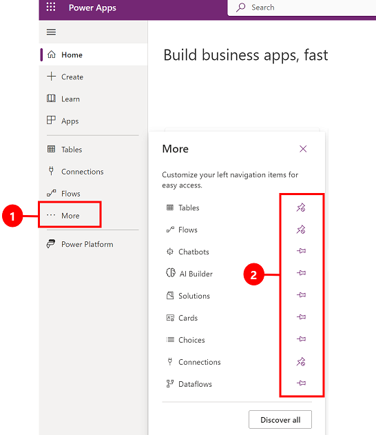
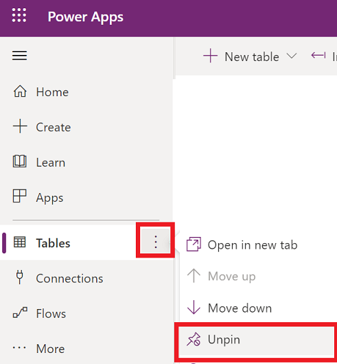
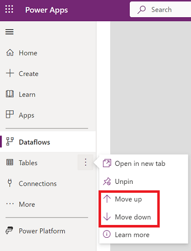
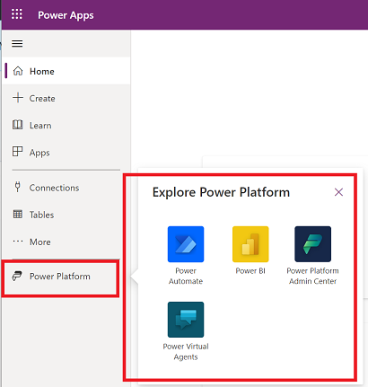
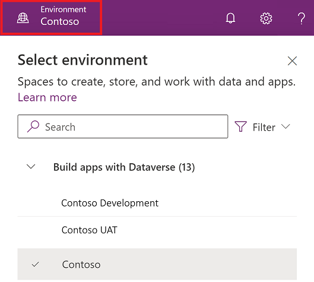
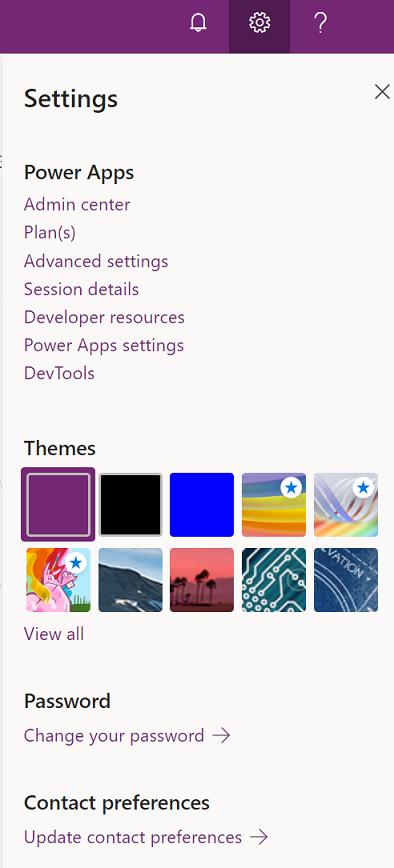
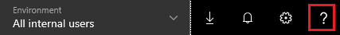

# Get started with Power Apps

Get started with Power Apps to build your first app quickly and efficiently. The Power Apps home page is your starting point for creating apps, managing existing ones, and accessing powerful features that streamline your workflow.

**What you'll accomplish:** By the end of this article, you'll learn how to navigate the interface, create your first app, and access Copilot AI features to accelerate development.

Select the appropriate tab in the following section to learn more.

:::image type="content" source="media/intro-maker-portal/homepage-new-look.png" alt-text="Screenshot of Power Apps home page." lightbox="media/intro-maker-portal/homepage-new-look.png":::

Legend:

1. [Left navigation pane](#1--left-navigation-pane)
1. [Search](#2--search)
1. [Environment information and settings](#3--environment-information-and-settings)
1. [Build apps](#4--build-apps)
1. [View and edit plans](#5---view-and-edit-plans)
1. [View and edit apps](#6--view-and-edit-apps)

> [!NOTE]
>
> Try the new Power Apps experience—an AI-native solution designed to simplify app creation. Effortlessly automate workflows, connect data sources, and speed up development, all without needing advanced coding skills. For more information, see [Overview of the New Power Apps experience (preview)](../../vibe/overview.md).

### Quick start options

- **New to Power Apps?** Start with our [5-minute canvas app tutorial](create-blank-app.md)
- **Have existing data?** [Create an app from SharePoint](app-from-sharepoint.md) or [Excel](get-started-create-from-blank.md)
- **Need help choosing?** Review [which app type is right for you](../../index.yml)

## 1 – Left navigation pane

**Your main control center.** When you sign in to the [Power Apps home page](https://make.powerapps.com), the left navigation pane gives you quick access to everything you need. Here's what each option does:

:::image type="content" source="media/intro-maker-portal/default-nav-1.png" alt-text="Screenshot of Power Apps home page navigation pane." lightbox="media/intro-maker-portal/default-nav-1.png":::

Legend:

1. **Home**: Takes you to the Power Apps home page.
1. **Create**: Create apps such as [canvas apps](/powerapps/maker/canvas-apps/), [model-driven apps](/powerapps/maker/model-driven-apps/), [chatbots](/powerapps/chatbots), and [AI models](/powerapps/use-ai-builder).
1. **Learn**: The [learn hub](../common/learn-hub.md) lets you explore documents, training material, get help from the Power Apps community, and other resources that help you to create and build Power Apps.
1. **Plans**: View and edit your plans. For more information, see [Overview of Plan designer](../plan-designer/plan-designer.md).
1. **Apps**: If you created an app or someone else created one and shared it with you, you can play or edit it. You can also filter the list of apps based on criteria such as whether you opened it recently.
1. **AI hub**: Create and use AI models that optimize your business processes. For more information, see [Overview of AI Builder](/ai-builder/overview).
1. **Your most used pages such as Tables, Connections, Flows**: When you first sign in, the top three pages that you use most are pinned to the left navigation pane. Use the **More** option to unpin any of these pages and pin something else.
1. **More**: Pin your most used items to the left navigation such as tables, flows, and more.
1. **Power Platform**: Explore other Power Platform products or service.

### Pin and unpin

Pin your most used pages in the navigation pane so you can quickly access features that you use frequently. Links to other pages are available through the **More** link. When you pin an item, it appears in the middle section above **More**.

When you sign in, the system automatically pins your most and recently used pages on the left navigation pane. However, you can pin and unpin pages and customize it to your preference.

To pin or unpin a page from the left navigation pane, select **More**, and then select the  pin or  unpin button.

> [!div class="mx-imgBorder"]
> 

You can also unpin an item by selecting the more button and then select **Unpin**.

> [!div class="mx-imgBorder"]
> 

### Discover all

To see all your Power Apps, from the left navigation pane, select **More** > **Discover all**. To keep it pinned, select the  pin button.

### Move up or move down

When you have a few pages pinned in the navigation pane, you can start moving them up or down.

To move a page up or down, select the more button next to the page that you want to move, and then select **Move up** or **Move down**.

> [!div class="mx-imgBorder"]
> 

### Power Platform

From the left navigation pane, select **Power Platform** to access Power Platform services such as Power Platform Admin Center, Power BI, and Power Automate.

> [!div class="mx-imgBorder"]
> 

## 2 – Search

**Find anything fast.** The search bar helps you:
- Locate your apps by typing any part of the name
- Discover new app templates
- Access help documentation

**Quick tip:** Start typing in the search bar, and then select the banner icon next to your app to open or edit it.

## 3 – Environment information and settings

View your environment information and settings.

### Choose an environment

For best results, start by ensuring that the home page is set to the right environment. For more information, see [Choose an environment](sign-in-to-power-apps.md#choose-an-environment).

> [!div class="mx-imgBorder"]
> 

Manage environments by using [Power Platform admin center](/power-platform/admin/environments-overview#manage-environments-in-the-power-platform-admin-center).

### Notifications

Select the bell icon to see notifications. The notification center stores notifications until you dismiss them or when they expire.

### Settings

Select the gear icon to perform tasks such as connecting to data sources, identify your Power Apps licenses, and open the page where you can perform administrative tasks.

- **Admin center**: Opens another window and goes to the Power Platform admin center.
- **Plans(s)**: View your licenses. For more information, see [Licensing overview](/power-platform/admin/pricing-billing-skus).
- **Advanced settings**: Manage your admin settings. For more information, see [Manage Microsoft Dataverse settings](/power-platform/admin/admin-settings#environment-settings-are-moving).
- **Session details**: View your Power Apps session details such as session ID, tenant ID, environment ID, and more.
- **Developer resources**: Access developer resources.
- **Power Apps settings**: View or update your language and time settings, notifications, or access directories.
- **Themes**: From the list of themes, select a theme for your organization.
- **Password**: Change your password.
- **Contact preferences**: Update your contact information.

  > [!div class="mx-imgBorder"]
  > 

### Help

In the header, select the question mark icon to find more information about [Power Apps](../../index.yml).

> [!div class="mx-imgBorder"]
> 

You find links to documentation, Power Apps training on Microsoft Learn, the Power Apps Community where you can share information with users in other organizations, and the Power Apps blog where the newest features are announced.

## 4 – Build apps

**Ready to build your first app?** Choose the option that best fits your needs:

- **[Start with a design →](create-blank-app.md)**: Pick a layout or start with blank canvas app and design your app.
- **[Start with data →](data-platform-create-app-scratch.md)**: Create a new table in Dataverse, or connect to an existing datasource, such as Dataverse, SharePoint, Excel, SQL, or upload a file.
- **[Start with a plan →](../plan-designer/plan-designer.md)**: Use plans to describe your business problem and generate apps, tables, and more.

You can also create app using the **Create** menu on the left navigation pane. Review the following articles, to learn more about creating apps:

- [Create a blank canvas app from scratch](create-blank-app.md).
- [Create a canvas app using Microsoft Dataverse](data-platform-create-app-scratch.md)
- [create a canvas app based on Excel data](get-started-create-from-blank.md).
- [Create a canvas app with data from a list](app-from-sharepoint.md)

  > [!NOTE]
  >  If you're trying to create an app by using Dataverse but the option is unavailable, review the [permissions table](#permissions-for-dataverse) in this article.

### Permissions for Dataverse

**Can't create a Dataverse app?** This table shows what happens based on your permissions and helps you understand your next steps.

| **Maker has access to a developer environment** | **Maker has permission to create a developer environment** |  **Maker has access to another Dataverse environment with required permissions** | **Action** | 
| --- | --- | --- |--- |
| Yes| n/a  | n/a  |  Switch to the developer environment that appears first in the alphabetical list |  
| No| Yes  | n/a | Create a developer environment | 
| No |No | Yes | Switch to another environment using the environment picker | 
| No|No| No | Contact your admin |

## 5 - View and edit plans

Select a plan to [view and edit a plan](../plan-designer/create-plan.md#view-and-edit-plans). You can also, use the **Plans** menu in the left navigation pane to access your plans.

## 6 – View and edit apps

**Manage your apps effectively:**

- **Access your apps:** Use the **Apps** menu in the left navigation pane to find apps you own or apps shared with you
- **Find apps quickly:** Filter and sort apps to locate what you need
- **Take action:** Hover over any app name to **Edit**, **Play**, or access **Commands** for sharing, viewing details, and settings

**Ready to customize?** [Learn advanced app editing techniques →](../../index.yml)

