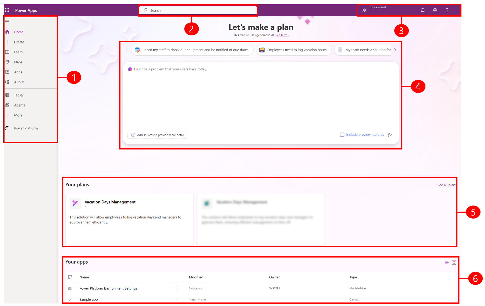
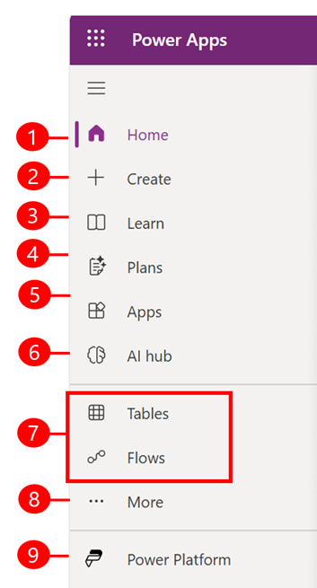
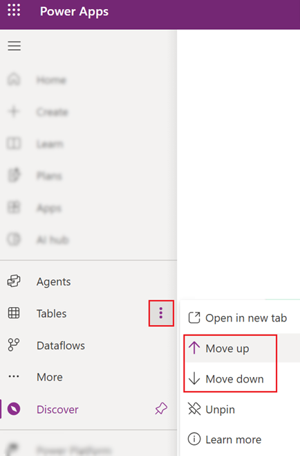

# Get started with Power Apps

The [Power Apps](https://make.powerapps.com?utm_source=padocs&utm_medium=linkinadoc&utm_campaign=referralsfromdoc) home page offers you various options for creating your own apps, opening apps that you or others have created, and performing related tasks. These tasks range from the most simple, such as identifying the license or licenses that give you access, to more advanced capabilities like creating custom connections to specific data sources.

A new version of the home page is being rolled out which provides a better app creation experience. If your organization has AI enabled then it also includes the new [Copilot](ai-overview.md) features. The new look is on by default. However, you can turn it off by using the toggle on the top-right corner of the home page.

> [!div class="mx-imgBorder"]
> 

Select the appropriate tab below to know more.

# [New look (preview)](#tab/home-new-look)

[This article is prerelease documentation and is subject to change.]

> [!div class="mx-imgBorder"]
> 

Legend:

1. [Left navigation pane](#1--left-navigation-pane)
2. [Search](#2--search)
3. [Environment information and settings](#3--environment-information-and-settings)
4. [Build apps](#4--build-apps)
5. [Get help from a virtual agent](#5--ask-a-virtual-agent)

# [Classic](#tab/home-classic)

> [!div class="mx-imgBorder"]
> 

Legend:

1. [Left navigation pane](#1--left-navigation-pane)
2. [Search](#2--search)
3. [Environment information and settings](#3--environment-information-and-settings)
4. [Build apps](#4--build-apps)
5. [Get help from a virtual agent](#5--ask-a-virtual-agent)

---

## 1 – Left navigation pane

Find what you need with the left navigation pane. When you sign in to [Power Apps home page](https://make.powerapps.com) the left navigation pane shows the following menu items:

> [!div class="mx-imgBorder"]
> 

Legend:

1. **Home**: Takes you to the Power Apps home page.
2. **Create**: Create apps as such as [canvas apps](/powerapps/maker/canvas-apps/), [model-driven apps](/powerapps/maker/model-driven-apps/), [chatbots](/powerapps/chatbots), and [AI models](/powerapps/use-ai-builder).
3. **Learn**: The [learn hub](../common/learn-hub.md) lets you explore documents, training material, get help from the Power Apps community, and other resources that help you to create and build Power Apps.
4. **Apps**: If you've created an app or someone else has created one and shared it with you, you can play or edit it. You can also filter the list of apps based on criteria such as whether you opened it recently.
5. **Your most used pages such as Tables, Connections, Flows**: When you first sign in the top three pages that you use most are pinned to the left navigation pane. Use the **More** option to unpin any of these pages and pin something else.
6. **More**: Pin your most used items to the left navigation such as tables, flows, and more.
7. **Power Platform**: Explore other Power Platform products or service.

### Pin and unpin

Pin your most used pages in the navigation pane so you can quickly access features that you use frequently. Links to other pages are available through the **More** link. When you pin an item, it appears in the middle section above **More**.

When you sign in, the system automatically pins your most and recently used pages on the left navigation pane. However, you can pin and unpin pages and customize it to your preference.

To pin or unpin a page from the left navigation pane, select **More**, and then select the  pin or  unpin button.

> [!div class="mx-imgBorder"]
> 

You can also unpin and item by selecting the more button and then select **Unpin**.

> [!div class="mx-imgBorder"]
> 

### Discover all

To see all your Power Apps, from the left navigation pane, select **More** > **Discover all**.

> [!div class="mx-imgBorder"]
> 

Select **Discover all** to see the **Discover** page on the left navigation pane. To keep in pinned, select the  pin button.

### Move up or move down

When you have a few pages pinned in the navigation pane, you can start moving them up or down.

To move a page up or down, select the more button next to the page that you want to move, and then select **Move up** or **Move down**.

> [!div class="mx-imgBorder"]
> 

### Power Platform

From the left navigation pane, select **Power Platform** to access Power Platform services such as Power Platform Admin Center, Power BI, and Power Automate.

> [!div class="mx-imgBorder"]
> 

## 2 – Search

Use the **Search** to find apps, create apps, or find help documentation.

To find your app, start typing one or more characters in the search bar. When you find the app you want, select the banner icon to play or edit the app.

## 3 – Environment information and settings

View your environment information and settings.

### Choose an environment

For best results, start by ensuring that the home page is set to the right environment. More information [Choose an environment](sign-in-to-power-apps.md#choose-an-environment).

> [!div class="mx-imgBorder"]
> 

### Notifications

Select the bell icon to see notifications. Notifications are stored in the notification center until you dismiss them or when they expire.

### Settings

Select the gear icon to perform tasks such as connecting to data sources, identify your Power Apps license or licenses, and open the page where you can perform administrative tasks.

- **Admin center**: Opens another windows and goes to the Power Platform admin center.
- **Plans(s)**: View your licenses. More information: [Licensing overview](/power-platform/admin/pricing-billing-skus)
- **Advanced settings**: Manage your admin settings. More information: [Manage Microsoft Dataverse settings](/power-platform/admin/admin-settings#environment-settings-are-moving).
- **Session details**: View your Power Apps session details such as session ID, tenant ID, environment ID and more.
- **Developer resources**: Access developer resources.
- **Power Apps settings**: View or update your language and time settings, notifications, or access directories.
- **Themes**: From the list of themes, select a theme for your organization.
- **Password**: Change your password.
- **Contact preferences**: Update your contact information.

  > [!div class="mx-imgBorder"]
  > 

### Help

In the header, select the question mark icon to find more information about either canvas apps or model-driven apps.

> [!div class="mx-imgBorder"]
> 

You'll find links to documentation, Power Apps training on Microsoft Learn, the Power Apps Community (where you can share information with users in other organizations), and the Power Apps blog (where the newest features are announced).

## 4 – Build apps

Start building apps, which provide rich business logic and workflow capabilities to transform your manual business operations into digital, automated processes.

Depending upon whether you have the new look turned on, select the appropriate tab below to know more.

# [New look (preview)](#tab/home-new-look)

[This article is prerelease documentation and is subject to change.]

If your organization has [AI enabled](ai-overview.md) then you'll see AI assistant on the Power Apps Home screen. For more information, see [Build apps through conversation](ai-conversations-create-app.md).

To create an app, select from the following options:

- **Start with data**: Lets you upload an [Excel file](get-started-create-from-data.md), build your own table, select a [Dataverse table](data-platform-create-app.md), or choose from external data source such as [SharePoint](app-from-sharepoint.md), [Excel](./connections/connection-excel.md), or [SQL](./connections/connection-azure-sqldatabase.md) to start building your app.
- **Choose a page template**: Select the type of app you want to create. You can also use the **Filter** option located in the top-right to narrow down templates by app type or features, such as offline use, responsive design, or embed into other Microsoft 365 products. More information: [Overview of creating apps in Power Apps](../index.md)
- **Pick an app template**: Choose from an app template including, data-centered templates for mobile apps. More information: [Create a canvas app from a template](get-started-test-drive.md)

> [!NOTE]
>  If you're trying to create an app using Dataverse but the option is unavailable, then review the [permissions table](#permissions-for-dataverse) below.

Furthermore, you can locate your top six apps under **Your apps**. You have the option to filter and sort them to quickly find the app you're searching for. Use the **Commands** button to perform various actions such as editing the app, viewing app details, and accessing settings.

### Permissions for Dataverse

The table summarizes scenarios and outcome when you create apps that require Microsoft Dataverse.

| **Maker has access to a developer environment** | **Maker has permission to create a developer environment** |  **Maker has access to another Dataverse environment with required permissions** | **Action** | 
| --- | --- | --- |--- |
| Yes| n/a  | n/a  |  Switch to the developer environment that appears first in the alphabetical list |  
| No| Yes  | n/a | Create a developer environment | 
| No |No | Yes | Switch to another environment using the environment picker | 
| No|No| No | Contact your admin |

# [Classic](#tab/home-classic)

In Power Apps, you can create and run these types of apps:

- **Canvas apps** support designing custom UI and connecting to data from various sources.
- **Model-driven apps** have a standard UI and connect to data only in Dataverse. However, you can more easily create other elements such as views, dashboards, and different types of business logic.
- **Cards** (preview) are micro-apps with enterprise data and workflows and interactive, lightweight UI elements that other applications can use as content.

In addition, Power Apps also allows you to create Power Pages websites. More information: [What is Power Pages?](/power-pages/introduction)

If you choose an [environment that has a Dataverse database](/power-platform/admin/create-environment#create-an-environment-with-a-database), you can build canvas or model-driven apps from the same **Home** page.

From the **Home** page, you can create apps, websites, chatbots, and AI models:

- [Get started with canvas apps](/powerapps/maker/canvas-apps/)
- [Get started with model-driven apps](/powerapps/maker/model-driven-apps/)
- [Get started with chatbots](/powerapps/chatbots)
- [Get started with AI models](/powerapps/use-ai-builder)

---

## 5 – Ask a virtual agent

Get contextual help while building your app using the Power Platform virtual agent. More information: [Get help building your app from a virtual agent](/power-apps/maker/common/virtual-agent)
