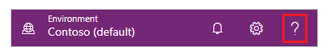

# Get started with Power Apps (preview)

[This article is prerelease documentation and is subject to change.]

The [Power Apps](https://make.powerapps.com?utm_source=padocs&utm_medium=linkinadoc&utm_campaign=referralsfromdoc) home page offers you various options for creating your own apps, opening apps that you or others have created, and performing related tasks. These tasks range from the most simple, such as identifying the license or licenses that give you access, to more advanced capabilities like creating custom connections to specific data sources.

You can select options in these general areas:

1. [Left navigation pane](#1--left-navigation-pane)
2. [Search bar at the top](#2--search-bar)
3. [Header on the top right of the page](#3--header-on-the-top-right-on-the-page)
4. [Large icons that feature prominently in the middle of the page]()
5. [Get help from a virtual agent])(#5--ask-a-virtual-agent) 

> [!div class="mx-imgBorder"]
> 

> [!IMPORTANT]
> - This is a preview feature.
> - Preview features aren’t meant for production use and may have restricted functionality. These features are available before an official release so that customers can get early access and provide feedback.

## 1 – Left navigation pane 

Find what you need with the new left navigation experience. If this is the first time you're signing in to the [Power Apps home page](https://make.powerapps.com) the default left navigation pane will show the following menu items:

- **Home**: Takes you to the Power Apps home page.
- **Create**: This is where you create apps as such as [canvas apps](/powerapps/maker/canvas-apps/), [model-driven apps](/powerapps/maker/model-driven-apps/), [chatbots](/powerapps/chatbots), and [AI models](/powerapps/use-ai-builder).
- **Learn**: The [learn hub](../common/learn-hub.md) lets you explore documents, training material, get help from the Power Apps community, and other resources that will help you to create and build Power Apps.
- **Apps**: If you've created an app (or someone else has created one and shared it with you), you can play or edit it. You can also filter the list of apps based on criteria such as whether you opened it recently.
- **More**: Pin your most-used items to the left navigation such as tables, flows, and more.
- **Power Platform**: Links to the Power Platform admin center.

> [!div class="mx-imgBorder"]
> 

### Pin and unpin

You can pin your most used pages in the navigation pane so you quickly access features that you use frequently. Links to other pages are available through the **More** link. When you pin an item it appear in the middle section, aboce the **More** menu. 

When you sign in for the first with the new navigation, the system will automatically pin your most and recently used pages on the left navigation pane. However, you can customize the middle section of the left navigation pane to your preference. 

> [!div class="mx-imgBorder"]
> 

To pin a page to the left navigation pane, select **More** and then choose the page that you want to pin.

> [!div class="mx-imgBorder"]
> 

To unpin a page, from the left navigation menu select the more button next to the page that you want to unpin and then select **Unpin**.

### Move up or move down

Once you pinned a few items you can also move them up or down them up or down the list.

To move an item up or down, select the more button next to the page that you want to move, and then select **Move up** or **Move down**.

> [!div class="mx-imgBorder"] 
> 

## 2 – Search bar

Use the **Search** to find apps, create app, or find help documentation. 

To find your app, start typing one or more characters in the search bar. When you find the app you want, select the banner icon to play or edit the app.

## 3 – Header on the top right on the page

View your environment information and settings.

### Choose an environment

For best results, start by ensuring that the home page is set to the right environment. More information [Sign in to Power Apps](sign-in.md).

### Notifications

When you have notification you will see them in the notication center. Notifications are stored in the notification center until you dismiss them or when they expire. 

### Settings

Select the gear icon to perform tasks such as connecting to data sources, identifying your Power Apps license or licenses, and opening the page where you can perform administrative tasks.

- **Admin center**: Opens another windows and go to your Power Platform admin center.
- **Plans(s)**: View the your licenses. More information: [Licensing overview](/power-platform/admin/pricing-billing-skus)
- **Advanced settings**: Manage your admin settings. More information: [Manage Microsoft Dataverse settings](power-platform/admin/admin-settings#environment-settings-are-moving).
- **Session details**: View your Power Apps session details such as session ID, tenant ID, environment ID and more. 
- **Developer resources**: Access developer resources.
- **Power Apps settings**: View or update your language and time settings, notifications, or access directories.
- **DevTools**: Access DevToos.
- **Themes**: From the list of themes select a theme for your organization.
- **Password**: Change your password.
- **Contact preferences**: Update your contact information.

> [!div class="mx-imgBorder"]
> 

### Help

In the header, select the question mark icon to find more information about either canvas apps or model-driven apps.

> [!div class="mx-imgBorder"]
> 

You'll find link to documentation, Power Apps training on Microsoft Learn, the Power Apps Community (where you can share information with users in other organizations), and the Power Apps blog (where the newest features are announced).

## 5 – Ask a virtual agent

Get contextual help while building your app using the Power Platform virtual agent. More information: [Get help building your app from a virtual agent](/power-apps/maker/common/virtual-agent)
