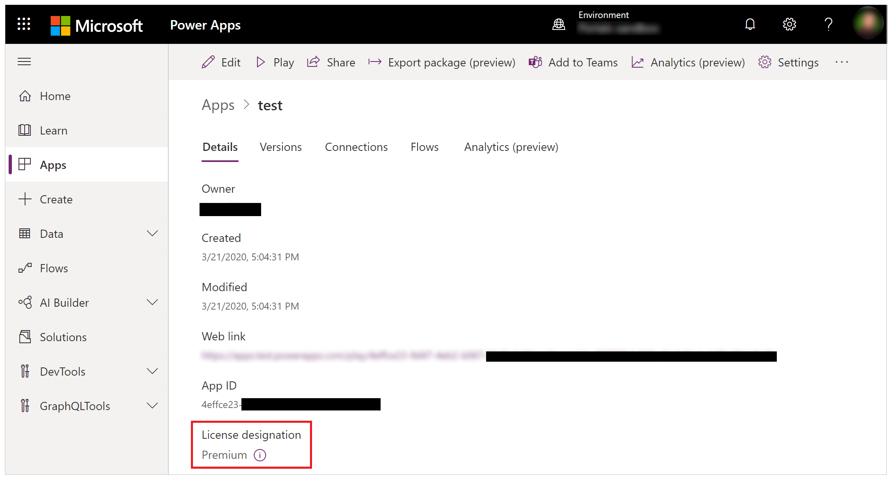

# How to check license designation for an app

Starting October 2019, several connectors are reclassified from Standard to Premium.

[Power Apps licensing FAQ](/power-platform/admin/powerapps-flow-licensing-faq#office-365) outlines
reclassified connectors. Apps using these connectors before the
reclassification have been granted an extended timeframe allowing users
without a premium license to access these apps.

The following table outlines the designations and which license an end user must have to access an app.

| **Designation​** | **Definition**
|-|-|
| Standard​ | An app that only uses standard connectors. An end user must have a Power Apps for Office 365 plan, per app plan, or a per user plan to access this app.
| Extended​ | An app allowed to use connectors promoted to premium on October 1, 2019.​ An end user must have a Power Apps for Office 365 plan, per app plan or per user plan. [Power Apps licensing FAQ](/power-platform/admin/powerapps-flow-licensing-faq#office-365) outlines which connectors were promoted to premium on October 1, 2019.
| Premium​ | An app that uses at least one premium connector, a custom connector or an on-premise gateway. An end user must have a per app plan or per user plan to access.

> [!NOTE]
> Power Apps built in Microsoft Teams environments that connect to Dataverse for Teams, or use custom connectors have **Premium** license designation.
> - End-users with a [Microsoft 365 subscription including Dataverse for Teams use rights](/power-platform/admin/powerapps-flow-licensing-faq#which-microsoft-365-subscriptions-include-dataverse-for-teams-and-power-virtual-agents-capabilities-with-teams) will be able to run these apps in Microsoft Teams. 
> - End-users that attempt to run these apps outside of Microsoft Teams are required to have a per app plan or per user plan.

## Check app license designation from app settings

1. Sign in to [Power Apps](https://make.powerapps.com).

1. Select **Apps** from left side.

1. Select an app from the list of app. You can use the **Settings** option from top or, use the **More Commands** (**...**) and then **Settings** from the drop-down menu:

    

1. Select **Settings** to see the license designation information:

    

## Check app license designation from app details

1. Sign in to [Power Apps](https://make.powerapps.com).

1. Select **Apps** from left side.

1. Select an app from the list of app. You can use the **Details** option from top or, use the **More Commands** (**...**) and then **Details** from the drop-down menu:

    

1. Select **Details**:

    

## Pass assignment

For information about Pass assignment, read [Power Apps per app
plans](/power-platform/admin/about-powerapps-perapp#step-three-set-up-apps-to-use-per-app-plans).

## Next steps

- [Power Apps licensing FAQ](/power-platform/admin/powerapps-flow-licensing-faq)

### See also

- [Edit an app](edit-app.md)
- [Delete an app](delete-app.md)

[!INCLUDE[footer-include](../../includes/footer-banner.md)]
