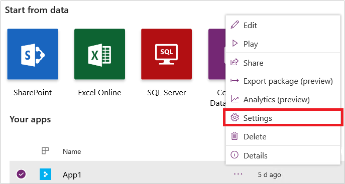
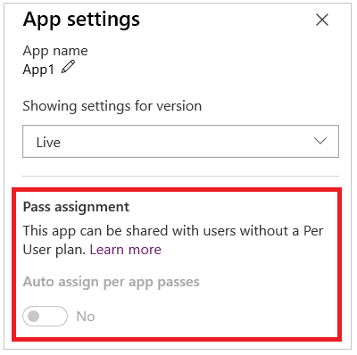

# System requirements, limits, and configuration values for canvas apps
This topic contains device platform and web browser requirements, as well as limits and configuration values for PowerApps.

## Supported platforms for running canvas apps using the PowerApps app

| **Minimum required** | **Recommended** |
| --- | --- |
| iOS 9.3 or later |iOS 10 or later with at least 2GB of RAM |
| Android 5 or later |Android 7 or later with at least 4GB of RAM |
| Windows 8.1 or later (PC only) |Windows 10 Fall Creators Update with at least 8 GB of RAM)|

> [!NOTE]
> We currently do not support new features on Windows platform for PowerApps app. Features such as improved Common Data Service capabilities and guest access are not be available for PowerApps app on this platform. We recommend using web player on Windows to leverage the full set of functionalities. Updates to PowerApps app for Windows platform will be announced in future.

## Supported browsers for running canvas apps

| **Browser** | **Operating system** |
| --- | --- |
| Google Chrome (latest version) (recommended) |Windows 7 SP1, 8.1, and 10  Android 5 or later  iOS 8 or later macOS |
| Microsoft Edge (latest version) (recommended) |Windows 10 |
| Microsoft Internet Explorer 11 (with Compatibility View off) |Windows 7 SP1, 8.1, and 10 |
| Mozilla Firefox (latest version) |Windows 7 SP1, 8.1, and 10   Android 5 or later  iOS 8 or later  macOS |
| Apple Safari (latest version) |iOS 8 or later  macOS |

## Supported browsers for PowerApps Studio

| **Browser** | **Operating system** |
| --- | --- |
| Google Chrome (latest version) (recommended) |Windows 7 SP1, 8.1, and 10  macOS |
| Microsoft Edge (latest version) (recommended) |Windows 10 |
| Microsoft Internet Explorer 11 (with Compatibility View off) |Windows 7 SP1, 8.1, and 10 |

## Request limits
These limits apply to each single outgoing request:

| Name | Limit |
| --- | --- |
| Timeout |180 Seconds |
| Retry attempts |4 |

> [!NOTE]
> The retry value may vary. For certain error conditions, it's not necessary to retry.

## IP addresses
Requests from PowerApps use IP addresses that depend on the region of the [environment](../../administrator/environments-overview.md) that the app is in. We don't publish fully qualified domain names available for PowerApps scenarios.

Calls made from an API connected through an app (for example, the SQL API or the SharePoint API) come from the IP address specified later in this topic.

You should use these addresses if, for example, you must whitelist IP addresses for an Azure SQL database.

> [!IMPORTANT]
>   If you have existing configurations, please update them as soon as possible before September 30, 2018 so they include and match the IP addresses in this list for the regions where your PowerApps apps exist.

| Region | Outbound IP |
| --- | --- |
| Asia | 13.75.36.64 - 13.75.36.79, 13.67.8.240 - 13.67.8.255, 52.175.23.169, 52.187.68.19 |
| Australia  | 13.70.72.192 - 13.70.72.207, 13.72.243.10, 13.77.50.240 - 13.77.50.255, 13.70.136.174 |
| Brazil | 191.233.203.192 - 191.233.203.207, 104.214.19.48 - 104.214.19.63, 13.65.86.57, 104.41.59.51 |
| Canada | 13.71.170.208 - 13.71.170.223, 13.71.170.224 - 13.71.170.239, 52.237.24.126, 40.69.106.240 - 40.69.106.255, 52.242.35.152|
| Europe | 13.69.227.208 - 13.69.227.223, 52.178.150.68, 13.69.64.208 - 13.69.64.223, 52.174.88.118, 137.117.161.181|
| India  | 104.211.81.192 - 104.211.81.207, 52.172.211.12, 40.78.194.240 - 40.78.194.255, 13.71.125.22, 104.211.146.224 - 104.211.146.239, 104.211.189.218 |
| Japan | 13.78.108.0 - 13.78.108.15, 13.71.153.19, 40.74.100.224 - 40.74.100.239, 104.215.61.248 |
| South America | 191.233.203.192 - 191.233.203.207, 104.214.19.48 - 104.214.19.63, 13.65.86.57, 104.41.59.51 |
| United Kingdom | 51.140.148.0 - 51.140.148.15, 51.140.80.51, 51.140.211.0 - 51.140.211.15, 51.141.47.105 |
| United States | 13.89.171.80 - 13.89.171.95, 52.173.245.164, 40.71.11.80 - 40.71.11.95, 40.71.249.205, 40.70.146.208 - 40.70.146.223, 52.232.188.154, 52.162.107.160 - 52.162.107.175, 52.162.242.161, 40.112.243.160 - 40.112.243.175, 104.42.122.49 |
| United States (Early Access)  | 13.71.195.32 - 13.71.195.47, 52.161.102.22, 13.66.140.128 - 13.66.140.143, 52.183.78.157 |

## Required services
This list identifies all services to which PowerApps Studio talks and their usages. Your network must **not** block these services.

| Domain(s) | Protocols | Uses |
| --- | --- | --- |
| management.azure.com |https |RP |
| msmanaged-na.azure-apim.net |https |Runtime of Connectors/Apis |
| login.microsoft.com login.windows.net login.microsoftonline.com secure.aadcdn.microsoftonline-p.com |https |ADAL |
| graph.microsoft.com graph.windows.net |https |Azure Graph - For getting user info (e.g., profile photo) |
| gallery.azure.com |https |Sample and Template apps |
| \*.azure-apim.net |https |Api Hubs - Different sub-domains for each locale |
| \*.powerapps.com |https | create.powerapps.com, make.powerapps.com, content.powerapps.com, and web.powerapps.com |
| \*.azureedge.net |https | create.powerapps.com, make.powerapps.com, content.powerapps.com, and web.powerapps.com |
| \*.blob.core.windows.net |https | Blob storage |
| \*.flow.microsoft.com | https | create.powerapps.com, make.powerapps.com, content.powerapps.com, and web.powerapps.com |
| vortex.data.microsoft.com |https |Telemetry |
| localhost | https | PowerApps Mobile

> [!NOTE]
> If you're using a VPN, it must be configured to exclude localhost from tunneling for PowerApps Mobile.

## Size limits

You can find information about size limits on text, hyperlinks, images, and media in [Data types](functions/data-types.md#text-hyperlink-image-and-media).

## PowerApps per app plan

PowerApps per app plan allows individual users to run 2 applications on a single portal for a specific business scenario based on the full capabilities of PowerApps. This plan provides an easy way for users to get started with the platform before broader scale adoption.

After an admin allocates PowerApps per app plan to an environment, they're assigned to users by default when app is shared with them.

Follow these steps to turn off the assigning per app plans for users when an app is shared with them:

- Choose the **App**.
- Select **Settings**.
- Change the **Auto assign per app passes** toggle under **Pass assignment**.

The **Auto assign per app passes** toggle appears in all app setting.

> [!NOTE]
> Disabling the per app plan is currently available for only canvas apps.  Model-driven apps and Portals will have this ability in the future.

### App Settings

### Pass assignment

