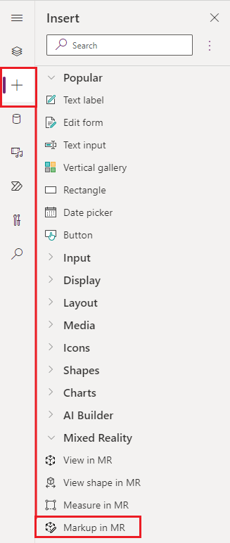
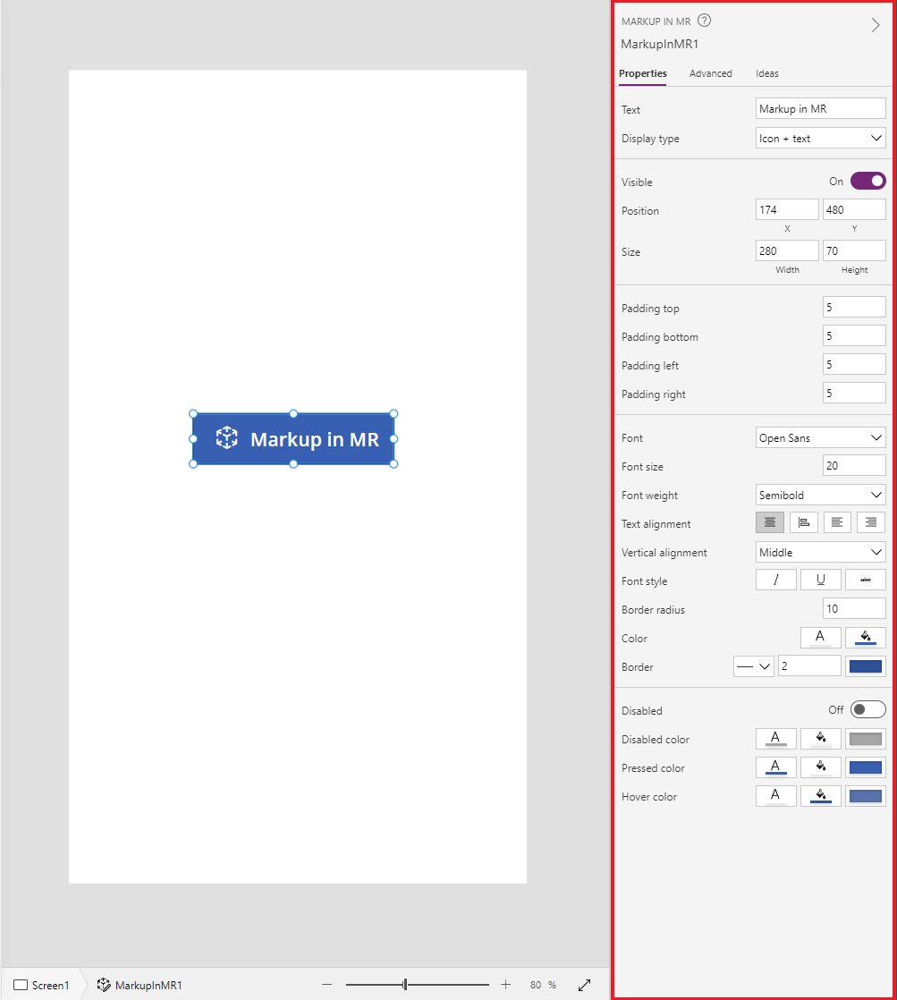

# Use the Markup in MR control in Power Apps (preview)

[This article is pre-release documentation and is subject to change.]

>[!IMPORTANT]
>This is a preview feature.
>[!INCLUDE[cc_preview_features_definition](../../includes/cc-preview-features-definition.md)]

Add the **Markup in MR** control in your app to allow users to add markups to visually specify an area or a particular asset in their environment.
Users can instantly place mixed reality markups such as arrows, add drawings, and then take photos of the marked-up object.

The **Markup in MR** control creates a **Markup in MR** button in your mixed reality app. When a user selects the **Markup in MR** button, it shows a live camera feed of the device. A user can identify points of interest to begin inking or adding arrows directly on the object.

Ink and arrows will scale appropriately depending on the distance from the objects. When you exit the **Markup in MR** screen screenshots are captured in the control's **Photos** output property.

> [!TIP]
> The mixed-reality (MR) controls work best in well-lit environments with flat-textured surfaces. Tracking is better on LIDAR-enabled devices.

> [!TIP]
> The MR controls in Power Apps use Babylon and Babylon React Native. Mixed reality content that works in the [Babylon sandbox](https://sandbox.babylonjs.com/) should work in Power Apps through this shared MR platform. If your content works in Babylon but not in Power Apps, ask a question in the [Power Apps Community Forum](https://powerusers.microsoft.com/t5/Get-Help-with-Power-Apps/ct-p/PA_General). (Tag it with "mixed reality.")

## Use Markup in MR

When a user selects the **Markup in MR** button, they will be prompted to move their phone side-to-side for better object or area detection. Once an object or area is detected the user can start using the markup toolbar.

### Add an arrow

To position an arrow:

- Make sure the arrow is selected in the markup toolbar.

- Move your device around to position the dot on the object or area you want.
    to highlight

- Select to place the ghost arrow on your device screen.

- To rotate the arrow, select and drag the arrow in a circular motion (360
    degrees).

### Inking

To determine where you start drawing:

- Make sure the ink pen is selected in the markup toolbar.

- Select and drag on the screen to start drawing.

## Add the Markup in MR control 

Insert the control into your app as you normally would for any other button control.

With an app open for editing in [Power Apps
Studio](https://create.powerapps.com/):

1. Open the **Insert** tab.

2. Expand **Mixed reality**.

3. Select the control **Markup in MR** to place it in the center of the app screen or drag and drop it to position it anywhere on the screen.

   > [!div class="mx-imgBorder"] 
   >

You can modify the control with several properties.

> [!TIP]
> Some properties are only available under **More options** in the **Advanced** tab on the **Markup in MR** pane.
> 
>   

| **Property**         | **Description**                                                                                                                                                                                                                       | **Type**       | **Location**                          |
|----------------------|---------------------------------------------------------------------------------------------------------------------------------------------------------------------------------------------------------------------------------------|----------------|---------------------------------------|
| Photos               | The photos captured during the mixed reality session. Note: You can [upload the mixed-reality photos to OneDrive and show them in a gallery](mixed-reality-take-upload-photos.md).                                                                                                                                                                                | Not Applicable | Not Applicable (Output property only) |                   
| OnMixedRealitySelect | Behavior that is triggered when exiting the MR experience with new results.                                                                                                                                                           | Defined Action | Advanced                              |
| OnChange             | Behavior that is triggered when any property on the button is changed.                                                                                                                                                                | Defined Action | Advanced                              |

### Additional properties

| **Property**                                                                                                             | **Description**                                                                                                                                                                            |
|--------------------------------------------------------------------------------------------------------------------------|--------------------------------------------------------------------------------------------------------------------------------------------------------------------------------------------|
| [**BorderColor**](./controls/properties-color-border.md)         | The color of a control's border.                                                                                                                                                           |
| [**BorderStyle**](./controls/properties-color-border.md)         | Whether a control's border is **Solid**, **Dashed**, **Dotted**, or **None**.                                                                                                              |
| [**BorderThickness**](./controls/properties-color-border.md)     | The thickness of a control's border.                                                                                                                                                       |
| [**Color**](./controls/properties-color-border.md)               | The color of text in a control.                                                                                                                                                            |
| [**DisplayMode**](./controls/properties-core.md)                 | Whether the control allows user input (**Edit**), only displays data (**View**), or is disabled (**Disabled**).                                                                            |
| [**DisabledBorderColor**](./controls/properties-color-border.md) | The color of a control's border if the control's [**DisplayMode**](./controls/properties-core.md) property is set to **Disabled**. |
| [**DisabledColor**](./controls/properties-color-border.md)       | The color of text in a control if its [**DisplayMode**](./controls/properties-core.md) property is set to **Disabled**.            |
| [**DisabledFill**](./controls/properties-color-border.md)        | The background color of a control if its [**DisplayMode**](./controls/properties-core.md) property is set to **Disabled**.         |
| [**FillColor**](./controls/properties-color-border.md)           | The background color of a control.                                                                                                                                                         |
| [**Font**](./controls/properties-text.md)                        | The name of the family of fonts in which text appears.                                                                                                                                     |
| [**FontStyle**](./controls/properties-text.md)                   | The style of the text in the control: **None**, **Strikethrough**, **Underline**, or **Italic**.                                                                                         |
| [**FontSize**](./controls/properties-text.md)                    | The font size of the text that appears on a control.                                                                                                                                       |
| [**FontWeight**](./controls/properties-text.md)                  | The weight of the text in a control: **Bold**, **Semibold**, **Normal**, or **Lighter**                                                                                                    |
| [**Height**](./controls/properties-size-location.md)             | The distance between a control's top and bottom edges.                                                                                                                                     |
| [**HoverBorderColor**](./controls/properties-color-border.md)    | The color of a control's border when the user keeps the mouse pointer on that control.                                                                                                     |
| [**HoverColor**](./controls/properties-color-border.md)          | The color of the text in a control when the user keeps the mouse pointer on it.                                                                                                            |
| [**HoverFill**](./controls/properties-color-border.md)           | The background color of a control when the user keeps the mouse pointer on it.                                                                                                             |
| [**PaddingBottom**](./controls/properties-size-location.md)      | The distance between text in a control and the bottom edge of that control.                                                                                                                |
| [**PaddingLeft**](./controls/properties-size-location.md)        | The distance between text in a control and the left edge of that control.                                                                                                                  |
| [**PaddingRight**](./controls/properties-size-location.md)       | The distance between text in a control and the right edge of that control.                                                                                                                 |
| [**PaddingTop**](./controls/properties-size-location.md)         | The distance between text in a control and the top edge of that control.                                                                                                                   |
| [**PressedBorderColor**](./controls/properties-color-border.md)  | The color of a control's border when the user taps or clicks that control.                                                                                                                 |
| [**PressedColor**](./controls/properties-color-border.md)        | The color of text in a control when the user taps or clicks that control.                                                                                                                  |
| [**PressedFill**](./controls/properties-color-border.md)         | The background color of a control when the user taps or clicks that control.                                                                                                               |
| [**TabIndex**](./controls/properties-accessibility.md)           | Keyboard navigation order.                                                                                                                                                                 |
| [**TextAlignment**](./controls/properties-text.md)               | The alignment of the text: **Center**, **Left**, **Right**, or **Justify**                                                                                                                 |
| [**Tooltip**](./controls/properties-core.md)                     | Explanatory text that appears when the user hovers over a control.                                                                                                                         |
| [**VerticalAlign**](./controls/properties-text.md)               | The location of text on a control in relation to the vertical center of that control: **Middle**, **Top**, or **Bottom**                                                                   |
| [**Visible**](./controls/properties-core.md)                     | Whether a control appears or is hidden.                                                                                                                                                    |
| [**Width**](./controls/properties-size-location.md)              | The distance between a control's left and right edges.                                                                                                                                     |
| [**X**](./controls/properties-size-location.md)                  | The distance between the left edge of a control and the left edge of its parent container (or the screen if there's no parent container).                                                  |
| [**Y**](./controls/properties-size-location.md)                  | The distance between the top edge of a control and the top edge of the parent container (or the screen if there's no parent container).                                                    |

### Output properties

| **Property** | **Description**                                                                                                                                                                                                                                 | **Type**       |
|--------------|-------------------------------------------------------------------------------------------------------------------------------------------------------------------------------------------------------------------------------------------------|----------------|
| Photos       | Collects the photos captured during the mixed reality session. You can [upload the mixed-reality photos to OneDrive and show them in a gallery](mixed-reality-take-upload-photos.md). | Not applicable |

## Other Mixed Reality controls

-   View 3D content with the [View in
    3D](mixed-reality-component-view-3d.md) control.

-   View images and 3D content in the real world with the [View in mixed
    reality](mixed-reality-component-view-mr.md) control.

-   Create and view predefined 3D shapes with the [View shape in mixed
    reality](mixed-reality-component-view-shape.md) control.

-   Measure distance, area, and volume with the [Measure in mixed
    reality](mixed-reality-component-measure-distance.md) control.

