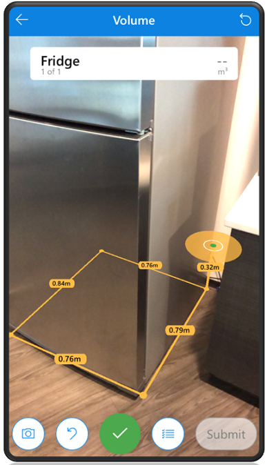
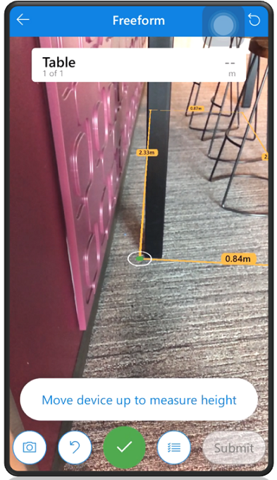

# Use the Measure in MR control to take measurements

Measure the distance, area, and volume of your physical space using your device camera.

To use the measurement feature, your app maker needs to enable the [Measure in MR](mixed-reality-component-measure-distance.md) control for your canvas app. Depending on how your app maker has configured the app, the type of measurements can vary as shown in the example below.

   > [!div class="mx-imgBorder"]
   > 

## Basic navigation

It's easy to get around and take measurements of your space. The following illustration shows the primary navigation elements.

   > [!div class="mx-imgBorder"]
   > 

Legend

1. **Camera**: Take a picture of your current view. The picture can be used by your
canvas app but isn't viewable when you're in a mixed reality experience.
1. **Undo**: Rewinds the last measurement action taken and returns to the state before the last add, reset, or delete.
1. **Add**: Select to start a new measurement or add a new measurement point. When you're done measuring the button changes to a checkmark button that you select to complete your measurement.
1. **Overview**: Opens a list with details of the items you have measured.
1. **Submit**: When you're done taking your measurement(s), use the Submit button to close the mixed reality experience and send the measurement(s) to your canvas app. The button is grayed out if there are no measurements or when you're in the process of taking measurements.
1. **Overview**: Opens a list with details of the items you have measured.
1. **Reset**: Clear all your measurements at once.
1. **Exit**: Leave the mixed reality experience and return to your canvas app.

## Take a measurement

1. Open your canvas app and select the **Measure in MR** button.

2. Follow the instructions on the screen by moving your device until it vibrates, and white dots appear. The white dot with a circle is the starting point of your measurement.

    

3. Select  to start a new measurement. Then follow these steps depending on the type of measurement you're taking:

   - **Distance**
     1. Select  and then slowly move the dot to where you want the measurement to end.
     1. Select the checkmark button to finish the measurement.

        > [!div class="mx-imgBorder"]
        > 

     1. Continue taking measurements, or select **Submit** to save your final measurements and return to your canvas app.
         > [!div class="mx-imgBorder"]
         > 

   - **Area**
      1. Select  to add points and outline the area that you want to measure.
         > [!div class="mx-imgBorder"]
         > 

      2. Connect the last dot to the first dot to complete the measurement. When you're done, select the checkmark button.
         > [!div class="mx-imgBorder"]
         > 

      3. Continue taking measurements, or select **Submit** to save your final measurements and return to your canvas app.
         > [!div class="mx-imgBorder"]
         > 

   - **Volume**
      1. Select  to add points and outline the base of the volume that you want to measure.
         > [!div class="mx-imgBorder"]
         > 

      1. Connect the last dot to the first dot to complete the measurement.
         > [!div class="mx-imgBorder"]
         > 

      1. Move your device upwards and select the desired height and then select the checkmark button.
         > [!div class="mx-imgBorder"]
         > 

      1. Continue taking measurements, or select **Submit** to save your final measurements and return to your canvas app.
          > [!div class="mx-imgBorder"]
          >   

          > [!NOTE]
          > If your app has **Box Draw** enabled then you can only measure volume by a rectangular prism. To take this measurement select four points; three to draw the base and one for the height.  
            

   - **Freeform**
       1. Select  to measure distance, multi-segment, area, and volume all together.
       1. Connect the last dot to the first dot to complete the measurement.
          > [!div class="mx-imgBorder"]
          >   

       1. Keep the dot at the last point and tap the green checkmark to finish your current measurement. Continue taking other measurements, or if you are done, select **Submit** to return to your canvas app.
          > [!div class="mx-imgBorder"]
          >   

          The same rectangle can be part of a volume measurement. Instead of selecting the last point you added, rotate your phone upwards to select a height and then  tap the green checkmark. Continue taking other measurements, or if you are done, select **Submit** to return to your canvas app.
           > [!div class="mx-imgBorder"]
           > 

> [!NOTE]
> If your app has **Box Draw** enabled, then in freeform you can only measure in a rectangular area and volume.

 track of your measurements

When you take measurements, you can always go back and review your measurements.

1. At the top select the measurement overview or select the overview button.

   > [!div class="mx-imgBorder"]
   > 

2. If your app maker has given you specific measurements to take, you can see their types here, beneath their label. Select the arrow next to measurement to view more details.

   > [!div class="mx-imgBorder"]
   > 

3. On the **Measurement Inputs** screen, you can do the following:

    - Select an incompleted measurement to measure it immediately.

    - Select the delete button to clear or remove a measurement.

    - Select the close button or overview button to continue measuring where you left off.
     > [!div class="mx-imgBorder"]
     > 

[!INCLUDE[footer-include](../../includes/footer-banner.md)]
