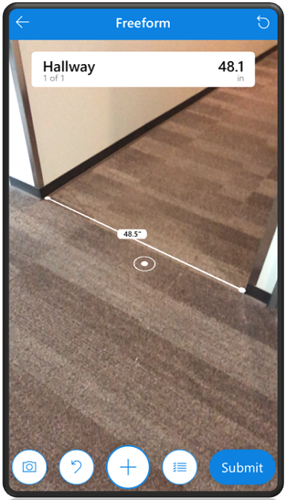
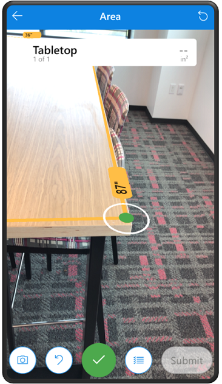
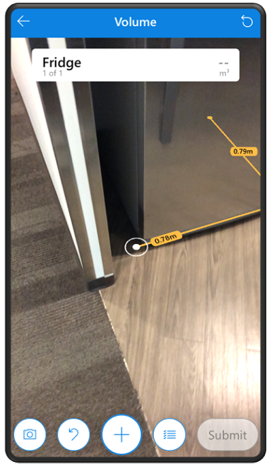
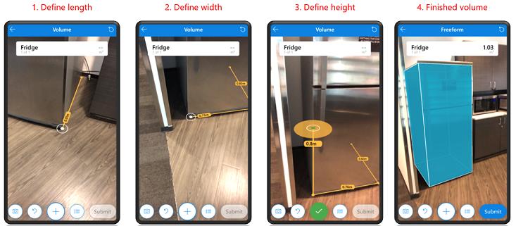
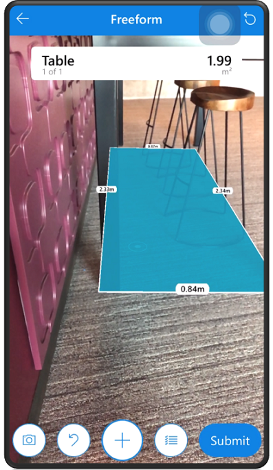
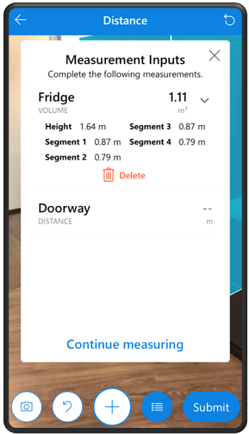

# Measure your space in mixed reality

Measure the distance, area, and volume of your physical space using your device camera.

To use the measurement feature, your app must enable the  [Measure in MR](mixed-reality-component-measure-distance.md) control for your canvas app.

## Prerequisites

Before you start taking measurements, follow these steps to enter basic information about your space.

1. Open your canvas app and select the **Measure in MR** button.
2. At the top select the measurement list or select the list button.
 
   > [!div class="mx-imgBorder"]
   > 

3. On **the Measurement Inputs** screen, enter the required measurements such as wall distance and desk area.
   
   > [!div class="mx-imgBorder"]
   > 

4. When you're done, select the close button.

## Take a measurement

1. Open your canvas app and select the **Measure in MR** button.

2. Select the camera button and then follow the instructions on your screen

3. Keep moving your device until it vibrates, and white dots appear. The white dot with a circle is the starting point of your measurement.

4. Select  to start a new measurement. Then follow these steps depending on the type of area that you're measuring:

   - **Distance**
     1. Select  and then slowly move the dot to where you want the measurement to end. 
     2. Select the checkmark button to finish the measurement. 
    
        > [!div class="mx-imgBorder"]
        > 
       
      3. Select **Submint** to save the final measurement.
         > [!div class="mx-imgBorder"]
         > 
   
   - **Area**
      1. Select  to add points and outline the area that you want to measure.
         > [!div class="mx-imgBorder"]
         > 

      2. Connect the last dot to the first dot to complete the measurement. When you're done, select the checkmark button.
         > [!div class="mx-imgBorder"]
         > 

      3. Select **Submint** to save the final measurement.
         > [!div class="mx-imgBorder"]
         > 

    - **Volume** 
      1. Select  to add points and outline the base of the volume you want to measure.
         > [!div class="mx-imgBorder"]
         > 
      
      2. Connect the last dot to the first dot to complete the measurement. 
         > [!div class="mx-imgBorder"]
         > 

      3. Move your device upwards and select the desired height and then select the checkmark. 
         > [!div class="mx-imgBorder"]
         >  
        
       4. Select **Submint** to save the final measurement.
          > [!div class="mx-imgBorder"]
          >   
     
          > [!NOTE]
          > If you app has **Box Draw** enabled then you can only measure volume by a rectangular prism. To take this measurement select four points; three to draw the base and one for the height.  
            

    - **Freeform** 
       1. Select  to measure distance, multi-segment, area, and volume all together. 
       2. Connect the last dot to the first dot to complete the measurement.
          > [!div class="mx-imgBorder"]
          >   
     
      4. To the complete the measurement keep the dot at the last point you added and then select **Submint**.
          > [!div class="mx-imgBorder"]
          >   
                 
          The same rectangle can be part of a volume measurement. Instead of selecting the last point you added, rotate your phone upwards to select a height and then select **Submint**.
           > [!div class="mx-imgBorder"]
           > 

          > [!NOTE]
          > If you app has **Box Draw** enabled then you can only measure in freeform in a rectangular area and volume.

## Keeping track of your measurements

When you taken measurments, you can always go back and review the measurements that you have taken.

1. At the top select the measurement list or select the list button.
   
   > [!div class="mx-imgBorder"]
   > 

2. Select the arrow next to measure to view more details.
   
   > [!div class="mx-imgBorder"]
   > 

3. On the **Measurement Inputs** screen, you can do the following:

    - Select measurement to remeasure or take a measurement out of the listed order.

    - Select the delete botton to clear a measurement.

    - Select the close button or list button to continue measuring where you left off.
      > [!div class="mx-imgBorder"]
      > 

## Button Guide

 *Exit button*  
Leave the mixed reality experience to return to your Power App screen

 *Reset button*  
Remove the 3D model and enter placement mode to place the model again

 *Camera button*  
Screen capture the current view. These pictures may be used by your  
Power App and are not viewable while in the mixed reality experience.

####  Undo button

Undo the last chosen point to redo part of the measurement.

####  List button

Open a window that lists the details of the measurements.

####  Submit button

Once you have finished measuring some or all measurements, you can press the submit button to close the mixed reality experience and send the measurement data to your app. Note that the button may be grayed out if no measurements were taken or a measurement is currently being taken.
