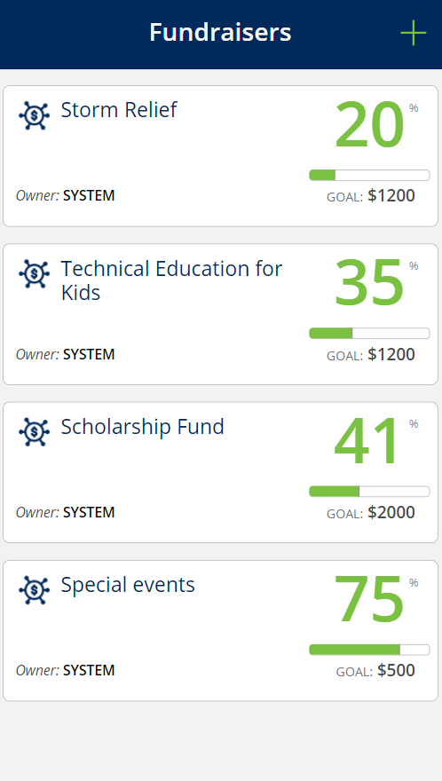
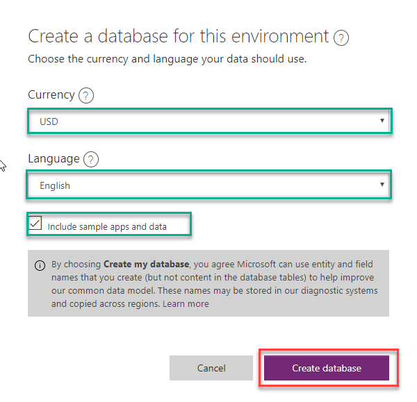
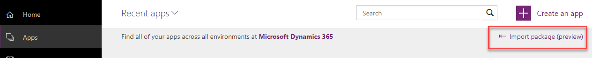
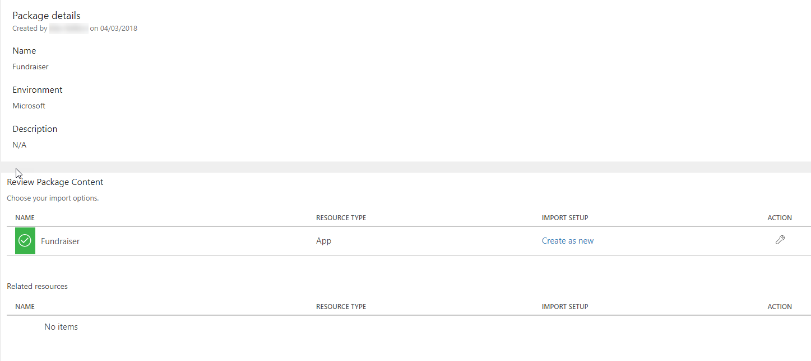
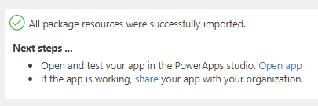
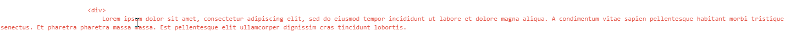

# Install and Configure the Fundraiser PowerApps Sample

Step-by-step instructions for installing and configuring the Fundraiser PowerApps sample.

Estimated time to complete these steps: **10-15 minutes**

## Fundraiser PowerApps sample overview
Fundraiser provides employees the opportunity to donate time and money towards causes they're passionate about. Start a fundraiser for your favorite cause, set goals, and track performance towards goals.

## Prerequisites

1. [Sign up](https://web.powerapps.com/) for PowerApps

## Create  new environment

1. Open a web browser and navigate to https://admin.powerapps.com/environments
2. Log in with an account that has permission to create new environments
3. Click on **New environment**
4. Specify any environment name you want
5. Select you region and chose **Trial** as environment type

6. Click **Create environment**
7. Click the **Create database** button
8. Select preferred currency, language and select **include sample apps and data**

9. Click **Create database**

## Download the Fundraiser PowerApp

1.	In a web browser, navigate to http://pappsfeprodwestuscontent.blob.core.windows.net/
2.	Download the PowerApps package and save it to your machine

## Create Connections

1.	In a web browser, navigate to https://web.powerapps.com
2.	Sign in by providing the same credentials that you used to sign up
3.	In the menu on the left, select **Connections**
	
### Create Office 365 Outlook Connection

1.	Click **+ New connection**
2.	In the **Search** textbox, enter **Office 365 Outlook**
3.	Select **Office 365 Outlook** in the list
4.	Click **Create**
5.	In the popup window, select the account you logged in with

### Create Office 365 Users Connection

1.	Click **+ New connection**
2.	In the **Search** textbox, enter **office 365 users**
3.	Select **Office 365 Users** in the list
4.	Click **Create**
5.	In the popup window, select the account you logged in with

## Import the Fundraiser PowerApp

1.	In a web browser, navigate to https://web.powerapps.com
2.	Sign in by providing the same credentials that you used to sign up
3.  In a top right corner choose the environment we've created before
4.	In the menu on the left, select **Apps** 
5.	Click **Import package(preview)**
	
	

6.	Click the **Upload** button and select the PowerApp package you downloaded in previous steps
7.	For the **App**  resource type, set **IMPORT SETUP** to **Create as new**
	
	

8.	Click **Import** and wait until the process is complete

	

## Configure the PowerApp to use the CDS

1. In the web browser, click **Apps**
2. Click the **ellipses** next to the Fundraiser PowerApp
3. Click **Edit on the web** 
4. Click **Allow**

### Delete connections
1. Click **View**
2. Click **Data sources**
3. In the **Data** pane, click the **ellipses** next to **Fundraisers**
4. Click **Remove**
5. Click **View**
6. Click **Data sources**
7. In the **Data** pane, click the **ellipses** next to **Donations**
8. Click **Remove**
9. Click **View**
10. Click **Data sources**
11. In the **Data** pane, click the **ellipses** next to **Users**
12. Click **Remove**

### Add CDS tables

1. Click **View**
2. Click **Data sources**
3. In the **Data** pane, click **+ Add data source**
4. Select **Common Data Service(Preview)**
5. Select **Fundraisers**,**Donations** and **Users** table
6. Click **Connect**

**Tip**: Follow the section below if you would like to change email template 
### Change email template body

1. Open Fundraiser in editor
2. Go to **AddDonationScreen**
3. Select **Add** button and choose **OnSelect** method
4. Find **div** tag responsible for email body text

5. Change text inside the tag to meet your requirements

## Play the PowerApp

1. In the web browser, click **Apps**
2. Click the **ellipses** next to the Help Desk PowerApp
3. Click **Open**