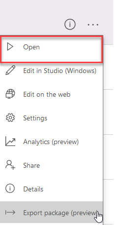

# Install and Configure the Sales Buddy PowerApps Sample

Step-by-step instructions for installing and configuring the Sales Buddy PowerApps sample.

Estimated time to complete these steps: **10-15 minutes**

## Sales Buddy PowerApps sample overview
**NEED DESCRIPTION** This app requires a small amount of setup to make it your own.

## Prerequisites

1. [Sign up](signup-for-powerapps.md) for PowerApps

## Download and deploy the Microsoft Dynamics CRM package

1.	In a web browser, navigate to

	http://pappsfeprodwestuscontent.blob.core.windows.net/sampleapps/<INSERT URL HERE> SalesBuddyPackageDeployment.zip

2.	Download the Microsoft Dynamics CRM deploy package and save it to your machine
3.  Extract the contents of the zip file to any folder
4.  Run the tool by double-clicking the **PackageDeployer.exe** file 
5.  Click **Continue** on the main screen of the tool

	

6.  In the **Connect to Microsoft Dynamics 365** screen, provide authentication details to connect to your Dynamics 365 server where you want to deploy the package.

	>**Important:** The specified user must have the **System Administrator** rile in Dynamics CRM.

	>**Note:** If you have multiple organizations, check the **Display list of available organizations** check box. 
	
7. 	Click **Login**

	

8.  If you have multiple organizations on your Dynamics 365 server, select a Dynamics 365 organization to connect to.

	

9.  Follow the instructions on the subsequent screens to complete the deployment of the package.

	

## Download the Sales Buddy PowerApp

1.	In a web browser, navigate to the following link

	http://pappsfeprodwestuscontent.blob.core.windows.net/sampleapps/<INSERT URL HERE>

2.	Download the SalesBuddy PowerApps Sample package and save it to your machine

## Create Connections

1.	In a web browser, navigate to https://web.powerapps.com
2.	Sign in by providing the same credentials that you used to sign up
3.	In the menu on the left, select **Connections**

### Create Dynamics 365 Connection

1.	Click **+ New connection**
2.	In the **Search** textbox, enter **Dynamics**
3.	Select **Dynamics 365** in the list
4.	Click **Create**
	
### Create Office 365 Outlook Connection

1.	Click **+ New connection**
2.	In the **Search** textbox, enter **Office 365 Outlook**
3.	Select **Office 365 Outlook** in the list
4.	Click **Create**
5.	In the popup window, select the account you logged in with

### Create Office 365 Users Connection

1.	Click **+ New connection**
2.	In the **Search** textbox, enter **Office 365**
3.	Select **Office 365 Users** in the list
4.	Click **Create**
5.	In the popup window, select the account you logged in with

## Import the Sales Buddy PowerApp

1.	In a web browser, navigate to https://web.powerapps.com
2.	Sign in by providing the same credentials that you used to sign up
3.	In the menu on the left, select **Apps** 
4.	Click **Import package(preview)**
	
	

5.	Click the **Upload** button and select the PowerApp package you downloaded in previous steps
6.	For the **App**  resource types, set **IMPORT SETUP** to **Create as new**
	
	

7.	Click **Import** and wait until the process is complete

	

## Configure the PowerApp to use Dynamics 365

1. In the web browser, click **Apps**
2. Click the **ellipses** next to the SalesBuddy PowerApp
3. Click **Edit on the web** 
4. Click **Allow**

### Delete connections
1. Click **View**
2. Click **Data sources**
3. In the **Data** pane, click the **ellipses** next to **Accounts**
4. Click **Remove**
5. In the **Data** pane, click the **ellipses** next to **Contacts**
6. Click **Remove**
7. In the **Data** pane, click the **ellipses** next to **Products**
8. Click **Remove**
9. In the **Data** pane, click the **ellipses** next to **Opportunities**
10. Click **Remove**
11. In the **Data** pane, click the **ellipses** next to **Opportunity Lines**
12. Click **Remove**

### Dynamic tables

1. Click **View**
2. Click **Data sources**
3. In the **Data** pane, click **+ Add data source**
4. Click **+ New connection**
5. Select **Dynamics 365**
6. Select name of Dynamics instance(Dataset) 
7. Select **Contacts**
8. Click Connect
9. Do same steps for **Accounts**,**Products**,**Opportunities**,**Opportunity Lines**

## Play the PowerApp

1. In the web browser, click **Apps**
2. Click the **ellipses** next to the SalesBuddy PowerApp
3. Click **Open** 

