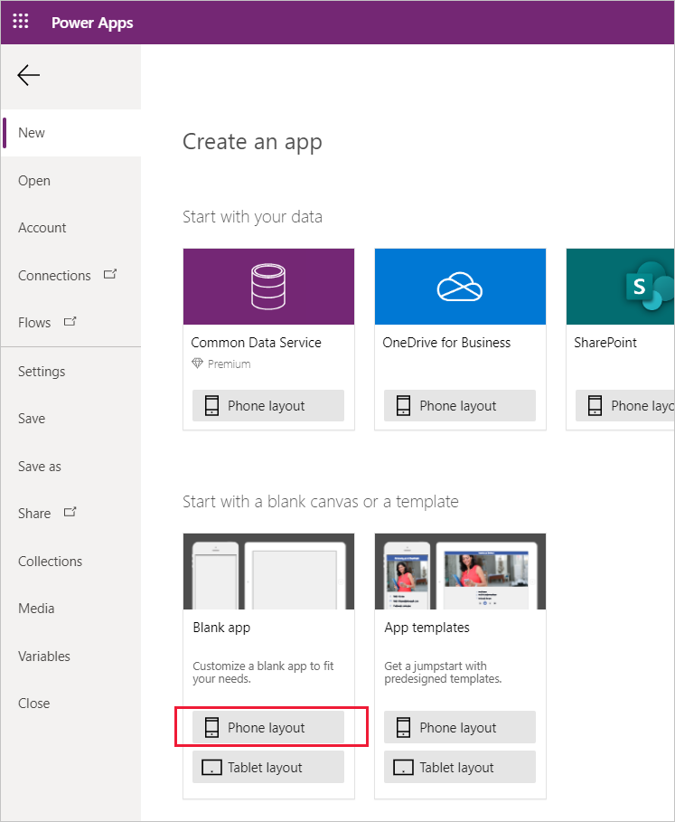
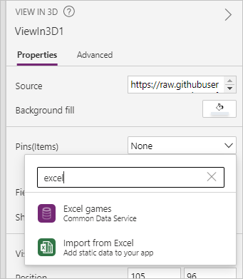
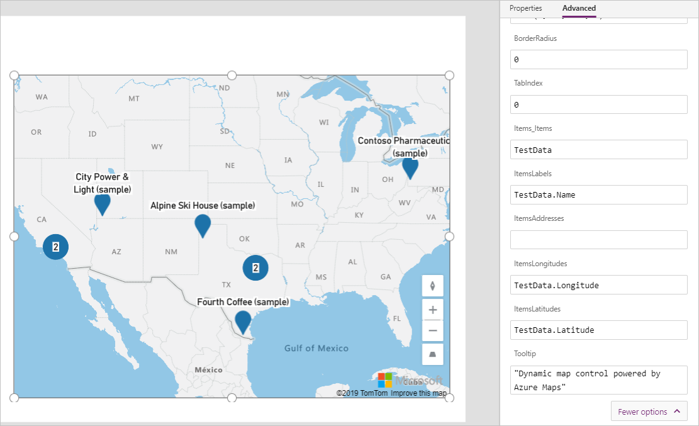
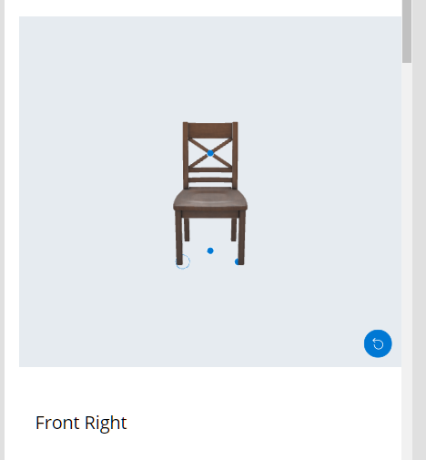
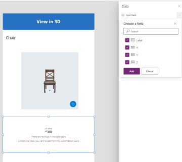
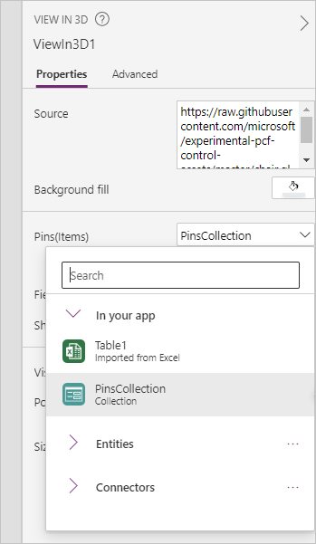

# Add pins to 3D models in Power Apps (Preview)

[!INCLUDE [cc-beta-prerelease-disclaimer.md](../../includes/cc-beta-prerelease-disclaimer.md)]

You can add pins (shown as circular markers) to specific points on 3D models that you display with the [View in 3D](mixed-reality-component-view-3d.md) component. 


This topic will guide you through creating a test app with a 3D model that you can insert pins onto. It will show you how to:


- Use a predefined list of pins from an Excel workbook to put pins on a 3D model
- Display information about each of the pins in your app
- Create a collection to allow users of the app to create their own pins


For this guide, you will first need to do the following:

- Create a blank canvas app ready for editing
  - Go to the [Power Apps Studio](https://create.powerapps.com) and, under the **Start with a blank canvas or a template** section, select **Phone layout** on the **Blank app** tile.  
       
       
- [Enable the MR features](mixed-reality-overview.md#enable-the-mixed-reality-features-for-each-app).
- Make sure to also [review the prerequisites for using MR components](mixed-reality-overview.md#prerequisites).


## Insert and connect pins to a 3D model

With an app open for editing in [Power Apps Studio](https://create.powerapps.com), you can insert a 3D model and connect a list of pins.

First, insert a 3D model:

1. Open the **Insert** tab.
2. Expand **Media**.
3. Select the component **View in 3D** to place it in the center of the app screen, or drag and drop it to position it anywhere on the screen.  
    A default shape is included in the component. You can change this shape to another by altering the **Source** property. See [Define where the 3D content is stored](mixed-reality-component-view-3d.md#define-where-the-3d-content-is-stored) in the **View in 3D** component's topic for more information. In this example, we'll use the URL *https://raw.githubusercontent.com/microsoft/experimental-pcf-control-assets/master/chair.glb*.


Now you'll need to connect a set of predefined pins to your model.

You can do this in a few ways, but the easiest is to use a table in an Excel workbook.


Your workbook needs to contain a named table with the following columns that should then be mapped to the associated property in the component's **Advanced** pane.

Column description | Maps to property
-- | -- 
Label for the pin | ItemsLabels
X dimension of the pin | PinsX
Y dimension of the pin | PinsY
Z dimension (depth) of the pint | PinsZ

<!-- is there a label field? -->


The following is an example of an Excel table with the required columns:


You can copy the following sample data to test this functionality:

Label | X Pins | Y Pins | Z Pins
-- | -- | -- | --
Front Left | -0.20 | 0.01 | 0.20
Front Right | 0.20 | 0.01 | 0.20
Zero | 0.00 | 0.00 | 0.00
X Point | 0.00 | 0.72 | -0.20


1. Copy and paste the table into a new Excel workbook.

1. Select one of the cells, and then on the Home tab in the ribbon, select **Format as Table** and choose any style, and then **OK**.

    

1. Select the table, and then go to the **Table Design** tab on the ribbon. Enter a name for the table under **Table Name:**, for example *TestData*.

    

1. Save the workbook.


1. In your open app, go to the **Properties** pane, select the **Pins(Items)** field and then search for *excel* and select **Import from Excel**.

    

1. Locate the Excel workbook and then select **Open**. Select the table that contains the information, **TestData**, and then **Connect**.

    

1. On the **Properties** pane, go to the **Advanced** tab, and select **More options**.

1. Set the following properties:

    - **PinsX** as `TestData.'X Pins'`
    - **PinsY** as `TestData.'Y Pins'`
    - **PinsZ** as `TestData.'Z Pins'`

1. The 3D component will now show each row in the table as a pin.

    


## Display the label and other information about each pin

You can show the label associated with the currently selected pin by inserting a data table control and setting it to the selected pin.



1. Open the **Insert** tab.
2. Expand **Layout**.
3. Select the **Data table** control and place it on the app screen.
4. In the expression editor at the top, set the **Items** property to `ViewIn3D1.SelectedItems`.
5. On the **Properties** pane, select **Edit fields** and then **Add field**. Select each of the fields and then **Add**.


    


## Create a collection to let users define their own pins in the app

You can [create a collection](create-update-collection) within the app so users can create their own pins that will show on the 3D model:

1. Open the **Insert** tab.
2. Select the **Text input** control and place it on the app screen. Copy and paste it twice so you have three text input controls.
3. Change the **Default** property for each control to `XCoordinate`, `YCoordinate`, and `ZCoordinate`.
4. Open the **Insert** tab and select the **Button** control. Place it in a free area on your app screen. Set the **Text** property to `Add pin`. 
5. Set the **OnSelect** property to the following:

    ```json
    Collect( 
    PinsCollection,
      {
        X: XCoordinate.Text,
        Y: YCoordinate.Text,
        Z: ZCoordinate.Text
      }
    )
    ```
6. Select the view in 3D component and change the **Pins(Items)** property to `PinsCollection`.

    

1. On the **Properties** pane, go to the **Advanced** tab, and select **More options**.

1. Set the following properties:

    - **PinsX** as `PinsCollection.X`
    - **PinsY** as `PinsCollection.Y`
    - **PinsZ** as `PinsCollection.Z`

Now when a user enters coordinates into each of the fields and selects the **Add pin** button, the coordinates will be converted into a pin and placed on the model.

## Other mixed reality controls

- View 3D content in MR with the **[View in MR](mixed-reality-component-view-mr.md)** component.
- Measure distance, area, and volume with the **[Measure in mixed reality](mixed-reality-component-measure-distance.md)** component.
- Create and view predefined 3D shapes with the **[View shape in mixed reality](mixed-reality-component-view-shape.md)** component
