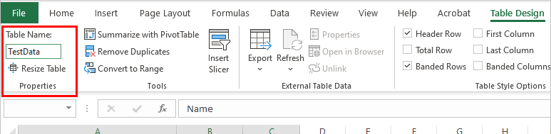

# Add pins to 3D models in Power Apps


You can add pins (shown as circular markers) to specific points on 3D models that you display with the [View in 3D](mixed-reality-component-view-3d.md) component. 


This topic will guide you through creating a test app with a 3D model that you can insert pins onto. It will show you how to:


- Use a predefined list of pins from an Excel workbook to put pins on a 3D model.
- Display information about each of the pins in your app.
- Create a collection to allow users of the app to create their own pins.


## Insert and connect pins to a 3D model

With an app open for editing in [Power Apps Studio](https://create.powerapps.com), you can insert a 3D model and connect a list of pins.

First, insert a 3D model:

1. Open the **Insert** tab.
2. Expand **Media**.
3. Select the component **View in 3D** to place it in the center of the app screen, or drag it to position it anywhere on the screen.  

    :::image type="content" source="./media/augmented-3d/augmented-3d-insert.png" alt-text="Insert the View in 3D component into the app.":::

    A default shape is included in the component. You can change this shape to another by altering the **Source** property. For more information, see how to [define where the 3D content is stored](mixed-reality-component-view-3d-store.md). In this example, we'll use the URL *https://raw.githubusercontent.com/microsoft/experimental-pcf-control-assets/master/chair.glb*.

> [!NOTE]
> This component will be named `ViewIn3D1` by default, and is how it will be referenced throughout this guide. If you add multiple versions of this component, you'll need to adjust your references.  
>
> For example, if you insert a second copy of the component, by default it will be called `ViewIn3D1_1` and any code references will need to be changed to refer to it.


Now you'll need to connect a set of predefined pins to your model.

You can connect predefined pins in a few ways, but the easiest is to use a table in an Excel workbook.


Your workbook needs to contain a named table with the following columns that should then be mapped to the associated property in the component's **Advanced** pane.

Column description | Maps to property
-- | -- 
Label for the pin | ItemsLabels
X dimension of the pin | PinsX
Y dimension of the pin | PinsY
Z dimension (depth) of the pin | PinsZ


> [!IMPORTANT]
> The mixed-reality (MR) controls use a [left-handed coordinate system](/windows/uwp/graphics-concepts/coordinate-systems).


The following is an example of an Excel table with the required columns:


You can copy the following sample data to test this functionality:

Label | X Pins | Y Pins | Z Pins
-- | -- | -- | --
Front Left | -0.20 | 0.01 | 0.20
Front Right | 0.20 | 0.01 | 0.20
Zero | 0.00 | 0.00 | 0.00
X Point | 0.00 | 0.72 | -0.20


1. Copy and paste the table into a new Excel workbook.

1. Select one of the cells, and then on the Home tab in the ribbon, select **Format as Table** and choose any style, and then **OK**.

    

1. Select the table, and then go to the **Table Design** tab on the ribbon. Enter a name for the table under **Table Name:**—for example, *TestData*.

    

1. Save the workbook.


1. In your open app, go to the **Properties** pane, select the **Pins(Items)** field, and then search for *excel* and select **Import from Excel**.

     field, typing Excel shows the Import from Excel option")

1. Locate the Excel workbook and then select **Open**. Select the table that contains the information, **TestData**, and then **Connect**.

    

1. On the **Properties** pane, go to the **Advanced** tab, and select **More options**.

1. Set the following properties:

    - **PinsX** as "X Pins"
    - **PinsY** as "Y Pins"
    - **PinsZ** as "Z Pins"

1. The 3D component will now show each row in the table as a pin.


## Display the label and other information about each pin

You can show the label associated with the currently selected pin by inserting a data table control and setting it to display all the pins, or the currently selected pin.

 is shown in a table below")

1. Open the **Insert** tab.
2. Expand **Layout**.
3. Select the **Data table** control and place it on the app screen.
4. Choose to show all pins, or only the selected pin:

   1. Show all pins: On the **Properties** pane, set the **Data source** property to the Excel table you added.

        

   1. Selected pin only: In the expression editor at the top, set the **Items** property to `ViewIn3D1.SelectedItems`.


        

5. On the **Properties** pane, select **Edit fields** and then **Add field**. Select each of the fields and then **Add**.

     are selected")


You can also add a single text box label to show the selected pin:

1. Open the **Insert** tab.
2. Select the **Text label** control and place it on the app screen.
3. Change the **Text** property to `ViewIn3D1.Selected.Label`.

## Create a collection to let users define their own pins in the app

You can [create a collection](create-update-collection.md) within the app so users can create their own pins that will show on the 3D model:

1. Open the **Insert** tab.
2. Select the **Text input** control and place it on the app screen. Copy and paste it so you have four text input controls.
3. Change the **Default** property for each control to `X`, `Y`, `Z`, and `Label`. 
4. On the **Tree view**, rename each control to:
   1. **XCoordinate**
   2. **YCoordinate**
   3. **ZCoordinate**
   4. **LabelInput**

    

4. Open the **Insert** tab and select the **Button** control. Place it in a free area on your app screen. Set the **Text** property to `Add pin`. 
5. Set the **OnSelect** property to:

    ```json
    Collect( 
    PinsCollection,
      {
        X: XCoordinate.Text,
        Y: YCoordinate.Text,
        Z: ZCoordinate.Text,
        Label: LabelInput.Text
      }
    )
    ```
6. Select the view in 3D component and change the **Pins(Items)** property to `PinsCollection`.

     field, select the PinsCollection option")

1. On the **Properties** pane, go to the **Advanced** tab and select **More options**.

1. Set the following properties:

    - **PinsX** as "X"
    - **PinsY** as "Y"
    - **PinsZ** as "Z"

Now when a user enters coordinates into each of the fields and a label, and selects the **Add pin** button, the coordinates will be converted into a pin and placed on the model.

You can display each of the pins as they are added:

1. Open the **Insert** tab.
2. Expand **Layout**.
3. Select the **Data table** control and place it on the app screen.
4. On the **Properties** pane, set the **Data source** property to the collection you created, **PinsCollection**.
5. On the **Properties** pane, select **Edit fields** and then **Add field**. Select each of the fields and then **Add**.

     are selected")

As users add pins with the **Add pin** button, they will display in the table below the button.

## Other MR controls

- View 3D content in mixed reality with the **[View in MR](mixed-reality-component-view-mr.md)** component.
- Measure distance, area, and volume with the **[Measure in MR](mixed-reality-component-measure-distance.md)** component.
- Create and view predefined 3D shapes with the **[View shape in MR](mixed-reality-component-view-shape.md)** component


[!INCLUDE[footer-include](../../includes/footer-banner.md)]
