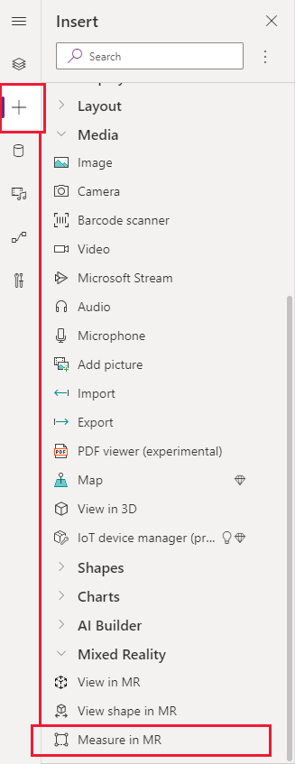
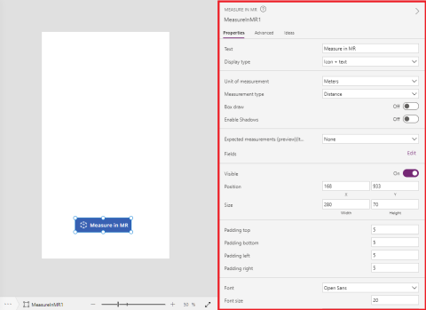

# Take measurements and create 3D volumes in mixed reality

You can use the **Measure in MR** component in your app to let users measure distances and create simple three-dimensional polygons. They could then use these polygons to confirm how a certain-sized object would fit within a space. 

The component creates a button in your app. When app users click the button, it shows a live camera feed of the device. App users can then identify a starting point and then individual points to measure from. The distance is shown directly on the live camera feed.

An example of how the component works inside an app is shown in the following video:

> [!VIDEO https://www.microsoft.com/videoplayer/embed/RE4vyoW]

When the user exits the component, the measurements that were taken are captured in the **Measurements** and **MeasurementsDetailed** properties so they can be saved or stored.

To use the component, you need to [enable the mixed reality (MR) features for each app](#enable-the-mixed-reality-features-for-each-app) that you want to use it in. 

Make sure to also [review the prerequisites for using MR components](mixed-reality-overview.md#prerequisites).

>[!TIP]
>The MR controls work best in well-lit environments with flat-textured surfaces.  
>When establishing tracking, point the device at the surface you would like to track and slowly pan the device from right to left in broad arm motions.  
>If tracking fails, exit and enter the MR view to reset the tracking and try again.

## Use the component

Insert the component into your app as you normally would for any other button control or component.

With an app open for editing in the Power Apps https://create.powerapps.com studio:

1. Open the **Insert** tab.
2. Expand **Mixed reality**.
3. Select the component **View shape in MR** to place it in the center of the app screen, or drag and drop it to position it anywhere on the screen.

  

You can modify the component with a number of properties.

### Properties

The following properties can be defined and configured in the component's **Measure in MR** pane on the **Properties** and **Advanced** tabs. 

Note that some properties are only available under **More options** in the **Advanced** tab on the **View in MR** pane.

Property | Description | Type | Location
- | - | - | -
Text | Label for the button | String | Properties (also in **Advanced**)
Display type | Whether the button shows just an icon, text, or both | Drop-down selection | Properties (also in **Advanced**)
Unit of measurement | Measurement unit used for the width, height, and depth fields. | Drop-down selection | **Properties** (also in **Advanced**)
Measurement type | What type of measurement the user can make, whether point-to-point distance, a complete area, or a three-dimensional volume (area plus height or depth). | **Properties** (also in **Advanced**)
Visible | Whether the component is shown or not. | Boolean | **Properties** (also in **Advanced**)
Position | X is the horizontal position of the component on the app screen. 0 is the leftmost edge of the screen.  Y is the vertical position of the component on the app screen. 0 is the topmost edge of the screen. | Pixels | **Properties** (also in **Advanced** as individual X and Y values)
Size | Width and height of the component in pixels. | Pixels | **Properties** (also in **Advanced** as individual width and height values)
Padding top, bottom, left, right | How much padding between the associated edge and the label inside the button. | Pixels | **Properties** (also in **Advanced**)
Font options | Font and styling that should be used for the button's text. | String | **Properties** (also in **Advanced**)
Disabled options | How the button should appear if it's set to a disabled state, where the app user will not be able to interact with it. | **Properties** (also in **Advanced**)
OnChange | Defines what happens when an event occurs within the component | Formula | **Advanced**
FillColor | Color of the button | RGBA or HTML hexadecimal color codes | **Advanced**
Tooltip | Descriptive text that appears when a user navigates to the component. | String | **Advanced**
DisplayMode | The mode to use for data cards and controls within the component. `DisplayMode.Edit` allows users to edit the component's forms and controls, `DisplayMode.View` sets the component to read only | String | **Advanced**
TabIndex | Order in which items on the app screen be tabbed between. | Integer | **Advanced**
Measurements | Resulting measurements in a semicolon-separated string (for example, ".52;.10" if there two measurements, the first being .52 and the second being .10). | String | Not applicable (output property only)
MeasurementsDetails | JSON-property collection describing the measured volumes and areas, comprised of:<ul><li>Measurements - List of measurement objects<ul><li>Units: String describing the base unit of this measurement (**meters** or **inches**)</li><li>Height: Number representing the height of the captured volume, or 0 if no a completed volume or 2D area</li><li>Segments - List describing all segments in the given measurement object with the following properties:<ul><li>Distance – Number representing the total distance of a given segment in the given units of measure (for example, .52).</li><li>Direction – Vector describing the direction of the segment, normalized</li><li>X – Number specifying the X direction of the segment in world space (for example, 0.5)</li><li>Y – Number specifying the Y direction of the measurement in world space (typically 0)</li><li>Z – Number specifying the Z direction of the measurement in world space (for example, 0.5)</li></ul></li></ul></li>

## Other augmented reality controls
- View 3D models with the **[View in 3D](mixed-reality-component-view-3d.md)** component.
- View 3D models in the real world with the **[View in mixed reality](mixed-reality-component-view-mr.md)** component.
- Create and view predefined 3D shapes with the **[View shape in mixed reality](mixed-reality-component-view-shape.md)** component

