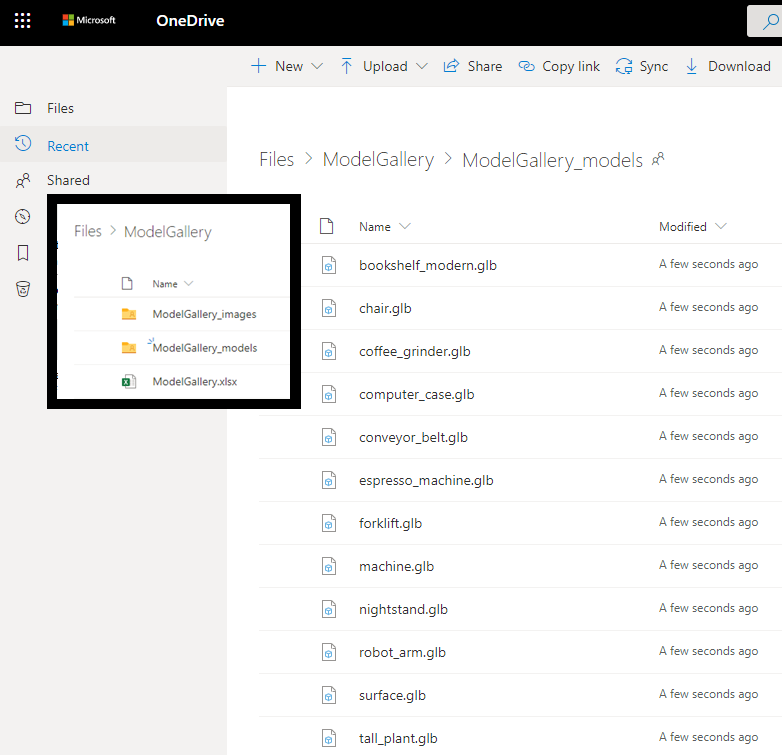
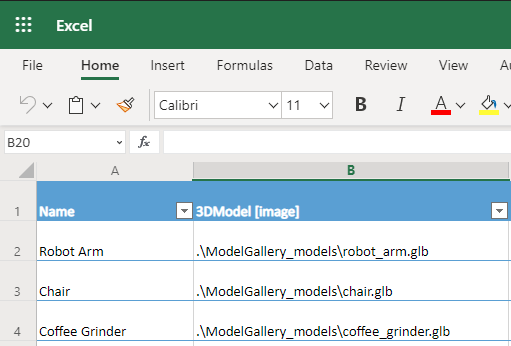
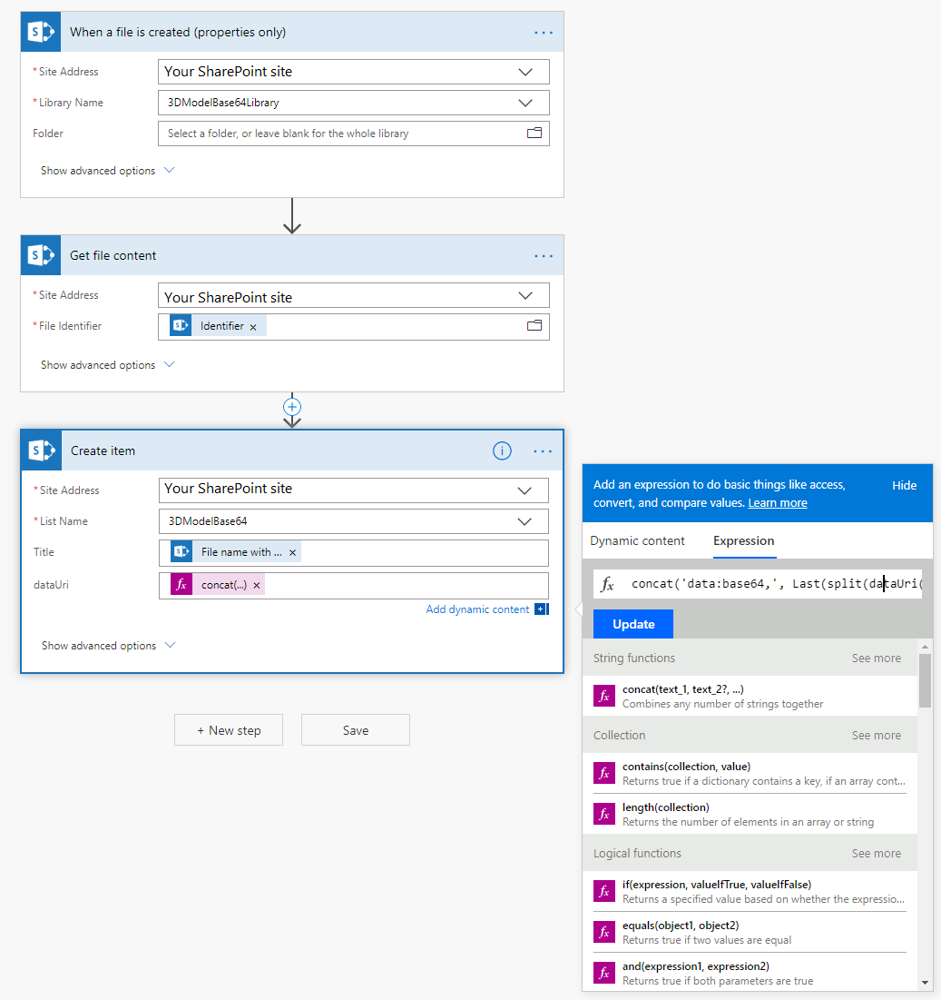

# Load models with the View in 3D component

You can set the source for 3D content as attachments or media content, as a direct URL to a .glb file, or as a base64-encoded URI.

For situations where you want to have a gallery of 3D models, you should put the **View in 3D** component outside of the gallery, and then set its source to the gallery's selected property. This process is described in the [Loading models from common connectors](#loading-models-from-common-connectors) section.

To help reduce load times, make sure your 3D models are [optimized for use with Power Apps](/dynamics365/mixed-reality/guides/3d-content-guidelines/optimize-models).

## Loading models from common connectors

Loading models as attachments or media content works through the binary storage associated with Power Apps. To check if a data connector uses binary storage, add a label and set the **Text** property to the data source. If the label starts with `appres://`, then that data source should work with the **View in 3D** component.

> [!TIP]
> You can rename a .glb file extension to .jpg and directly upload it to the app.

**To use a SharePoint list**

1. Create a SharePoint list.
1. In the created list, select the **+ Add** column and then select **Show/hide columns**.
1. Make sure **Attachments** is selected and press **Apply** at the top.
1. Create a new item in the list and press **Add attachments**.
1. Select your 3D model (.glb file).
1. Create a new item in the list for each 3D model that you want to have in your app.
1. In a canvas app, add a Gallery.
1. Set the gallery data source to the SharePoint list created earlier.
1. Add the **View in 3D** control and in the **Advanced** tab, set the **Source** property to **First(Gallery1.Selected.Attachments).Value**.

**To use Excel Online**

1. Create an Excel Online workbook on OneDrive where you've also stored your .glb files.

    

1. In the workbook, create a table with columns titled **3DModel [image]** and **Name**.
1. Add a row for each .glb file, inserting the relative file path to the .glb file in the **3DModel [image]** column.

    

1. Close the excel workbook.
1. In a canvas-based app, add a **Gallery**.
1. Set the gallery data source to the Excel Online workbook through the OneDrive connector.
1. In the **Advanced** properties tab for the **View in 3D** component, set the **Source** property to **Gallery1.Selected.'3DModel'**.

### Load models from a URL

The **Source** property can be a URL that points to a 3D model file (.glb).

You can't view a 3D model in your app if the file is on a server that has restrictive cross-origin resource sharing (CORS) settings. To resolve this issue, the hosting server must permit cross-origin requests from *powerapps.com*.

You can use the following services to host and obtain a CORS-compliant URL.

**To use Dropbox**

1. Upload your file to Dropbox as you normally would.
1. Select the **Share** button.
1. Generate a public download link. For example, *https://www.dropbox.com/s/rANdoMGeneR4tedLink/my-file.glb?dl=0*.
1. Replace **www** in the URL with **dl**, and remove **?dl=0** at the end. You now have a direct-access URL. For example, *https://dl.dropbox.com/s/rANdoMGeneR4tedLink/my-file.glb*.

**To use GitHub**

1. Ensure that your Git repo is set to **Public**.
1. Navigate to your file. For example, *https://github.com/microsoft/experimental-pcf-control-assets/blob/master/robot_arm.glb*.
1. Remove **/blob/**.
1. Replace **https://github.com** with **https://raw.githubusercontent.com**. You now have raw access to your file. For example, *https://raw.githubusercontent.com/microsoft/experimental-pcf-control-assets/master/robot_arm.glb*.

### Loading base64-encoded models

The **Source** property can be a base64-encoded 3D model data URI that is in the format *data:base64,\<base64-encoded content\>*.

> [!IMPORTANT]
> Loading base64-encoded models can be time-consuming, and may cause your app to take a long time to load.

The following are two common ways you can create a base64-encoded URI of your model.

**To use Power Automate**

Power Automate can convert files to base64 using the dataUri(base64(*file content*)) expression. For example, if you want to store .glb files in a SharePoint document library, you could do the following to load them in Power Apps using the View in 3D:

1. Create a **SharePoint Document Library** and a **SharePoint List**. The list should have a column of type **multiple-line text**.
1. From the **Document Library**, create a new flow using the **When a new file is added in SharePoint, complete a custom action** template.
1. Add a new step to **Get file content from SharePoint**, setting **File Identifier** to **Identifier**.
1. Add a new step to **Create item from SharePoint**, setting **List Name** to the SharePoint list you created earlier, and the **Title** to File Name with extension, and the multiple-line text column to the following expression:
    ```
    concat('data:model/gltf-binary;base64,', Last(split(dataUri(base64(body('Get_file_content'))), ',')))
    ```

    

When you add .glb files to the **Document Library**, they'll be converted to a base64-encoded data URI, which you can set to the **Source** property of the **View in 3D** component, using the SharePoint data connector to access the list.

**To use Microsoft Dataverse**

The [Note table](../../developer/data-platform/annotation-note-entity.md) in Microsoft Dataverse converts any attached file to base64 in the **Document** field.


## Known constraints

- The security architecture of Power Apps requires HTTPS links, not HTTP.
- The server that hosts the document must not require authentication and must be [CORS-compliant](https://en.wikipedia.org/wiki/Cross-origin_resource_sharing).

[!INCLUDE[footer-include](../../includes/footer-banner.md)]
