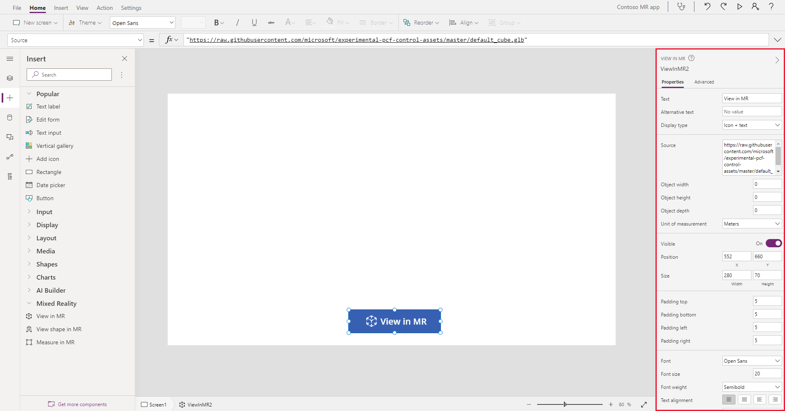

# View 3D content or images in the real word

You can use the **View in MR** component in your app to let users see how a particular item might fit within a specified space.

The component creates a button in your app. When app users click the button, it overlays a selected 3D model (in .glb, .stl or .obj file formats) or image (in .jpg or .png file formats) onto the live camera feed of the device.

:::image type="content" source="./media/augmented-overview/view-in-mixed-reality.png" alt-text="Photo showing a 3D model of a forklift being overlaid onto the real world through a mobile device.":::

You can also take photos and [upload them to OneDrive](mixed-reality-take-upload-photos.md).

> [!IMPORTANT]
> Your 3D content must be in the .glb, .stl, or .obj file formats.
> You can [convert your existing 3D models into the .glb file format](/dynamics365/mixed-reality/guides/3d-content-guidelines/) from a variety of 3D formats.
> 3D content compressed with Draco compression is not supported.

> [!TIP]
> If your model has a large file size, it could negatively affect your experience. Consider [optimizing your models for use in mixed reality.](/dynamics365/mixed-reality/guides/3d-content-guidelines/optimize-models)

> [!TIP]
> The MR components work best in well-lit environments with flat-textured surfaces. When establishing tracking, point the device at the surface you would like to track and slowly pan the device from right to left in broad arm motions. If tracking fails, exit and enter the MR view to reset the tracking and try again.  
>
> LIDAR-enabled devices will also result in better tracking.

> [!TIP]
> The MR components in Power Apps leverage Babylon and Babylon React Native. As a result of this shared MR platform, 3D content that works in the [Babylon sandbox](https://sandbox.babylonjs.com/) should work in Power Apps. 

## Use the component

Insert the component into your app as you normally would for any other button control or component.

With an app open for editing in [Power Apps Studio](https://create.powerapps.com):

1. Open the **Insert** tab.
2. Expand **Mixed reality**.
3. Select the component **View in MR** to place it in the center of the app screen, or drag and drop it to position it anywhere on the screen.

   :::image type="content" source="./media/augmented-view-mr/augmented-view-mr.png" alt-text="Insert the View in MR component into the app.":::

You can modify the component with several properties.

### Properties

The following properties are on the component's **View in MR** pane on the **Properties** and **Advanced** tabs.

Some properties are only available under **More options** in the **Advanced** tab on the **View in MR** pane.

Property | Description | Type | Location
- | - | - | -
Text | Label for the button. | String | Properties (also in **Advanced**)
Alternative text | Text to be displayed if the component can't load, or if the app user hovers on the component. | String | **Properties** (also in **Advanced** as **AltText**)
Display type | Whether the button shows just an icon, text, or both. | Drop-down selection | Properties (also in **Advanced**)
Source | Data source that identifies the .glb, .stl, or .obj file to display. The **View in MR** component supports loading models from: <ul><li>Publicly accessible, CORS-compliant URLs.</li><li>Base64-encoded URIs.</li><li>Attachments or media content accessed through data connectors.</li></ul> For more information, see [how to define where the 3D content is stored](mixed-reality-component-view-3d-store.md). | Not applicable | **Properties** (also in **Advanced**)
Object width | Width of the displayed image or 3D content. See also [How object scaling is handled](#how-object-scaling-is-handled). | Integer | **Properties** (also in **Advanced**)
Object height | Height of the displayed image or 3D content. See also [How object scaling is handled](#how-object-scaling-is-handled). | Integer | **Properties** (also in **Advanced**)
Object depth | The three-dimensional depth of the 3D content. See also [How object scaling is handled](#how-object-scaling-is-handled). | Integer | **Properties** (also in **Advanced**)
Units | The unit used for the object width, height, and depth fields. | Drop-down selection | **Properties** (also in **Advanced**)
Photos | The photos captured during the mixed reality session. You can [upload the mixed-reality photos to OneDrive and show them in a gallery](mixed-reality-take-upload-photos.md). | | Not applicable (output property only)
OnMixedRealitySelect | Behavior that is triggered when exiting the MR experience with new results. | Defined action | **Advanced**
OnChange | Behavior that is triggered when any property on the button is changed. | Defined action | **Advanced**

### How object scaling is handled

When you insert a model with the **View in MR** component, it will follow the model's inherent dimensions. Alternatively, you can specify some or all of the dimensions - these dimensions are labeled as the **Object width**, **Object height**, and **Object depth** properties.

If you want to change the size of the model, we apply certain scaling techniques depending on how many dimensions you change:

- If no dimensions are set, we assume the model is already at its intended scale and leave it as is.  

- If one dimension is set, and the others are left at the default `0`, we scale the whole object equally based on the set dimension.  
  This behavior is similar to using a setting such as "keep aspect ratio" when resizing an image.  

- If two dimensions are set, we force the model to match the given dimensions and average the scale for the third dimension.  
  - For example, say you had a model with an **Object height** of `12`, an **Object width** of `6`, and an **Object depth** of `3`.  
  You set **Object height** to `24`, and **Object width** to `9`, but leave **Object depth** unchanged.  
  The height has increased by a factor of 2, but the width has increased by a factor of 1.5 - we average these two measurements to come to 1.75 and then scale the depth by that amount.  
  The final scaled model would have an **Object height** of `24`, **Object width** of `9`, and **Object depth** of `5.25`.  

- If all three dimensions are set, we match the size of the model to what you specify.

> [!NOTE]
> If the measurements don't adhere to the original aspect ratio, you could end up with a squashed or distorted model when you view it in MR.

### Additional properties

**[BorderColor](./controls/properties-color-border.md)** – The color of a control's border.

**[BorderStyle](./controls/properties-color-border.md)** – Whether a control's border is **Solid**, **Dashed**, **Dotted**, or **None**.

**[BorderThickness](./controls/properties-color-border.md)** – The thickness of a control's border.

**[Color](./controls/properties-color-border.md)** – The color of text in a control.

**[DisplayMode](./controls/properties-core.md)** – Whether the control allows user input (**Edit**), only displays data (**View**), or is disabled (**Disabled**).

**[DisabledBorderColor](./controls/properties-color-border.md)** – The color of a control's border if the control's **[DisplayMode](./controls/properties-core.md)** property is set to **Disabled**.

**[DisabledColor](./controls/properties-color-border.md)** – The color of text in a control if its **[DisplayMode](./controls/properties-core.md)** property is set to **Disabled**.

**[DisabledFill](./controls/properties-color-border.md)** – The background color of a control if its **[DisplayMode](./controls/properties-core.md)** property is set to **Disabled**.

**[FillColor](./controls/properties-color-border.md)** – The background color of a control.

**[Font](./controls/properties-text.md)** – The name of the family of fonts in which text appears.

**[FontStyle](./controls/properties-text.md)** – The style of the text in the component: **None**, **Strikethrough**, **Underline**, or **Italic**.

**[FontSize](./controls/properties-text.md)** – The font size of the text that appears on a control.

**[FontWeight](./controls/properties-text.md)** – The weight of the text in a control: **Bold**, **Semibold**, **Normal**, or **Lighter**.

**[Height](./controls/properties-size-location.md)** – The distance between a control's top and bottom edges.

**[HoverBorderColor](./controls/properties-color-border.md)** – The color of a control's border when the user keeps the mouse pointer on that control.

**[HoverColor](./controls/properties-color-border.md)** – The color of the text in a control when the user keeps the mouse pointer on it.

**[HoverFill](./controls/properties-color-border.md)** – The background color of a control when the user keeps the mouse pointer on it.

**[PaddingBottom](./controls/properties-size-location.md)** – The distance between text in a control and the bottom edge of that control.

**[PaddingLeft](./controls/properties-size-location.md)** – The distance between text in a control and the left edge of that control.

**[PaddingRight](./controls/properties-size-location.md)** – The distance between text in a control and the right edge of that control.

**[PaddingTop](./controls/properties-size-location.md)** – The distance between text in a control and the top edge of that control.

**[PressedBorderColor](./controls/properties-color-border.md)** – The color of a control's border when the user taps or clicks that control.

**[PressedColor](./controls/properties-color-border.md)** – The color of text in a control when the user taps or clicks that control.

**[PressedFill](./controls/properties-color-border.md)** – The background color of a control when the user taps or clicks that control.

**[TabIndex](./controls/properties-accessibility.md)** – Keyboard navigation order.

**[TextAlignment](./controls/properties-text.md)** – The alignment of the text: **Center**, **Left**, **Right**, or Justify.

**[Tooltip](./controls/properties-core.md)** – Explanatory text that appears when the user hovers over a control.

**[VerticalAlign](./controls/properties-text.md)** – The location of text on a control in relation to the vertical center of that control: **Middle**, **Top**, or **Bottom**.

**[Visible](./controls/properties-core.md)** – Whether a control appears or is hidden.

**[Width](./controls/properties-size-location.md)** – The distance between a control's left and right edges.

**[X](./controls/properties-size-location.md)** – The distance between the left edge of a control and the left edge of its parent container (or the screen if there's no parent container).

**[Y](./controls/properties-size-location.md)** – The distance between the top edge of a control and the top edge of the parent container (or the screen if there's no parent container).

## Other mixed reality controls

- View 3D content with the **[View in 3D](mixed-reality-component-view-3d.md)** component.
- Measure distance, area, and volume with the **[Measure in mixed reality](mixed-reality-component-measure-distance.md)** component.
- Create and view predefined 3D shapes with the **[View shape in mixed reality](mixed-reality-component-view-shape.md)** component

[!INCLUDE[footer-include](../../includes/footer-banner.md)]
