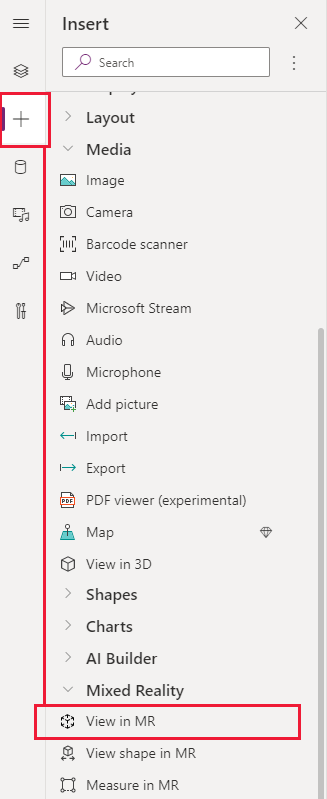

# View 3D models or 2D images in the real word

You can use the **View in MR** component in your app to let users see how a particular item might fit within a specified space. 

The component creates a button in your app. When app users click the button, it overlays a selected 3D object (in the .glb file format) or 2D image (in .jpg or .png file formats) onto the live camera feed of the device. 

- Blah
- Blahblah
- Moreblahs

>[!IMPORTANT]
>Your 3D objects must be in the .glb file format.  
>You can [convert your existing 3D models into the .glb file format](/dynamics365/mixed-reality/import-tool/) from a variety of 3D formats.

To use the component, you need to [enable the mixed reality (MR) features for each app](#enable-the-mixed-reality-features-for-each-app) that you want to use it in. 

Make sure to also [review the prerequisites for using MR components](mixed-reality-overview.md#prerequisites).

>![TIP]
>The MR controls work best in well-lit environments with flat-textured surfaces. 
>When establishing tracking, point the device at the surface you would like to track and slowly pan the device from right to left in broad arm motions.
>If tracking fails, exit and enter the MR view to reset the tracking and try again.

## Explore the sample app

You can test the component in the sample app:

1. Go to https://create.powerapps.com to open the app studio.
2. On the homepage, select either **Phone layout** or **App layout** under **App templates**.

    

1. Select the **App name** app, confirm the right location for the storage of the sample data file (this will default to your currently logged in OneDrive account), and select **Use**.

    

The sample app lets you view and manipulate 3D objects in the real world. You'll need to [publish your app](save-publish-app.md) and then [open it on a mixed reality-capable device](../../user/run-app-client.md).

# Use the component

Insert the component into your app as you normally would for any other button control or component.

With an app open for editing in the Power Apps https://create.powerapps.com studio:

1. Open the **Insert** tab.
2. Expand **Mixed reality**.
3. Select the component **View in MR** to place it in the center of the app screen, or drag and drop it to position it anywhere on the screen.

  

You can modify the component with a number of properties.

### Properties

The following properties can be defined and configured in the component's **View in MR** pane on the **Properties** and **Advanced** tabs. 

Note that some properties are only available in the **Advanced** tab on the **View in MR** pane.

Property | Description | Type | Location
- | - | - | -
Text | Label for the button | String | Properties (also in **Advanced**)
Display type | Whether the button shows just an icon, text, or both | Drop-down selection | Properties (also in **Advanced**)
Source | Data source that identifies the .glb file to display.  Within **model-driven apps**, the **View in 3D** component is bound to a *SingleLine.URL* field property. This means that you can only add the component to a *SingleLine.URL* field on the form. An example is the **Website** field on the **Account** entity.  Within **canvas apps**, the **View in 3D** component supports loading models from: <ul><li>Publicly accessible, CORS-compliant URLs</li><li>Base64-encoded URIs</li><li>Attachments or media content accessed through data connectors</li></ul>See [Define the location for 3D objects](mixed-reality-component-view-3d.md#define-the-location-for-3d-objects) in the **View in 3D** component's topic for more information. | Not applicable | **Properties** (also in **Advanced**)
Object width | Width of the 3D object. | Integer | **Properties** (also in **Advanced**)
Object height | Height of the 3D object. | Integer | **Properties** (also in **Advanced**)
Object depth | The three-dimensional depth of the 3D object. | Integer | **Properties** (also in **Advanced**)
Unit of measurement | The measurement unit used for the width, height, and depth fields. | Drop-down selection | **Properties** (also in **Advanced**)
Visible | Whether the component is shown or not. | Boolean | **Properties** (also in **Advanced**)
Position | X is the horizontal position of the component on the app screen. 0 is the leftmost edge of the screen.  Y is the vertical position of the component on the app screen. 0 is the topmost edge of the screen. | Pixels | **Properties** (also in **Advanced** as individual X and Y values)
Size | Width and height of the component in pixels. | Pixels | **Properties** (also in **Advanced** as individual width and height values)
Padding top, bottom, left, right | How much padding between the associated edge and the label inside the button. | Pixels | **Properties** (also in **Advanced**)
Font options | Font and styling that should be used for the button's text. | String | **Properties** (also in **Advanced**)
Disabled options | How the button should appear if it's set to a disabled state, where the app user will not be able to interact with it. | **Properties** (also in **Advanced**)
OnChange | Defines what happens when an event occurs within the component | Formula | **Advanced**
FillColor | Color of the button | RGBA or HTML hexadecimal color codes | **Advanced**
Tooltip | Descriptive text that appears when a user navigates to the component. | String | **Advanced**
DisplayMode | The mode to use for data cards and controls within the component. `DisplayMode.Edit` allows users to edit the component's forms and controls, `DisplayMode.View` sets the component to read only | String | **Advanced**
TabIndex | Order in which items on the app screen be tabbed between. | Integer | **Advanced**

>![CAUTION]
>How does it find the font?

## Other augmented reality controls
- View 3D models with the **[View in 3D](mixed-reality-component-view-3d.md)** component.
- Take measurements and create 3D volumes with the **[Measure in mixed reality](mixed-reality-component-measure-distance.md)** component.
- Create and view predefined 3D shapes with the **[View shape in mixed reality](mixed-reality-component-view-shape.md)** component

## Next steps
Explore [example AR apps](augmented-reality-example-apps.md) and see what sorts of scenarios AR controls can help solve
