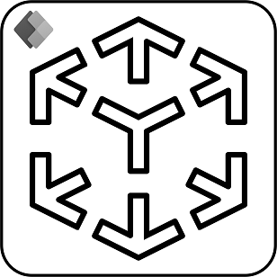

# Use marker detection with mixed reality controls

Use physical markers to improve the precision and persistence of media that's placed using the [View in MR](./mixed-reality-component-view-mr.md) and [View Shape in MR](./mixed-reality-component-view-shape.md) controls. The topic covers how to enable marker detection and how to add markers to your space.

## Prerequisites
In addition to the standard device compatibility requirements outlined in [add mixed reality controls to your canvas app](./mixed-reality-overview.md) marker detection requires physical markers to be present in your space.

To create a marker, print out the image below or display the image on a monitor or tablet. For the best results the marker should be printed in portrait orientation on standard A4 or 8.5" x 11" letter paper. Ensure that the marker is fully visible and not cut off on either the top or bottom. The marker should be approximately 20 x 20 cm for optimal tracking speed and accuracy.

## Enable marker detection

To enable marker detection for the **View in MR** and **View Shape in MR** controls set the **Enable Marker Detection** property to **On** in the properties panel or the formula bar.

:::image type="content" source="./media/augmented-marker-detection/marker-detection-properties.png" alt-text="A screenshot of the properties panel with the marker detection toggle highlighted.":::

## Use marker detection on device

When you enter the mixed reality experience, you will be prompted to point your device at a physical marker in your space. To quickly acquire tracking make sure the marker is fully in frame and about 2-5 feet from the device.

:::image type="content" source="./media/augmented-marker-detection/marker-detection-point-device.png" alt-text="A screenshot of the mixed reality placement experience showing optimal framing of the marker for detection.":::

Once the marker is detected the loaded media is automatically aligned and placed directly on top of the marker. You can manipulate the media's position or rotate it by using the on-screen gestures or by physically moving the marker.

:::image type="content" source="./media/augmented-marker-detection/marker-detection-placement.gif" alt-text="An animated image showing marker detection for placement and positioning.":::

If no marker is present or detection is taking too long, you can turn off the marker detection by selecting the highlighted marker detection button.

:::image type="content" source="./media/augmented-marker-detection/marker-detection-fallback.gif" alt-text="An animated image showing how to disable marker detection during the mixed reality experience.":::

### See also

- [View in MR control](./mixed-reality-component-view-mr.md)
- [View shape in MR control](./mixed-reality-component-view-shape.md)

[!INCLUDE[footer-include](../../includes/footer-banner.md)]
