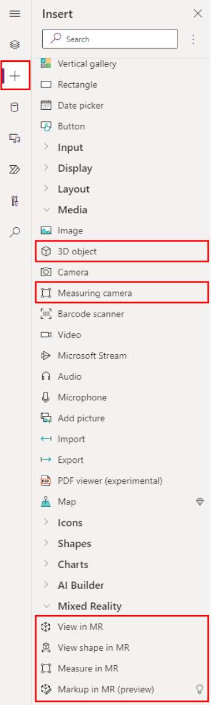

# Add augmented reality components to your app

You can add a number of mixed reality (MR) components to your canvas app to support multiple 3D and mixed reality scenarios.

Components are groups of controls that can answer the need for a specific scenario. For example, you can use these AR components to:
- View and manipulate 3D objects
- Overlay 3D objects and 2D images onto the feed from the camera
- Measure and identify spaces and objects in the real world with an AR overlay

You can read more about components and how to build your own in [the Power Apps developer library](/powerapps/developer/component-framework/custom-controls-overview).

The following pre-built components can be used to solve your mixed reality scenarios:
- [View in 3D](mixed-reality-component-view-3d.md)
- [View in mixed reality](mixed-reality-component-view-ar.md)
- [Measure in measure reality](mixed-reality-component-measure-distance.md)
- [View shape in mixed reality](mixed-reality-component-view-shape.md)

## Prerequisites

1. You need a PowerApps license that supports Common Data Service (CDS). If you [identify your current license](/powerapps/maker/signup-for-powerapps#identify-your-current-license) does not support CDS, you can sign up for a [free trial license for 30 days](http://web.powerapps.com/trial). Please note that in some circumstances this step may take 30 to 60 minutes. Please check periodically after requesting a trial license.
2. If you don't have one already, you will need to [create an environment with Common Data Service instance installed](/power-platform/admin/create-environment). You will need to have system administrator privileges for this step.
3. [Enable the mixed reality features for each app](#enable-the-mixed-reality-features-for-each-app).

### Enable the mixed reality features for each app

For each app you create, you need to enable the mixed reality features:

1. Open the app for editing in the Power Apps studio at [https://create.powerapps.com](https://create.powerapps.com).

2. Select **File** from the top menu.

    

3. Go to the **Settings** tab, select **Advanced settings**, and scroll down to find the **Mixed reality features** option. Set the option to **On**.

    

4. Return to editing your app by selecting the back arrow icon

    

5. Open the **Insert** pane to see the mixed reality components under **Media** and **Mixed Reality**.

    

## Next steps
Explore [example mixed reality apps](mixed-reality-example-apps.md) or start installing the components in your apps:

- View 3D models with the **[View in 3D](mixed-reality-component-view-3d.md)** component.
- View 3D models in the real workld with the **[View in mixed reality](mixed-reality-component-view-ar.md)** component.
- Take measurements and create 3D volumes with the **[Measure in mixed reality](mixed-reality-component-measure-distance.md)** component.
- Create and view pre-defined 3D shapes with the **[View shape in mixed reality](mixed-reality-component-view-shape.md)** component

