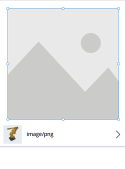

# Take and upload mixed reality photos in Power Apps (Preview)

[!INCLUDE [cc-beta-prerelease-disclaimer.md](../../includes/cc-beta-prerelease-disclaimer.md)]

You can add a control to take photos of the mixed reality (MR) experience in your apps that use the following components:
- [View in MR](mixed-reality-component-view-mr.md)
- [View shape in MR](mixed-reality-component-view-shape.md)
- [Measure in MR](mixed-reality-component-measure-distance.md)

This topic will guide you through creating a test app that you can use to take and upload photos from within an MR session. This includes:

- Inserting a **View in 3D** component with the default sample 3D object included so you can see and manipulate a 3D object
- Connecting the **View in 3D** component to a **View in MR** component button so you can view the 3D object in MR
- Testing the components using a MR-capable device
- Inserting a gallery to view recorded photos taken from the **View in MR** component on the MR-capable device
- Uploading photos to OneDrive with a Power Automate flow

For this guide, you will first need to do the following:

- Create a blank canvas app ready for editing
  - Go to the [Power Apps Studio](https://create.powerapps.com) and, under the **Start with a blank canvas or a template** section, select **Phone layout** on the **Blank app** tile.  
       
       
- [Enable the MR features](mixed-reality-overview.md#enable-the-mixed-reality-features-for-each-app).
- Have a OneDrive folder that you can store your photos in when testing the upload feature.
- Make sure to also [review the prerequisites for using MR components](mixed-reality-overview.md#prerequisites).

> [!TIP]
> The MR components work best in well-lit environments with flat-textured surfaces. When establishing tracking, point the device at the surface you would like to track and slowly pan the device from right to left in broad arm motions. If tracking fails, exit and enter the MR view to reset the tracking and try again.

## Insert and connect a 3D object to the View in MR component and test your app

With an app open for editing in [Power Apps Studio](https://create.powerapps.com), you can insert and connect the **View in 3D** and **View in MR** components. This will let you overlay a sample 3D object (which looks like a box's frame) into the real world using your device's camera.

1. Open the **Insert** tab.
2. Expand **Media**.
3. Select the component **View in 3D** to place it in the center of the app screen, or drag and drop it to position it anywhere on the screen.  
    A default shape is included in the component. You can change this shape to another by altering the **Source** property. See [Define where the 3D content is stored](mixed-reality-component-view-3d.md#define-where-the-3d-content-is-stored) in the **View in 3D** component's topic for more information. In this example, we'll use the URL *https://raw.githubusercontent.com/microsoft/experimental-pcf-control-assets/master/robot_arm.glb*.
1. Open the **Insert** tab.
2. Expand **Mixed reality**.
3. Select the component **View in MR** to place it in the app screen, or drag and drop it to position it anywhere on the screen.

   

1. In the **Properties** panel for the **View in MR** component, select the **Source** field and enter `ViewIn3D1.Src` to set the source object as the 3D object you inserted with the **View in 3D** component.  
    You can also use the expression editor at the top of the window: type `ViewIn3D1.Src`.

   

   <!-- doesn't work -->

9. [Save (and, if necessary, publish) the app](save-publish-app.md) and [load it on your mobile device](../../user/run-canvas-and-model-apps-on-mobile.md) to test that you can view the 3D object in MR by selecting the **View in MR** button.

## Insert a gallery to view photos taken in the app

You can now insert a gallery control into your app. This lets users of the app take and view photos from within the app.

Photos you take by selecting the camera icon in the MR view on the app will be loaded into the gallery component on the app. You need to exit the MR view to see the gallery, and re-entering the MR view and taking more photos will overwrite the photos.

1. Open the **Insert** tab.
2. Select the **Vertical gallery** control to place it in the center of the app screen, or drag and drop it to position it anywhere on the screen.
3. In the **Properties** panel for the gallery control, on the **Advanced** tab, set the **Items** property to equal `ViewInMR1.photos`.  
    You can also use the expression editor at the top of the window.
            

    >[!TIP]
    >You can load all photos taken across multiple MR components by adding `Collect(AllPhotos,ViewInMR1.Photos)` to the **OnChange** property of each MR component.

You can insert a "pop-up" overlay of the selected image so users of the app can see the photo full size.

1. Open the **Insert** tab.
2. Expand **Media** and select the **Image** control to place it in the app screen. Drag and position it so it covers the entire screen (or however much of the screen you want the image to cover when selected from the gallery).

    

3. Go to the **Advanced** tab of the **Properties** pane:  
    1. Change the **OnSelect** property to `UpdateContext({vVisibleImageZoom:false})`.
    2. Change the **Image** property to `Gallery1.Selected.Image2` (or whatever the first image in the gallery control is labelled).
    3. Change the **Visible** property to `vVisibleImageZoom`.
4. Select the first image in the gallery control.
5. Go to the **Advanced** tab of the **Properties** pane and change the **OnSelect** property to `UpdateContext({vVisibleImageZoom:true})`.

    

6. [Save and publish the app](save-publish-app.md) and [load it on your mobile device](../../user/run-canvas-and-model-apps-on-mobile.md).
7. Tap the **View in MR** button to open MR view. 
8. Tap the screenshot icon at the bottom of the screen, then tap the back arrow at the top of the screen.
9. You should see the screenshot now showing underneath the **View in MR** button. Tap on the screenshot's thumbnail, and a large version of the screenshot will appear. Tap anywhere on the image to hide it.

## Upload photos to OneDrive with a Power Automate flow

1. Go to the **Action** tab and select **Power Automate**, followed by **Create a new flow**.
    
2. Choose the template for a **Power Apps button**.
    
3. Rename the flow to make it easier to find later.
4. In the flow, select the + icon to add a new step. Search for "OneDrive create file" and select the **Create file** action that appears in the results.
5. Fill in the following information:
   6. For the **Folder Path**, enter **MRPhotos**.
   6. For the **File Name**, select the 

## Other mixed reality controls

- View 3D content with the **[View in 3D](mixed-reality-component-view-3d.md)** component.
- Measure distance, area, and volume with the **[Measure in mixed reality](mixed-reality-component-measure-distance.md)** component.
- Create and view predefined 3D shapes with the **[View shape in mixed reality](mixed-reality-component-view-shape.md)** component
