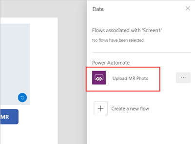

# Take and upload mixed-reality photos in Power Apps

You can add a control to take photos of the mixed-reality (MR) experience in your apps that use the following components:
- [View in MR](mixed-reality-component-view-mr.md)
- [View shape in MR](mixed-reality-component-view-shape.md)
- [Measure in MR](mixed-reality-component-measure-distance.md)

This topic will guide you through creating a test app that you can use to take and upload photos from within an MR session, including:

- Inserting a **View in 3D** component with the default sample 3D object included so you can see and manipulate a 3D object.
- Connecting the **View in 3D** component to a **View in MR** component button so you can view the 3D object in MR.
- Testing the components using an MR-capable device.
- Inserting a gallery to view recorded photos taken from the **View in MR** component on the MR-capable device.
- Uploading photos to OneDrive with a Power Automate flow.

## Prerequisites

- Create a blank canvas app ready for editing.
  - Go to the [Power Apps Studio](https://create.powerapps.com) and, under the **Start with a blank canvas or a template** section, select **Phone layout** on the **Blank app** tile.  
- Have a OneDrive folder called **MRPhotos** that you can store your photos in when testing the upload feature.

> [!TIP]
> The MR components work best in well-lit environments with flat-textured surfaces. When establishing tracking, point the device at the surface you would like to track and slowly pan the device from right to left in broad arm motions. If tracking fails, exit and enter the MR view to reset the tracking and try again.  
>
> LIDAR-enabled devices will also result in better tracking.

## Insert and connect a 3D object to the View in MR component and test your app

With an app open for editing in [Power Apps Studio](https://create.powerapps.com), you can insert and connect the **View in 3D** and **View in MR** components. Using these components lets you overlay a sample 3D object (which looks like a box's frame) into the real world using your device's camera.

1. Open the **Insert** tab.
2. Expand **Media**.
3. Select the component **View in 3D** to place it in the center of the app screen, or drag it to position it anywhere on the screen.  

    A default shape is included in the component. You can change this shape to another by altering the **Source** property. For more information, see [how to define where the 3D content is stored](mixed-reality-component-view-3d-store.md). In this example, we'll use the URL *https://raw.githubusercontent.com/microsoft/experimental-pcf-control-assets/master/robot_arm.glb*.
1. Open the **Insert** tab.
2. Expand **Mixed reality**.
3. Select the component **View in MR** to place it in the app screen, or drag it to position it anywhere on the screen.

    :::image type="content" source="./media/augmented-view-mr/augmented-view-mr.png" alt-text="Insert the View in MR component into the app.":::

1. In the **Properties** panel for the **View in MR** component, on the **Advanced** tab, select the **Source** field and enter `ViewIn3D1.Source` to set the source object as the 3D object you inserted with the **View in 3D** component.  

    You can also use the expression editor at the top of the window: type `ViewIn3D1.Source`.

   

9. [Save (and, if necessary, publish) the app](save-publish-app.md) and [load it on your mobile device](/powerapps/maker/canvas-apps/../mobile/run-powerapps-on-mobile) to test that you can view the 3D object in MR by selecting the **View in MR** button.

## Insert a gallery to view photos taken in the app

You can now insert a gallery control into your app. The gallery control lets users of the app take and view photos from within the app.

Photos you take by selecting the camera icon in the MR view on the app will be loaded into the gallery component on the app. If you exit the MR view to see the gallery, re-entering the MR view and taking more photos will overwrite the photos.

1. Open the **Insert** tab.
2. Select the **Vertical gallery** control to place it in the center of the app screen, or drag it to position it anywhere on the screen.
3. In the **Properties** panel for the gallery control, on the **Advanced** tab, set the **Items** property to equal `ViewInMR1.Photos`.  
    
    You can also use the expression editor at the top of the window.
    
    
4. Hold the `Alt` key and click on the View in MR button to generate sample photos and data. You should now see the gallery populate with a sample picture.

:::image type="content" source="./media/augmented-upload-photo/gallery-example.png" alt-text="Example of what the gallery should look like":::

    > [!TIP]
    > You can load all photos taken across multiple MR components by adding `Collect(AllPhotos,ViewInMR1.Photos)` to the **OnChange** property of each MR component.

You can insert a "pop-up" overlay of the selected image so users of the app can see the photo full size.

1. Open the **Insert** tab.
2. Expand **Media** and select the **Image** control to place it in the app screen. Drag and position it so it covers the entire screen (or however much of the screen you want the image to cover when selected from the gallery).

    

3. Go to the **Advanced** tab of the **Properties** pane:  
    1. Change the **OnSelect** property to `UpdateContext({vVisibleImageZoom:false})`.
    2. Change the **Image** property to `Gallery1.Selected.Image1` (or whatever the first image in the gallery control is labeled).
    3. Change the **Visible** property to `vVisibleImageZoom`.
4. Select the first image in the gallery control.
5. Go to the **Advanced** tab of the **Properties** pane and change the **OnSelect** property to `UpdateContext({vVisibleImageZoom:true})`.

    

6. [Save and publish the app](save-publish-app.md) and [load it on your mobile device](/powerapps/maker/canvas-apps/../mobile/run-powerapps-on-mobile).
7. Tap the **View in MR** button to open MR view. 
8. Tap the screenshot icon at the bottom of the screen, then tap the back arrow at the top of the screen.
9. You should see the screenshot now showing underneath the **View in MR** button. Tap the screenshot's thumbnail, and a large version of the screenshot will appear. Tap anywhere on the image to hide it.

## Upload photos to Sharepoint with a Power Automate flow

1. Go to the **Action** tab and select **Power Automate**, followed by **Create a new flow**. This option opens Power Automate in a new browser tab. You might need to sign in at the top.

    
2. Choose the template for a **PowerApps button**.

    
3. To make it easier to find later, rename the flow by selecting **PowerApps button** at the top and entering a new name of "Upload MR Photo".

    

4. Click on the "..." button next to the PowerApps trigger then select **Delete** followed by **OK**

:::image type="content" source="./media/augmented-view-mr/delete-powerapps-trigger.gif" alt-text="Deleting the PowerApps trigger":::

5. In the search box type in "PowerApps (V2)" and then select the "PowerApps (V2)" trigger.

:::image type="content" source="./media/augmented-view-mr/select-powerapps-v2-trigger.png" alt-text="Select the PowerApps (V2) trigger":::

6. Click the **Add an input** button and select the type **Text** then change the name from "Input" to "FileName"

7. Click **Add an input** again and select the type **File** then change the name from "File Content" to "Image"

:::image type="content" source="./media/augmented-view-mr/trigger-inputs.png" alt-text="The expected values for the PowerApps (V2) trigger":::

4. Select **+ New step**. Search for **OneDrive create file** and select the **Create file** action that appears in the results.

    

    Make sure you are signed in to the correct OneDrive account where you want to upload your photos.

5. Fill in the following information:
    1. For the **Folder Path**, enter **MRPhotos**.
    2. For the **File Name**, select the text box and then choose the option for **Ask in PowerApps**.
    
        

    3. For **File Content**:
       1. Select the text box and then choose **Expression**. Enter `decodeDataUri(replace(triggerBody()?['Createfile_FileContent'], '"', ''))` and then select **OK**. 

           

       2. Under the **Dynamic content** section, select **See more** and then choose **Ask in PowerApps**.  

           
           

          Adding this content adds a second purple box named **Createfile_FileContent** into the **Create file** task.  
          
          Select **X** to remove it. 

          

6. Your Flow should now have the **Folder Path**, **File Name**, and **File Content** fields filled in:
    
    

7. Save the flow and return to the browser tab that has your canvas app open. You'll see your flow now shows up in the **Data** pane.

    

8. Open the **Insert** tab and select **Button**.
9. Change the **Text** property of the button to `Upload photos`, and set the font size to 16. Move the button to a free area on the app screen and change its size so the button label fits inside it properly.
10. In the expression editor at the top of the Power Apps window, select the **OnSelect** property, and then select the **Action** tab. Select **Power Automate**, and then select the flow you created.

    

11. The **OnSelect** method will be populated with `YourFlowName.Run(`. Insert the following code to upload the last photo taken to the **MRPhotos** folder on OneDrive: 

    
    `UploadMRPhoto.Run(Last(ViewInMR1.Photos).ImageURI, JSON(Last(ViewInMR1.Photos).ImageURI, JSONFormat.IncludeBinaryData));`
    

    

    If you're inside a gallery of the MR photos, instead use the following formula:
    
    `UploadMRPhoto.Run(ThisItem.ImageURI, JSON(ThisItem.ImageURI, JSONFormat.IncludeBinaryData));`

    If you want to create a button that uploads all of the photos taken in the MR session, use this formula: 

    `ForAll(ViewInMR1.Photos, UploadMRPhoto.Run(ImageURI, JSON(ImageURI, JSONFormat.IncludeBinaryData)));`

## Use SaveData and LoadData functions

You can use the **SaveData** and **LoadData** functions In Power Apps with the MR components.

See the [SaveData, LoadData, and ClearData functions in Power Apps](./functions/function-savedata-loaddata.md) topic for how to use these functions.

## Other mixed-reality controls

- View 3D content with the **[View in 3D](mixed-reality-component-view-3d.md)** component.
- Measure distance, area, and volume with the **[Measure in mixed reality](mixed-reality-component-measure-distance.md)** component.
- Create and view predefined 3D shapes with the **[View shape in mixed reality](mixed-reality-component-view-shape.md)** component

[!INCLUDE[footer-include](../../includes/footer-banner.md)]
