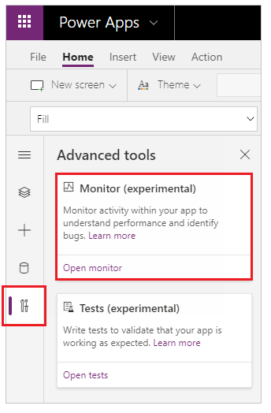
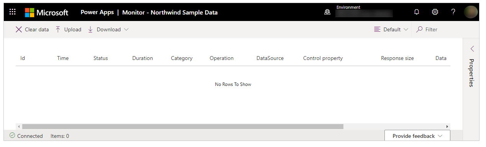
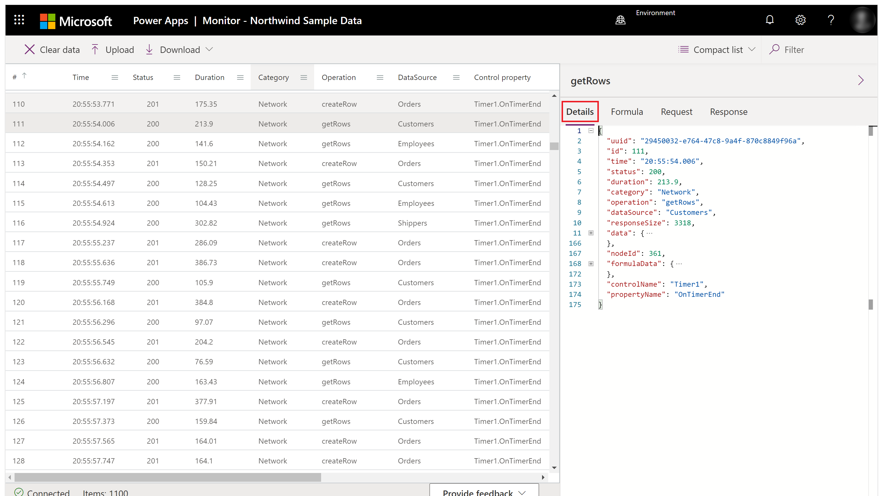
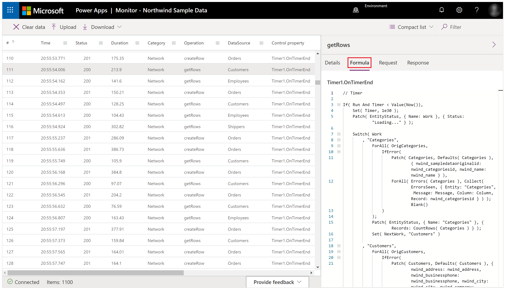
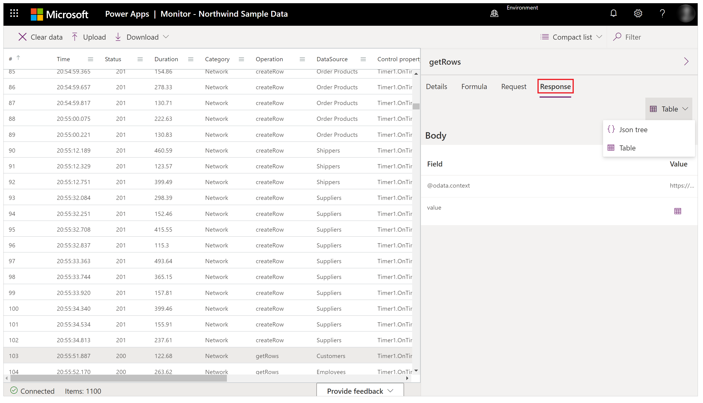
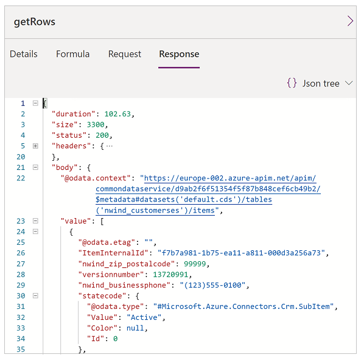
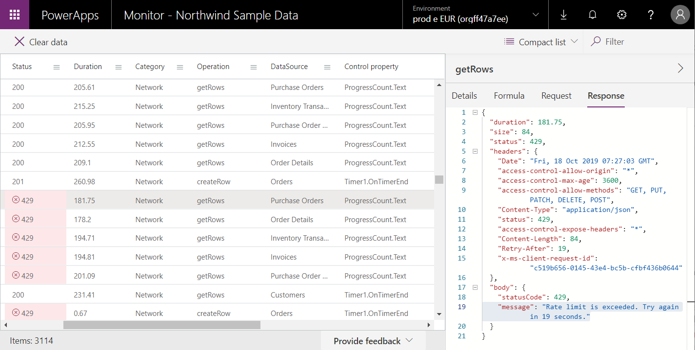
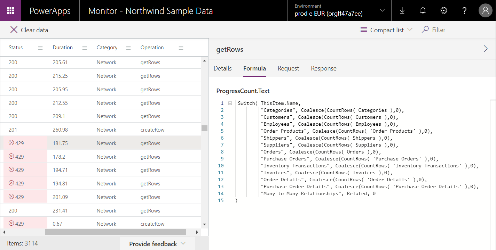

# Canvas app Monitor

## Overview

**Canvas app monitor** can help you debug and diagnose problems faster, and help you build faster, reliable apps. Monitor provides a deep view into how an
app runs by providing a log of all activity occurring in your app as it is
played. This gives you a better understanding of how the formulas contained in
your app work so you can improve performance and identify any errors or
problems.

## Debugging an app

The key to debugging an issue is to have a better understanding of what your app does, and how. Sometimes, it's difficult to isolate an issue when just looking at the app formulas, or even reviewing runtime errors. Watching the events as they occur in your app can help you understand the order and performance of events, errors, and diagnose issues faster.

Monitor helps you answer the following questions about your app:

- **High number of network calls**
    - Is the app fetching data too frequently?
    - Can you optimize the app to only fetch data when required?
    - Are timer controls firing too often?
    - Are too many events occurring when app starts? And can fetching some of the data be delayed?

- **Retrieve data from the same data source**
    - Can you use different patterns such as caching data in collections or variables instead of fetching same data multiple times?
    
-  **The response data size**
    – Can you use query filters to reduce the amount of data requested?

- **The duration of the request**
    - Are integrations optimized?
    - Can we reduce the size of the response using query filters?

- **Errors**
    - Have you configured the required permissions to run the app correctly?
    - Are your requests throttled by the platform?

These are just a few example questions, and answers that you can uncover when using the monitor. To see **Monitor** in action, see [Example: how to identify an issue in a sample app using Monitor](#Link-To-Example).

## Open canvas app Monitor

The canvas app Monitor is available by default for all canvas apps. To open the monitor:

1. Sign in to [Power Apps](https://make.powerapps.com/).

1. Create a [new app](https://docs.microsoft.com/powerapps/maker/canvas-apps/get-started-test-drive) or [edit an existing app](https://docs.microsoft.com/powerapps/maker/canvas-apps/edit-app).

1. Select **Advanced tools** in the left navigation pane.

1. Select **Open Monitor** to open the Monitor for this app. 

    

This opens Monitor in a new browser tab and connects the monitor to your existing Studio session:

> [!NOTE]
> Monitor has no impact on your app. You can use Monitor with any app in a test environment or in production.

## View events in canvas app Monitor

To view events from your app, play the app in the Studio. The monitor will then
display the table of events occurring along with specific details.

You can review various properties for each event inside the Monitor. Depending on the event category, some of these properties may not contain data.

Description of columns in canvas app Monitor:

| Column name | Description
| - | -
| **\#** | Sequence number for the events.
| **Time** | Time of the event.
| **Status** | The [http status code](https://www.w3.org/Protocols/rfc2616/rfc2616-sec10.html) of a network request. For example, a 2XX code represents a successful request while a 4XX code represents an error.
| **Duration** | Depends on the type of event. For example, for a network request, duration is the time taken for the request to be sent and a response to be received. Duration can be used to understand the performance of network calls in the app.
| **Category** | Type of event, such as *Network*.
| **Operation** | The resulting internal operation name of the request inside the app. For example, *createRow* is the operation name from the **Patch** function.
| **Control property** | Control property that raised the event.
| **Response size** | For a network request event, represents response size in bytes received from the sender to your app.

When you select an event in the grid, a panel displays containing
additional details about the event. The panel has four tabs:

- **Details** - Shows a high-level overview of the event that you select. Some of the data may be collapsed in the tree view. You can expand and drill down to view content:

    

- **Formula** - Shows related formula from your app for the selected event. The name of the control property triggering the event is displayed on top of the tab, and inside the event table:

    

- **Request** - Shows the HTTP request sent:

    

- **Response** - Shows the HTTP response received. You can view the response in tabular or JSON format. Default format is *Table* if the data can be displayed in tabular format:

    

    If you select *Table* format, tables and records are displayed in a grid. Selecting a table allows you to drill down to the records inside the table:

    

    Selecting *JSON tree* shows content in JSON format:

    

## Example - use Monitor to identity an issue with an app

In this example, you'll use the *Northwind Sample Data* app included with
the [Northwind sample solution](https://docs.microsoft.com/powerapps/maker/canvas-apps/northwind-install).

*Northwind sample solution* is a canvas app that loads sample data into the Common Data Service. You can also create a new app or use an existing app instead.

### Example issue background

Consider the scenario where the app is deployed and the initial app versions experiences performance degradation. The app also intermittently generates errors with no clear pattern. Loading data in app succeeds mostly and fails sometimes.

To debug the app, start the Monitor. <!--CONTINUE EDITING FROM HERE-->Within the monitor, we observed the
data operations as they were happening for each table load. But we also saw
several requests with a https status code of 429, indicating the user has sent
too many requests in a specific timeframe. Selecting one of these events in the
table, we were able to view the specific details and error message "Rate limit
exceeded. Try again in xx seconds."

This issue needed further analysis to understand why requests were getting
throttled. In the monitor, we could see that for each **createRow** call we are
generating a lot of **getRows** requests from
the **ProgressCount.Text** property, each to a different entity. This was not
the entity we were creating rows for. The **ProgressCount.Text**  formula could
be seen directly in the monitor.

For each record added, the formula was being revaluated and **CountRows** is
being called on many of the entities. This resulted in **getRows** in the log,
since **CountRows** isn't delegated for CDS. For each single request to add a
record, we were potentially making 12 additional requests to count the rows in
each entity.

These extra requests sporadically caused errors due to the CDS platform
throttling the requests to the service, and it also explained the overall
performance problem.

The permanent fix for this app was to do the **CountRows** manually for each
entity as records were being created in it.   Without monitor, it would have
been difficult to diagnose and resolve this issue.

### See also

[Canvas app Test Studio](test-studio.md)
