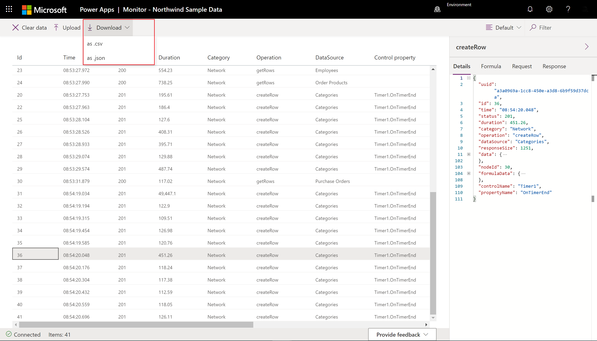
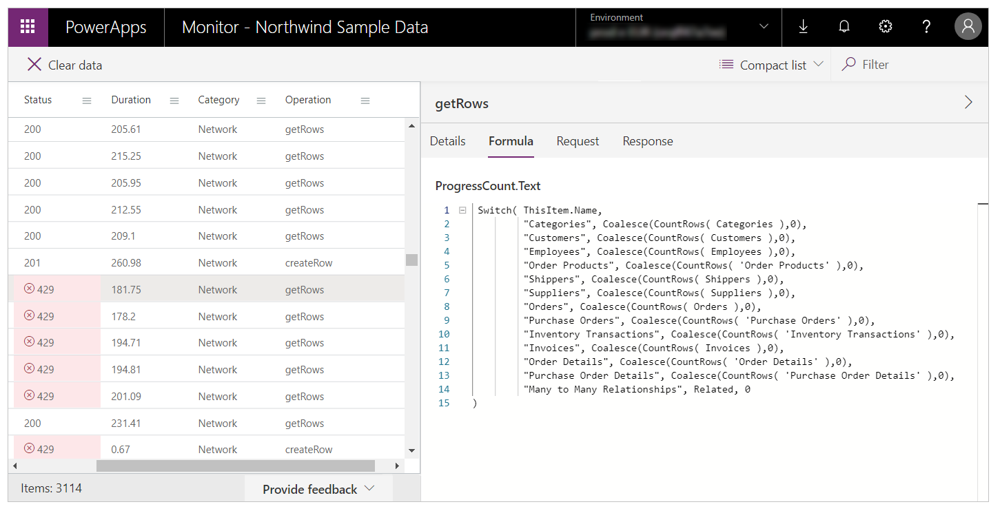

# Debugging an app with canvas app Monitor (Experimental)

**Canvas app Monitor** can help you debug and diagnose problems faster, and help you build faster, reliable apps. Monitor provides a deep view into how an app runs by providing a log of all activities in your app as the app runs.

This gives you a better understanding of how the formulas contained in your app work so you can improve performance and identify any errors or problems.

> [!NOTE]
> The canvas app Monitor feature is still experimental. For more information, see [Experimental and preview features](working-with-experimental-preview.md).

## Debugging an app

The key to debugging an issue is to have a better understanding of what your app does, and how. Sometimes, it's difficult to isolate an issue when just looking at the app formulas, or even reviewing runtime errors. Watching the events as they occur in your app can help you understand the order and performance of events and errors, and diagnose issues faster.

A few example issues and queries that you can uncover when using Monitor are:

- **High number of network calls**
    - Is the app fetching data too frequently?
    - Can you optimize the app to only fetch data when required?
    - Are timer controls firing too often?
    - Are too many events occurring when the app starts? And can fetching some of the data be delayed?

- **Retrieve data from the same data source**
    - Can you use different patterns such as caching data in collections or variables instead of fetching same data multiple times?
    
-  **The response data size**
    – Can you use query filters to reduce the amount of data requested?

- **The duration of the request**
    - Are integrations optimized?
    - Can you reduce the size of the response using query filters?

- **Errors**
    - Have you configured the required permissions to run the app correctly?
    - Are your requests throttled by the platform?

To see **Monitor** in action, see the [example scenario](#example).

## Open canvas app Monitor

Canvas app Monitor is available by default for all canvas apps. To open Monitor:

1. Sign in to [Power Apps](https://make.powerapps.com/).

1. Create a [new app](https://docs.microsoft.com/powerapps/maker/canvas-apps/get-started-test-drive) or [edit an existing app](https://docs.microsoft.com/powerapps/maker/canvas-apps/edit-app).

1. Select **Advanced tools** in the left navigation pane.

1. Select **Open Monitor** to open Monitor for this app. 

    

This opens Monitor in a new browser tab and connects it to your existing Studio session:


> [!NOTE]
> Monitor has no impact on your app. You can use Monitor with any app in a test environment or in production.

## View events in canvas app Monitor

To view events from your app, play the app in the Studio. Monitor will then display the table of events occurring along with specific details.


Refresh the page to replay the media.

You can review various properties for each event inside Monitor. Depending on the event category, some of these properties might not contain data.

Description of columns in canvas app Monitor:

| Column name | Description
| - | -
| **\#** | Sequence number for the events.
| **Time** | Time of the event.
| **Status** | The [http status code](https://www.w3.org/Protocols/rfc2616/rfc2616-sec10.html) of a network request. For example, a 2XX code represents a successful request while a 4XX code represents an error.
| **Duration** | Depends on the type of event. For example, for a network request, duration is the time taken for the request to be sent and a response to be received. Duration can be used to understand the performance of network calls in the app.
| **Category** | Type of event, such as *Network*.
| **Operation** | The resulting internal operation name of the request inside the app. For example, *createRow* is the operation name from the **Patch** function.
| **Control property** | Control property that raised the event.
| **Response size** | For a network request event, represents response size in bytes received from the sender to your app.

When you select an event in the grid, a panel displays containing additional details about the event. The panel has four tabs:

- **Details**: Shows a high-level overview of the event that you select. Some of the data might be collapsed in the tree view. You can expand and drill down to view content:

    

- **Formula**: Shows related formula from your app for the selected event. The name of the control property triggering the event is displayed on top of the tab, and inside the event table:

    

- **Request**: Shows the HTTP request sent:

    

- **Response**: Shows the HTTP response received. You can view the response in tabular or JSON format. Default format is *Table* if the data can be displayed in tabular format:

    

    If you select *Table* format, tables and records are displayed in a grid. Selecting a table allows you to drill down to the records inside the table:

    

    Selecting *Json tree* shows content in JSON format:

    

## Download and upload a trace file

You can download the events that are shown in the  table for offline analysis. The downloaded trace file can be shared with others and it can be uploaded back into Monitor for review and analysis. You can also attach a trace file to support service requests helping expedite the solution to your problem.



Select **Upload** to load a ```.json``` trace file to Monitor. The upload option will remove any events currently displayed in the Monitor table, and replace the details with the events contained in the trace file.


## Example

In this example, you'll use the *Northwind Sample Data* app included with the [Northwind sample solution](https://docs.microsoft.com/powerapps/maker/canvas-apps/northwind-install).

*Northwind sample solution* is a canvas app that loads sample data into Common Data Service. You can also create a new app or use an existing app instead.

### Background

Consider the scenario where the app is deployed and the initial app version experiences performance degradation. The app also intermittently generates errors with no clear pattern. Loading data in the app succeeds mostly and fails sometimes.

When you check canvas app Monitor, you see data operations as expected. However, you also see several responses with HTTP status code 429 indicating too many requests in a specific timeframe.

When you select such an event, you see the error as *Rate limit exceeded. Try again in XX seconds.*


### Analysis

The issue needs further analysis to understand why requests are getting throttled. In Monitor, you see that for each **createRow** call, there are several **getRows** requests from the **ProgressCount.Text** property, each to a different entity. These aren't the entities the app is creating rows for. The **ProgressCount.Text**  formula is seen in Monitor:



For each record added, the formula is evaluated again and **CountRows** is called on several entities. This resulted in **getRows** in the log, since **CountRows** isn't delegated for Common Data Service. For each single request to add a record, you're potentially making 12 additional requests to count the rows in each entity.

These extra requests intermittently cause errors due to the Common Data Service platform throttling the requests to the service. And it also explains the overall performance problem.

### Conclusion

The permanent fix for this app is to do the **CountRows** manually for each entity as records are being created in it. Without using Monitor, it would have been difficult to diagnose and resolve this issue.

### See also

[Canvas app Test Studio](test-studio.md)
