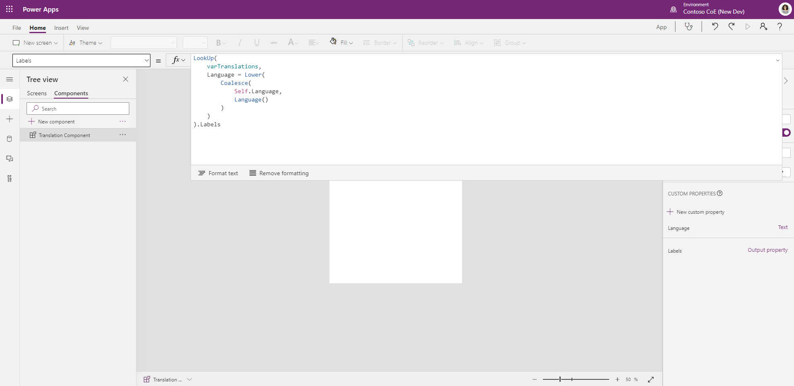
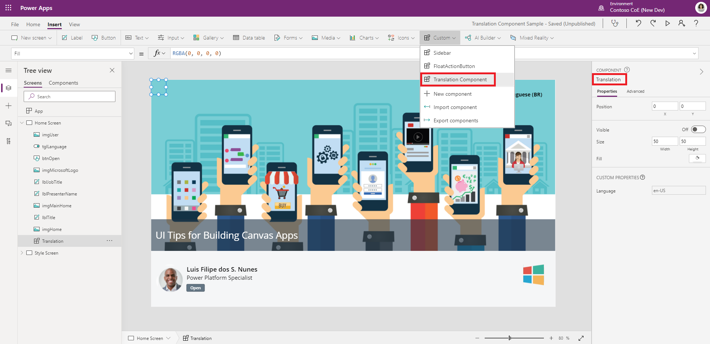
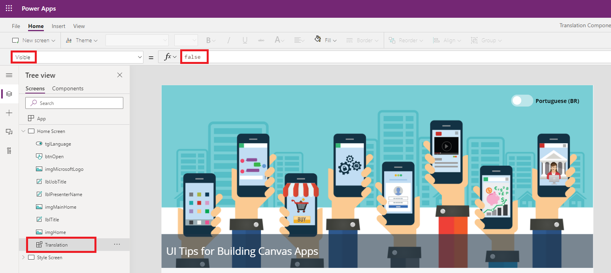
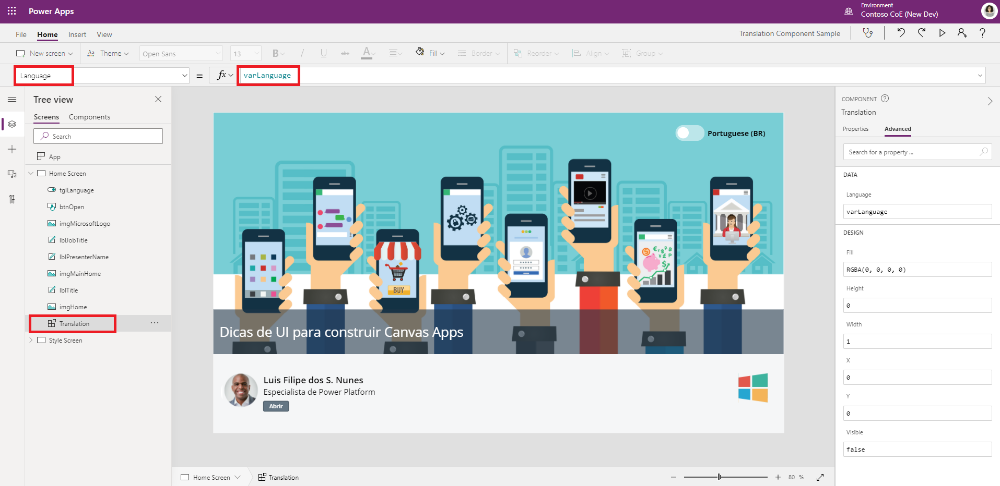
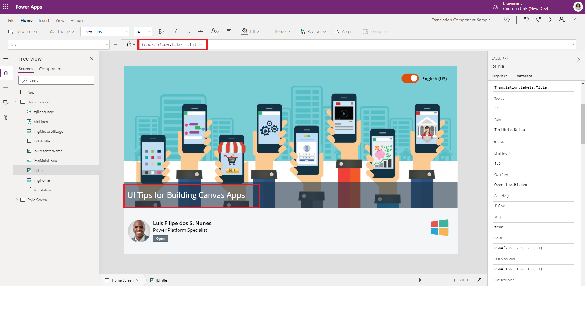

# Build a multi-language app

In this article, you'll learn how to create a multi-language app with localized experience. With this method, you can use canvas app components and make translations available in an app using a uniform formula syntax.

> [!IMPORTANT]
> The method described in this article use components for canvas apps which is in public preview. For more information, see [Create a component for canvas apps](create-component.md)

## Create a translation component

When working with a multi-language app, the first step is to create a reusable component for translation.

In this component, you'll store a table that acts as the dictionary of all translations you'll need. An output property will be used to provide output strings from this dictionary table based on the language of the user running the app that uses this component.

1. Sign in to [Power Apps](https://make.powerapps.com).

1. On the left pane, select **Apps**.

1. Under **Apps**, select **Component libraries (preview)**.

    ")

1. Select **+ New component library (preview)**.

1. Enter a name, such as "Translation components", and select **Create** to open the component in Power Apps Studio.

1. Rename "Component1" by selecting **...** on the left pane, and then select **Rename** as "Translation component".

   

1. From the property pane on the right-side of the screen, select **+ New custom property**.

1. Set the following property values:

    | Property name | Value |
    | - | - |
    | Display name | Language |
    | Name | Language |
    | Description | The language that you want to translate the text to. |
    | Property type | Input |
    | Data type | Text |

1. Select **Raise OnReset when value changes** checkbox.

    

1. Select **Create**.

    > [!NOTE]
    > This input property will receive the current locale ID (LCID) of the logged-in user.

1. From the property pane on the right-side of the screen, select **+ New custom property**.

1. Set the following property values:

    | Property name | Value |
    | - | - |
    | Display name | Labels |
    | Name | Labels |
    | Description | Translated labels. |
    | Property type | Output |
    | Data type | Record |

    

1. Select **Create**.

    > [!NOTE]
    > This output property exposes the translated labels based on the input locale ID.

1. On the upper-left side of the screen, select the property list drop-down and choose **OnReset** property for the component.

    

1. Copy and pate the following formula in the formula bar for the **OnReset** property.

   ```powerapps-dot
   Set(
    varTranslations,
    Table(
            {
                Language: "en-us",
                Labels: {
                    Title: "UI Tips for building canvas apps",
                    JobTitle: "Power Platform Specialist",
                    Close: "Close",
                    Open: "Open",
                    Cancel: "Cancel"
                }
            },
            {
                Language: "pt-br",
                Labels: {
                    Title: "Dicas de UI para construir canvas apps",
                    JobTitle: "Especialista de Power Platform",
                    Close: "Fechar",
                    Open: "Abrir",
                    Cancel: "Cancelar"
                }
            }
        )
       )
   ```

    The formula uses [Set()](functions/function-set.md) function to create a [table](functions/function-table.md) with the labels in different languages as a dictionary. To customize this table as the dictionary for your translations, change the control names such as *Title*, *JobTitle*, *Platform*, *Close*, *Open*, *Cancel*, and so on. You can add, or remove translations for control names depending on your business requirement.

    The table should also have an entry for each language that your app supports. Each entry will have a **Labels** property that will contain the translated content of all possible buttons, inputs and labels in your app.

1. Now change the formula of the output property **Labels** as follows:

   

   > [!NOTE] 
   > The formula will find the right translation entry based on the input **Language**. In the case where the language was not set, the formula will use the current user's language as the filter, hence the usage of the [Coalesce](https://docs.microsoft.com/powerapps/maker/canvas-apps/functions/function-isblank-isempty) function.

   ```
   LookUp(
    varTranslations,
    Language = Lower(
        Coalesce(
            Self.Language,
            Language()
        )
    )).Labels
    ```

## Use the Translation Component in a Canvas App

To use the translation component in your app

1. Add the component to the app and set the Name to "**Translation**".

   

1. Set the component **Visible** to **false**
   
   
1. Pass the value of the **Language** to the input property of the **translation component**. In this case we have a toggle control that sets a variable called `varLanguage` to the language selected by the user.

   

1. On every control in your app that needs to be translated, instead of using static text as the label, use the formula `Translation.Labels.[ControlName]` where [ControlName] is the name of the control defined in the dictionary.

   

With this approach, whenever the user changes their language, the app will automatically change the text of all buttons, inputs, labels etc. as shown below

