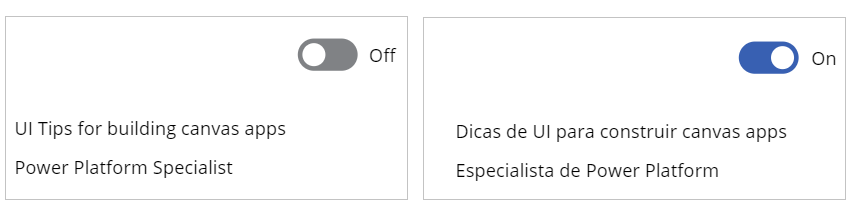

# Build a multi-language app

In this article, you'll learn how to create a multi-language app with localized experience. With this method, you can use canvas app components and make translations available in an app using a uniform formula syntax.

> [!IMPORTANT]
> The method described in this article use components for canvas apps which is in public preview. For more information, see [Create a component for canvas apps](create-component.md)

## Create a translation component

When working with a multi-language app, the first step is to create a reusable component for translation. In this component, you'll store a table that acts as the dictionary of all translations you'll need. An output property will be used to provide output strings from this dictionary table based on the language of the user running the app that uses this component.

1. Sign in to [Power Apps](https://make.powerapps.com).

1. On the left pane, select **Apps**.

1. Under **Apps**, select **Component libraries (preview)**.

    ")

1. Select **+ New component library (preview)**.

1. Enter a name, such as "Translation components", and select **Create** to open the component in Power Apps Studio.

1. Rename "Component1" by selecting **...** on the left pane, and then select **Rename** as "Translation component".

   

1. From the property pane on the right-side of the screen, select **+ New custom property**.

1. Set the following property values:

    | Property name | Value |
    | - | - |
    | Display name | Language |
    | Name | Language |
    | Description | The language that you want to translate the text to. |
    | Property type | Input |
    | Data type | Text |

1. Select **Raise OnReset when value changes** checkbox.

    

1. Select **Create**.

    > [!NOTE]
    > This input property will receive the current locale ID (LCID) of the logged-in user.

1. From the property pane on the right-side of the screen, select **+ New custom property**.

1. Set the following property values:

    | Property name | Value |
    | - | - |
    | Display name | Labels |
    | Name | Labels |
    | Description | Translated labels. |
    | Property type | Output |
    | Data type | Record |

    

1. Select **Create**.

    > [!NOTE]
    > This output property exposes the translated labels based on the input locale ID.

1. On the upper-left side of the screen, select the property list drop-down and choose **OnReset** property for the component.

    

1. Copy and pate the following formula in the formula bar for the **OnReset** property.

   ```powerapps-dot
   Set(
    varTranslations,
    Table(
            {
                Language: "en-us",
                Labels: {
                    Title: "UI Tips for building canvas apps",
                    JobTitle: "Power Platform Specialist",
                }
            },
            {
                Language: "pt-br",
                Labels: {
                    Title: "Dicas de UI para construir canvas apps",
                    JobTitle: "Especialista de Power Platform",
                }
            }
        )
       )
   ```

    The formula uses [Set()](functions/function-set.md) function to create a [table](functions/function-table.md) with the labels in different languages as a dictionary. To customize this table as the dictionary for your translations, change the control names such as *Title*, *JobTitle*, *Platform*, *Close*, *Open*, *Cancel*, and so on. You can add, or remove translations for control names depending on your business requirement.

    The table should also have an entry for each language that your app supports. Each entry will have a **Labels** property that will contain the translated content of all possible buttons, inputs, and labels in your app.

1. On the upper-left side of the screen, select the property list drop-down and choose **Labels** property for the component.

    

1. Copy and pate the following formula in the formula bar for the **OnReset** property.

    ```powerapps-dot
       LookUp(
        varTranslations,
        Language = Lower(
            Coalesce(
                Self.Language,
                Language()
            )
        )).Labels
    ```

    The formula finds the right translation entry based on the input **Language** using the [Lookup()](functions/function-filter-lookup.md) function. In case where the language isn't set, the formula uses the current user's language as the filter through [Coalesce](functions/function-isblank-isempty.md) function.

1. Select **File** -> **Save** to save the component library.

1. Select **Publish** to publish the component library.

    > [!TIP]
    > To learn more about creating, saving, and publishing component library, go to [Create an example component library](component-library.md#create-an-example-component-library)

Your translation component library is created, saved, and published for use.

## Use the translation component in your app

Previously, you created the translation component library for reuse. In this section, you'll create an app that uses the translation component library and demonstrate the language translation based on the selected language.

1. Sign in to [Power Apps](https://make.powerapps.com).

1. On the left pane, select **Apps**.

1. Select **New app** -> **Canvas app**.

1. Select the **Blank app** template with **Phone layout**.

1. On the left-side of the screen, select **+** (Insert).

1. On the bottom-left side of the screen, select **Get more components**.

1. Select **Translation component**.

    

    > [!NOTE]
    > The name might be different if you saved the component library created earlier with a different name.

1. Select **Import**.

1. On the left-side of the screen, select **+** (Insert).

1. Under **Library components**, select **Translation component** to add the component to this app.

1. On the left-side of the screen, select the tree view.

1. Select the translation component.

1. On the upper-left side of the screen, select the property list drop-down and choose **Visible** property for the component.

1. Set the value of the **Visible** property to **false** to make the component invisible on the app.

1. Under **Input** in the list of controls, select **Toggle**.

1. On the upper-left side of the screen, select the property list drop-down and choose **OnChange** property for the component.

1. Update the formula for the **OnCheck** property of the toggle control to the following.

    ```powerapps-dot
        Set(varLanguage,"pt-br")
    ```

    In this formula, the toggle sets a variable called **varLanguage** with the value of "pt-br" using the function [Set()](functions/function-set.md), for Portuguese (BR) language code.

1. Update the formula for the **OnUncheck** property of the toggle control to the following.

    ```powerapps-dot
        Set(varLanguage,"en-us")
    ```

    In this formula, the toggle sets a variable called **varLanguage** with the value of "en-us" using the function [Set()](functions/function-set.md), for English (US) language code.

1. On the left-side of the screen, select the translation component.

1. On the upper-left side of the screen, select the property list drop-down and choose **Language** property for the component.

1. Set the formula value for **Language** property to `varLanguage`. The variable **varLanguage** is determined by the toggle configured earlier. When the toggle is checked, the language is set to "pt-br". When unchecked, the language is set to "en-us".

1. On the left-side of the screen, select **+** (Insert).

1. Select **Text label**.

1. Update the label control name to **Title** from the right-side of the screen using the property pane.

1. Select **Text label** again to add one more label.

1. Update the label control name to **JobTitle**.

1. Set the **Title**, and **JobTitle** labels below the toggle control so that both labels are visible.

1. Set the **Text** property for **Title**, and **JobTitle** labels from the upper-left side of the screen to the following.

    | Label | Formula |
    | - | - |
    | Title | `'Translation component_1'.Labels.Title`  |
    | JobTitle | `'Translation component_1'.Labels.JobTitle` |

    > [!NOTE]
    > Replace **'Translation component_1'** in this formula to the name of the component in your app, if different.

    Similarly, you can use different labels, and properties, as defined in the component that you created earlier to pass more property values. For example, in addition to *Title*, and *JobTitle*, you can create more properties such as *Description*, or *Instructions* in the component library with the translated text. And then, use such properties on the respective labels, as *'Translation component_1'.Labels.Description*, or *'Translation component_1'.Labels.Instructions*.

1. Select **File** -> **Save**, update the name for your app, and then select **Save** to save your app. More information: [Save and publish an app](save-publish-app.md)

## Test your app with language translation

Now your app is using the translation component. Go to [Power Apps](https://make.powerapps.com) and select the app to run.

When the toggle is selected, the language is changed to Portuguese (BR) for the labels. When unchecked, the language is set back to English (US).



With this approach, you can now create your own component having the translations dictionary that fits your business requirement. And then, create more canvas apps that use the component that gives the business users the ability to use different languages.

### See also

[Add and configure controls](add-configure-controls.md) <br>
[Understand variables](working-with-variables.md) <br>
[Formula reference](formula-reference.md)