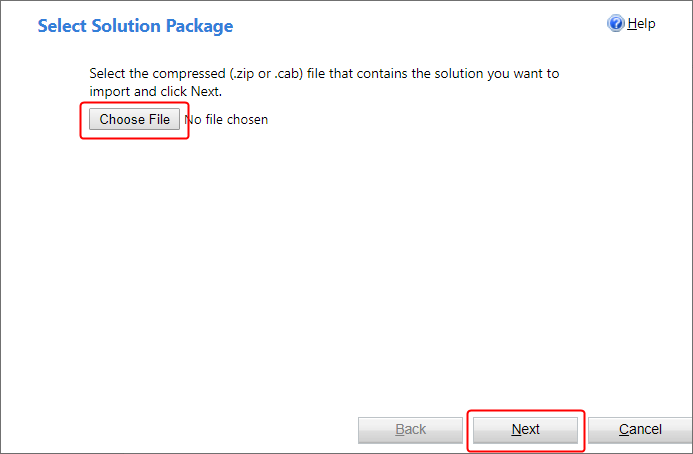
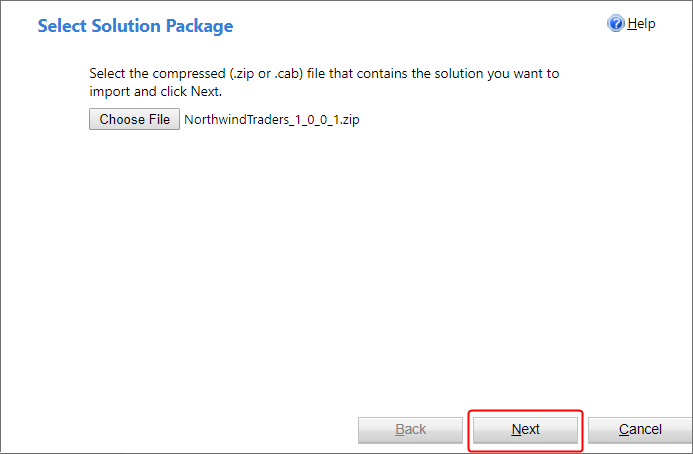
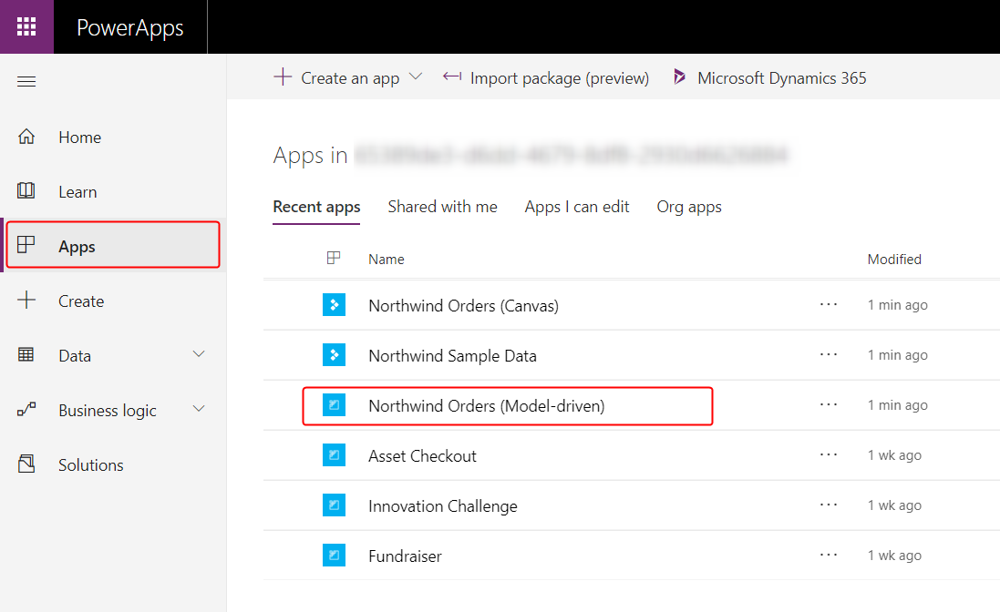

# Install Northwind Traders database and apps

Learn how to build business apps over relational data in Common Data Service by downloading and exploring a sample database and two apps that you can use to manage it. By following the steps in this topic, install the Northwind Traders database in your own environment, and discover concepts behind canvas and model-driven apps, relationships between entities, and option sets.

Northwind Traders is a fictitious organization that manages orders, products, customers, suppliers, and many other aspects of a small business. This sample appeared with the first versions of Microsoft Access and is still available as an Access template.

## Prerequisites

- A PowerApps license that supports Common Data Service. You can [purchase a free license](../signup-for-powerapps.md) for 30 days.
- An environment with a Common Data Service database. You can [create such an environment](https://docs.microsoft.com/power-platform/admin/create-environment) if you have appropriate permissions.

## Install the solution

As the first step of installing the database and the apps, download the [**Northwind Traders Solution File**](https://pwrappssamples.blob.core.windows.net/samples/NorthwindTraders_1_0_0_1.zip)  (.zip), which contains the definitions of entities, option sets, and business processes. This [solution](../../developer/common-data-service/introduction-solutions.md) file also contains the canvas and model-driven apps, as well as any other pieces that are used together.

To install the solution, select **Solutions** in the left navigation pane, and then select **Import** in the toolbar near the top of the screen: 

In the **Select Solution Package** page, select **Choose File**, navigate to and select the file that you downloaded, and then select **Next**. (Unless you selected a different location, the file will be in your Downloads folder.)

Confirm that you have the correct file (the version number might vary), and then select **Next**:

In the **Solution Information** page, select **Next** to confirm the name of the solution and the publisher.

In the next page, select **Import** to confirm SDK message handling, which the sample requires:

Another page appears and shows progress as the solution is installed in the next few minutes:

When the installation finishes, the original page shows the result:

 
## Load the sample data

After you install the solution, navigate to the Apps section of your environment and open the Northwind Sample Data app. It may take a few minutes for apps to appear after you install the solution:

When the app asks for permission to interact with Common Data Service, select **Allow**:

After the app loads and shows that the sample entities contain no records, select **Load Data** button to populate the entities:

As the app loads the data, dots march across the top of the app, and the number of records increases.

Entities are loaded in a specific order so that relationships can be established between records. For example, the **Order Details** entity has a many-to-one relationship with the **Orders** and **Order Products** entities, which are loaded first.  

You can cancel the process at any time by selecting **Cancel**, and you can remove the data at any time by selecting **Remove Data**:

When complete, the last row (**Many to Many Relationships**) shows **Done**, and the **Load Data** and **Remove Data** buttons are enabled again: 

## Orders app

This solution includes two apps for interacting with this data.

### Canvas

With **Apps** selected in the left navigation bar, select the **Northwind Orders (Canvas)** app:

This app is a simple master-detail view of the **Orders** entity, where you can view and edit details of the order and the line items for an order. A list of orders appears near the left edge, and you can select an arrow in that list to show the details of that order.

### Model-driven

With **Apps** selected in the left navigation bar, select the Northwind Orders (Model-driven) app:

This app operates on the same data (in the **Orders** entity) as the canvas app. In the list of orders, show details about an order by selecting its number:

The details appear on a separate form:

If you scroll down the form, it shows the same line items as the canvas app did:

