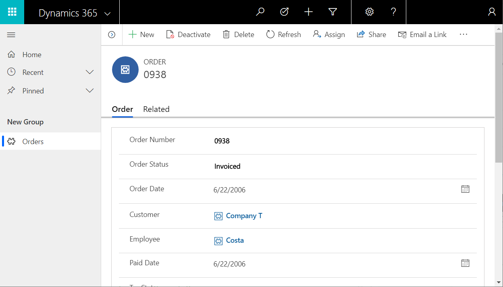

# Install Northwind Traders sample database and apps

Northwind Traders is a sample database and set of applications that illustrate how to build business apps over relational data in the Common Data Service.  It showcases the use of both Canvas and Model-driven apps, relationships between entities, and Option sets.       

Northwind Traders is the name of our fictitious that needs to manage Orders, Products, Customers, Suppliers, and many other aspects of a small business.  This sample appeared with the first versions of Microsoft Access and is still available as an Access template today.

This article explains how to install this sample in your own environment and start exploring.  

## Environment

You will need an environment in which to install the sample.  An environment is a container that can hold a database.

[Create an environment](https://docs.microsoft.com/en-us/power-platform/admin/create-environment) 

As this is a sample intended for educational purposes, you may want to create a Trial tenant to install the sample. 

[Explore PowerApps for free for 30 days](../signup-for-powerapps.md)

## Solution

This sample is provided as a [Solution](../../developer/common-data-service/introduction-solutions).  A solution file is a .zip file that contains the entity definitions, Option set definitions, business process definitions, Canvas and Model-driven apps, and any other pieces that are used together.

To begin, download this file to your local computer: [**Northwind Traders Solution File**](https://pwrappssamples.blob.core.windows.net/samples/NorthwindTraders_1_0_0_1.zip)

To install the solutions, navigate to the Solutions tab in the left hand navigation pane and select "Import" at the top of the screen: 

A pop-up window will appear asking for the solution file you downloaded.  Unless you selected a different location, the file will be in your Downloads folder.  Select the "Choose File" button, select the file from your local computer, and then select the "Next" button:

Confirm that you have the correct file (the version number may vary) and select the "Next" button:

The next screen confirms the solution name and published.  Select "Next":

The next screen confirms SDK message handling which is required by the sample.  Select "Import":

Another pop-up window will now appear and show progress as the solution is installed.  The process takes a few minutes:

After the install is complete, the original pop-up window will show the result:

 
## Loading sample data

After the solution has been installed, navigate to the Apps section of your environment and open the "Northwind Sample Data" app.  It may take a few minutes for apps to appear after the solution install:

The app will ask for permission to interact with the Common Data Service, select "Allow":

The app will load and show the number of records in each of the sample entities (zero).  Select the "Load Data" button to begin populating the entities:

The app will begin loading the data.  Dots will march across the top of the app, the number of records will increase.  

Entities are loaded in a specific order so that relationships can be established between records.  For example, Order Details has a many-to-one relationship with Orders and Order Products that must be loaded first.  

You can cancel the load at any time by selecting the "Cancel" button.  And you can remove the data at any time by selecting the "Remove Data" button:

When complete, the last Many to Many Relationships row will show "Done" and the "Load Data" and "Remove Data" buttons will again be enabled: 

## Canvas Orders app

Included with this solution are two apps for interacting with this data.  

With Apps selected in the left hand navigation bar, select the "Northwind Orders (Canvas)" app:

This app is a simple master-detail view of Orders, where you can view and edit details of the order and the line items for an order.  Select the right arrows in the left hand list of orders to see the details for an order.

## Model-driven Orders app

There is also a Model-driven app included.  Again with Apps selected in the left hand navigation bar, select the "Northwind Orders (Model-driven)" app:

This app operates on the same data as the Canvas Orders app.  Here you select an order from the list of orders:

And then see the on a separate form:

Scrolling down the form we can see the same line items as we saw on the Canvas app:

