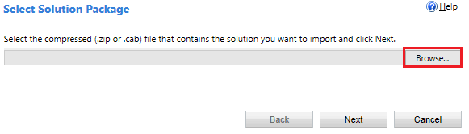
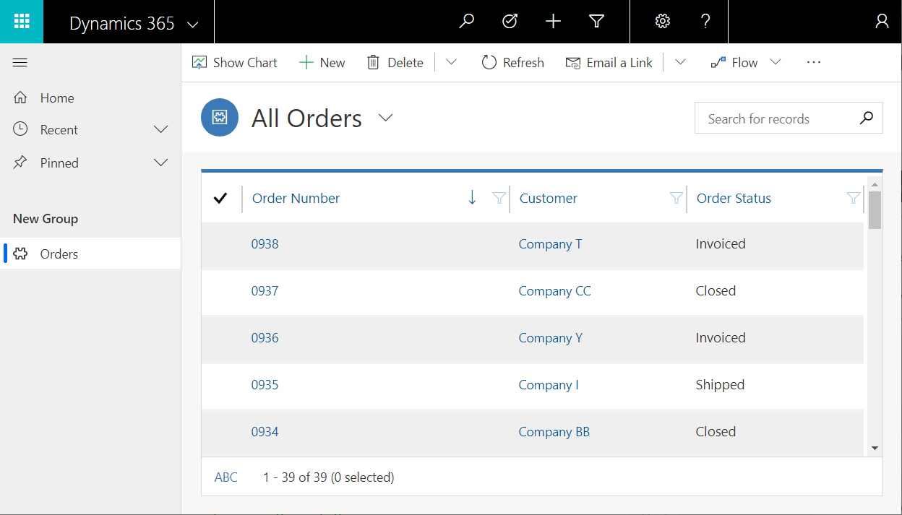

# Install Northwind Traders database and apps

Learn how to build business apps over relational data in Common Data Service by downloading and exploring a sample database and two apps that you can use to manage it. By following the steps in this topic, install the Northwind Traders database in your own environment, and discover concepts behind canvas and model-driven apps, relationships between entities, and option sets.

Northwind Traders is a fictitious organization that manages orders, products, customers, suppliers, and many other aspects of a small business. This sample appeared with the first versions of Microsoft Access and is still available as an Access template.

## Prerequisites

- A PowerApps license that supports Common Data Service. You can [purchase a free license](../signup-for-powerapps.md) for 30 days.
- An environment with a Common Data Service database. You can [create such an environment](https://docs.microsoft.com/power-platform/admin/create-environment) if you have appropriate permissions.

## Install the solution

1. Download the [**Northwind Traders Solution File**](https://pwrappssamples.blob.core.windows.net/samples/NorthwindTraders_1_0_0_1.zip).

    This [solution](../../developer/common-data-service/introduction-solutions.md) file (.zip) contains the definitions of entities, option sets, and business processes; the canvas and model-driven apps; and any other pieces that are used together.

1. Sign in to [PowerApps](https://web.powerapps.com?utm_source=padocs&utm_medium=linkinadoc&utm_campaign=referralsfromdoc), and then ensure that you're working in an environment that contains a Common Data Service database.

1. In the left navigation pane, select **Solutions**, and then select **Import** in the toolbar near the top of the screen:

    > [!div class="mx-imgBorder"]
    > 

1. In the **Select Solution Package** page, select **Browse**, find and select the file that you downloaded, and then select **Next**.

    Unless you selected a different location, the file will be in your Downloads folder.

    > [!div class="mx-imgBorder"]
    > 

1. If you have the correct file (the version number might vary), select **Next**:

    > [!div class="mx-imgBorder"]
    > 

1. In the **Solution Information** page, select **Next** if the name of the solution and the publisher are correct.

    > [!div class="mx-imgBorder"]
    > 

1. In **Import Options** page, select **Import** to confirm SDK message handling, which the sample requires:

    > [!div class="mx-imgBorder"]
    > 

    Another page appears and shows progress as the solution is installed over the next few minutes:

    > [!div class="mx-imgBorder"]
    > 

    When the installation finishes, the original page shows the result:

    > [!div class="mx-imgBorder"]
    > 

1. Select **Close**.

## Load the sample data

1. Select **Apps**, and then select **Northwind Sample Data**.

    Wait a few minutes if the Northwind apps don't appear immediately after you install the solution:

    > [!div class="mx-imgBorder"]
    > 

1. When the app asks for permission to interact with Common Data Service, select **Allow**:

    > [!div class="mx-imgBorder"]
    > 

1. After the app loads and shows that the sample entities contain no records, select **Load Data** button to populate the entities:

    > [!div class="mx-imgBorder"]
    > 

    As the app loads the data, dots march across the top of the app, and the number of records increases.

    Entities are loaded in a specific order so that relationships can be established between records. For example, the **Order Details** entity has a many-to-one relationship with the **Orders** and **Order Products** entities, which are loaded first.

    You can cancel the process at any time by selecting **Cancel**, and you can remove the data at any time by selecting **Remove Data**:

    > [!div class="mx-imgBorder"]
    > 

    When the data finishes loading, the last row (**Many to Many Relationships**) shows **Done**, and the **Load Data** and **Remove Data** buttons are enabled again:

    > [!div class="mx-imgBorder"]
    > 

## Orders app

The Northwind solution includes these apps for interacting with this data:

- Northwind Orders (Canvas)
- Northwind Orders (Model-driven)

You open these apps the same way that you opened the app in the previous procedure.

### Canvas

This app is a simple master-detail view of the **Orders** entity, where you can view and edit details of the order and the line items for an order. A list of orders appears near the left edge, and you can select an arrow in that list to show the details of that order.

> [!div class="mx-imgBorder"]
> 

### Model-driven

This app operates on the same data (in the **Orders** entity) as the canvas app. In the list of orders, show details about an order by selecting its number:

> [!div class="mx-imgBorder"]
> 

The details appear on a separate form:

> [!div class="mx-imgBorder"]
> 

If you scroll down the form, it shows the same line items as the canvas app does:

> [!div class="mx-imgBorder"]
> 