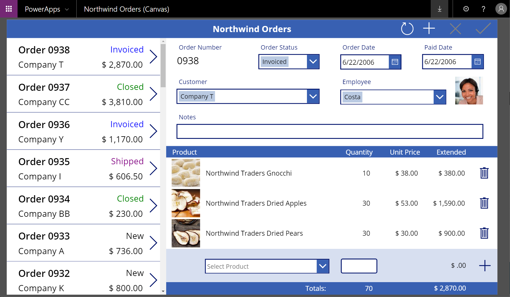

# Install Northwind Traders database and apps

By following the steps in [this series of topics](northwind-orders-canvas-part1.md), you can discover concepts about relational data as implemented in a sample database in Microsoft Dataverse. You can also explore sample business apps, both canvas and model-driven, for managing that data and earn practical experience by creating such an app. This first topic explains how to install the Northwind Traders database in your own environment and gain access to the sample apps, which you can open for editing to reveal how they were built.

Northwind Traders is a fictitious organization that manages orders, products, customers, suppliers, and many other aspects of a small business. This sample appeared with the first versions of Microsoft Access and is still available as an Access template.

## Prerequisites

- A Power Apps license that supports Dataverse. You can [use a free trial license](../signup-for-powerapps.md) for 30 days.
- An environment with a Dataverse database. You can [create such an environment](/power-platform/admin/create-environment) if you have appropriate permissions.

## Download the solution

> [!div class="nextstepaction"]
> [Download the Northwind Traders Solution File](https://pwrappssamples.blob.core.windows.net/samples/NorthwindTraders_1_0_0_6.zip)

This [solution](../../developer/data-platform/introduction-solutions.md) file (.zip) contains the definitions of tables, choices, and business processes; the canvas and model-driven apps; and any other pieces that are used together.

## Install the solution

1. Sign in to [Power Apps](https://make.powerapps.com?utm_source=padocs&utm_medium=linkinadoc&utm_campaign=referralsfromdoc), and then ensure that you're working in an environment that contains a Dataverse database.

1. In the left navigation pane, select **Solutions**, and then select **Import** in the toolbar near the top of the screen:

    > [!div class="mx-imgBorder"]
    > 

1. In the **Select Solution Package** page, select **Browse**.

    > [!div class="mx-imgBorder"]
    > 

1. Find the file that you downloaded, and then select **Open**.

    Unless you selected a different location, the file will be in your Downloads folder.

1. If you have the correct file (the version number might vary), select **Next**:

    > [!div class="mx-imgBorder"]
    > 

1. In the **Solution Information** page, select **Next** if the name of the solution and the publisher are correct.

    > [!div class="mx-imgBorder"]
    > 

1. In the **Import Options** page, select **Import** to confirm SDK message handling, which the sample requires:

    > [!div class="mx-imgBorder"]
    > 

    Another page appears and shows progress as the solution is installed over the next few minutes:

    > [!div class="mx-imgBorder"]
    > 

    When the installation finishes, the original page shows the result:

    > [!div class="mx-imgBorder"]
    > 

1. Select **Close**.

## Load the sample data

1. Select **Apps**, and then select **Northwind Sample Data**.

    Wait a few minutes if the Northwind apps don't appear immediately after you install the solution:

    > [!div class="mx-imgBorder"]
    > 

1. When the app asks for permission to interact with Dataverse, select **Allow**:

    > [!div class="mx-imgBorder"]
    > 

1. After the app loads and shows that the sample tables contain no records, select **Load Data** to populate the tables:

    > [!div class="mx-imgBorder"]
    > 

    As the app loads the data, dots march across the top of the app, and the number of records increases.

    Tables are loaded in a specific order so that relationships can be established between records. For example, the **Order Details** table has a many-to-one relationship with the **Orders** and **Order Products** tables, which are loaded first.

    You can cancel the process at any time by selecting **Cancel**, and you can remove the data at any time by selecting **Remove Data**:

    > [!div class="mx-imgBorder"]
    > 

    When the data finishes loading, the last row (**Many to Many Relationships**) shows **Done**, and the **Load Data** and **Remove Data** buttons are enabled again:

    > [!div class="mx-imgBorder"]
    > 

## Sample apps

The Northwind solution includes these apps for interacting with this data:

- Northwind Orders (Canvas)
- Northwind Orders (Model-driven)

You open these apps the same way that you opened the app in the previous procedure.

### Canvas

This single-screen app offers a simple master-detail view of the **Orders** table, where you can view and edit a summary of the order and each line item for an order. A list of orders appears near the left edge, and you can select an arrow in that list to show a summary and the details of that order. More information: [Overview of the canvas app for Northwind Traders](northwind-orders-canvas-overview.md).

> [!div class="mx-imgBorder"]
> 

### Model-driven

This app operates on the same data (in the **Orders** table) as the canvas app. In the list of orders, show more information about an order by selecting its number:

> [!div class="mx-imgBorder"]
> 

A summary of the order appears on a separate form:

> [!div class="mx-imgBorder"]
> 

If you scroll down the form, it shows the same line items as the canvas app does:

> [!div class="mx-imgBorder"]
> 

## Do it yourself

You can follow step-by-step instructions to create the canvas app shown earlier in this topic.  The instructions are divided into three parts:

1. [Create an order gallery](northwind-orders-canvas-part1.md).
1. [Create a summary form](northwind-orders-canvas-part2.md).
1. [Create a detail gallery](northwind-orders-canvas-part3.md).

If you want to skip ahead, the solution contains a starting-point app for each part.  In the list of apps, look for **Northwind Orders (Canvas) - Begin Part 1** and so on.

This [overview of the app](northwind-orders-canvas-overview.md) explains the user interface, data sources, and how relationships are used.

> [!div class="nextstepaction"]
> [Start by reading the overview](northwind-orders-canvas-overview.md)

[!INCLUDE[footer-include](../../includes/footer-banner.md)]