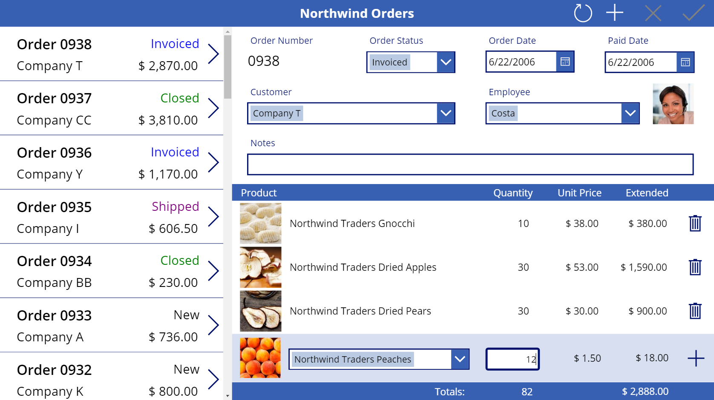
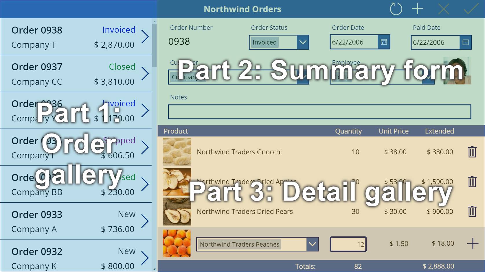

# Overview of the canvas app for Northwind Traders

Learn about the canvas app for managing relational data in the Northwind Traders database that you [installed in your environment](northwind-install.md). Then follow step-by-step instructions in subsequent topics to build this app from scratch, thereby gaining hands-on experience working with relational data.

In this topic, discover:

- How an app user shows and manages relational data in the app.
- Which types of data drive the app.
- How relationships between those types of data were created.

In a single screen, the app user can show, update, create, and delete orders.

> [!div class="mx-imgBorder"]
> 

## Explore the user interface

### Order gallery

On the left edge of the app, a gallery shows a list of orders, including the order number, the status, the name of the customer, and the total cost of the order. The user can scroll through the list to find an order and then show more information about it by selecting the order's arrow. More information: [Create the order gallery](northwind-orders-canvas-part1.md).

### Summary form

In the upper-right corner, a form summarizes the order that the user selected in the order gallery. The summary includes much of the same information as that gallery does, but the summary also shows the dates when the order was created and paid, as well as the name and the picture of the employee who managed the order. The user can change the data in the form, save those changes, cancel them, or delete the order by selecting an icon near the right edge of the title bar. More information: [Create the summary form](northwind-orders-canvas-part2.md).

### Detail gallery

In the lower-right corner, another gallery shows information about which products the selected order contains and in what quantities. Each item in this gallery is known as an order detail. The app user can add and delete any item in that gallery by using controls in and under it. More information: [Create the detail gallery](northwind-orders-canvas-part3.md).

> [!div class="mx-imgBorder"]
> 

## Explore the data sources

To create this app, you'll show data from five tables and an choice. In fact, most areas of this app show data from multiple tables. For example, the order gallery contains this information:

- The order number is a field in the **Orders** table.
- The status is another field in the **Orders** table, an option from the **Orders Status** choice.
- The customer name is a field in the **Customers** table.
- The total cost is calculated based on data in the **Order Details** table.

The summary contains some of the same information as the list of orders, but it also contains the name and the picture of the employee who managed the order. That information is pulled from fields in the **Employees** table. The detail gallery shows records in the **Order Details** table, and each product in those details is a record in the **Order Products** table.

## Explore the relationships

You can show data from different sources (for example, tables) in the same gallery or form because those tables have relationships that were created for you in the database.

### Many-to-one relationships

For example, information about the customer and the employee for each order resides in the **Customers** and **Employees** tables. Therefore, the **Orders** table has many-to-one relationships with those tables because there are many orders, each of which can be placed by only one customer and managed by only one employee.

Each order also has one or more line items that represent the products that the order contains and their quantities. Each line item is a record in the **Order Details** table, which pulls information about each product from the **Order Products** table. Each detail identifies only one product, but each product can appear in multiple details. Therefore, the **Order Details** table has a many-to-one relationship with the **Order Products** table.

### One-to-many relationships

Each order can contain multiple line items, but each line item relates to only one order. Therefore, the **Orders** table has a one-to-many relationship with the **Order Details** table.

### Dot notation for relationships 

To show data based on a relationship between tables, you can use the dot property selector to walk across a relationship from one table to another.  For example, each record in the **Orders** table pulls information from the **Customers** table so that the order gallery can show the customer names. In that gallery, you configure this behavior by setting the **Text** property of a label to this expression: `ThisItem.Customer.Company`

**ThisItem** specifies a record in the **Orders** table and pulls information from the **Customers** table about the customer who placed the order. In this case, the expression specifies that the customer's company name appears. However, the entire record for that customer is pulled, so you could just as easily show, for example, an email address for that customer instead.

As another example of walking from one table to another, you can specify that a gallery should show records in one table based on a record that the user selected in another gallery and that's in another table. To show the order details, you'll set the detail gallery's **Items** property to this expression: `Gallery1.Selected.'Order Details'`

In this case, **Gallery1.Selected** specifies a record in the **Orders** table, just as **ThisItem** did in the previous example. However, this expression doesn't pull just one record as the previous expression did. Instead, it pulls an entire table of records to show the name and per-unit cost of each product (as reflected in the **Order Products** table) and the quantity (as reflected in the **Order Details** table).

## Do it yourself

You can follow step-by-step instructions to create the Northwind Orders canvas app.  The instructions are divided into three parts:

1. [Create an order gallery](northwind-orders-canvas-part1.md).
1. [Create a summary form](northwind-orders-canvas-part2.md).
1. [Create a detail gallery](northwind-orders-canvas-part3.md).

If you want to skip ahead, the solution contains a starting-point app for each part.  In the list of apps, look for **Northwind Orders (Canvas) - Begin Part 1** and so on.

> [!div class="nextstepaction"]
> [Continue by creating the order gallery](northwind-orders-canvas-part1.md)

[!INCLUDE[footer-include](../../includes/footer-banner.md)]