# Build Northwind Orders (Canvas): Part 1, Orders list

This series of articles will build a simple order management Canvas app step-by-step.  It will showcase how to use:
- Many-to-One relationships.  Many Orders can be related to the same Customer.  But each Order can be related to only one Customer.
- One-to-Many relationships.  Each Order can be related to many Order Details (or line items).  But each Order Detail is related to only one Order.
- Many-to-Many relationships.  Each Product can be related to many Product Categories.  And each Product Category can be related to many Products. 
- Option sets.  

The completed app will look like this:


There are four parts:
- Part 1, Orders list
- Part 2, Order details form
- Part 3, Order line items
- Part 4, Order categories 

## Getting started

1. Login to the PowerApps portal.  

1. [Install the Northwind Traders sample database and apps](northwind-install.md).  This will install all the entities that we need and a completed version of the app we are about to build.

1. Create your own blank Tablet app:

	

	Name your app whatever you like and select "Create":

	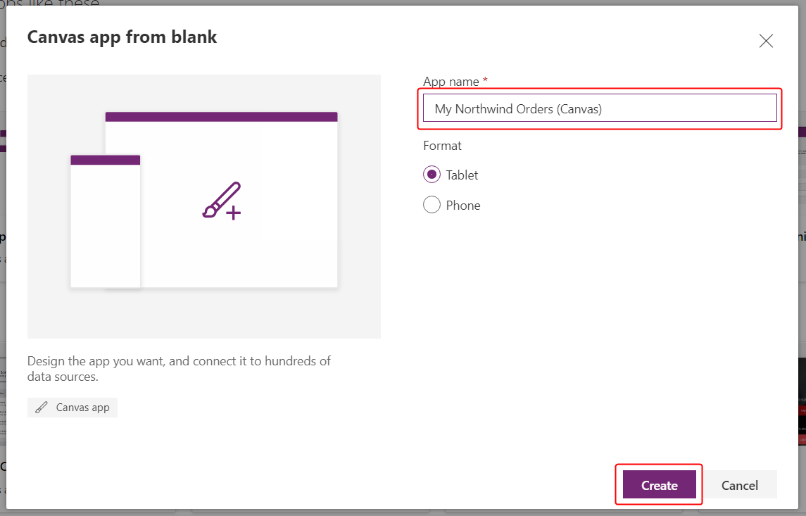

1. You are now in the PowerApps Studio, ready to add data sources and controls to your app:

	

1. Before moving on, let's enable a useful feature for seeing the results of formulas directly from the formula bar.  Select the **File** menu, **App settings**, **Advanced settings**, scroll to the very bottom of the list, and turn on **Enable formula bar result view**:

	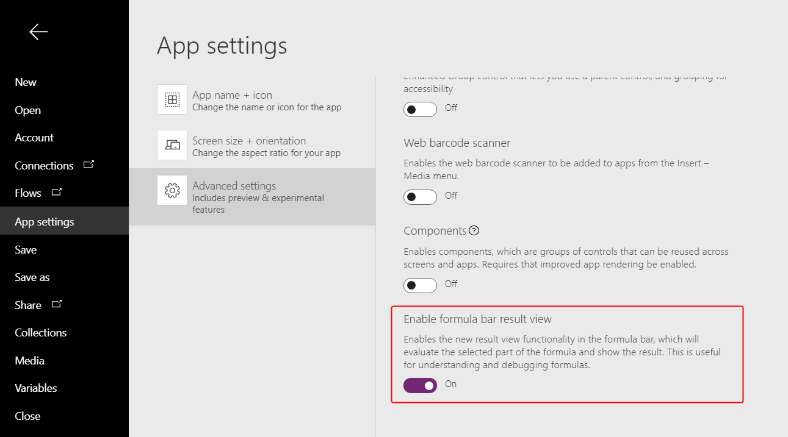

	This is an experimental feature that will be turned on by default soon.

## Adding the Orders data source

1. Let's add the **Orders** entity as a data source.  Select **View**, **Data sources**, and then **+ Add data source**:
 
	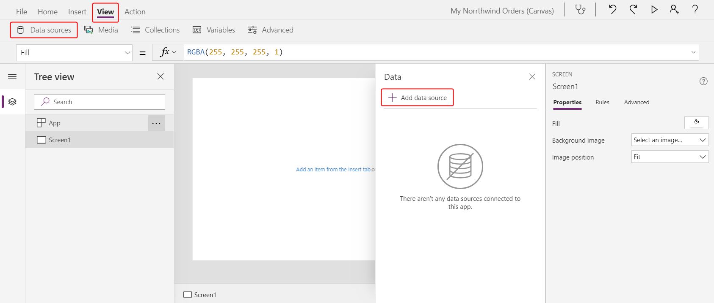

1. Select **Common Data Service**.  If **Common Data Service** does not already exist as a connection, select **+ New connection** and add it.

	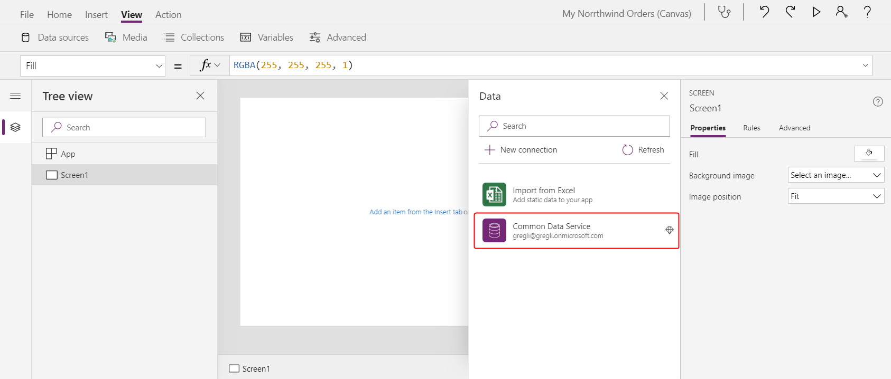

1. Type **Orders** in the entity search box, check the **Orders** entity, and select **Connect**:

	

1. You have now added the **Orders** data source:

	

1. If we return the PowerApps portal, we can see the columns of the **Orders** entity:

	

	Note that there are two names shown for each column the **Display name** and the **Name**.  In general, we use the **Display name** when creating our app, but in some cases the more cryptic **Name** will be used.  Both names refer to the same thing.

## Displaying the list of Orders with a Many-to-One relationship

1. Let's add a [**Gallery**](controls/control-gallery.md) control to view the list of **Orders**.  Select **Insert**, **Gallery**, and then **Blank vertical**:

	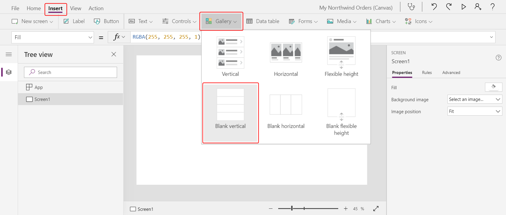

1. In the Properties pane, pull down the **Items** and select the **Orders** data source:

	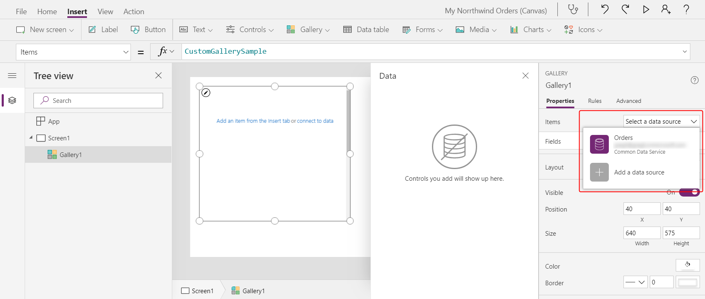

1. Pull down the **Layout**:

	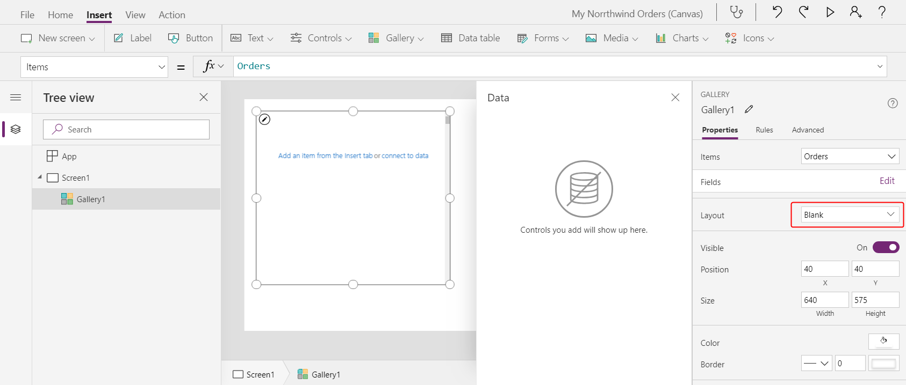

	and select **Title and subtitle**:

	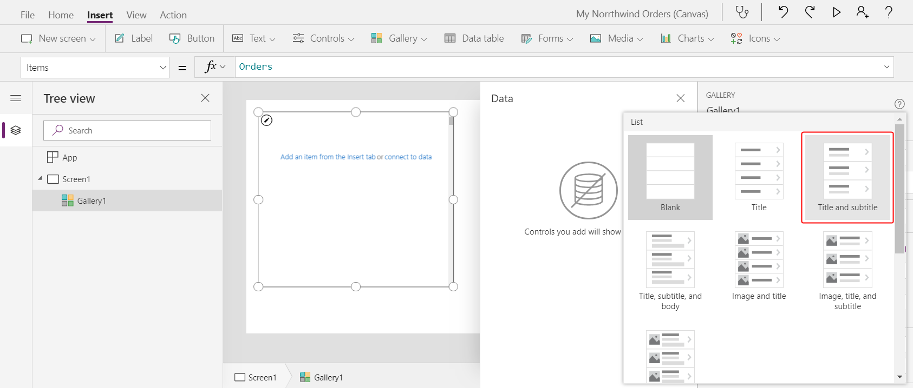

1. Select **Title1** in the Data pane:

	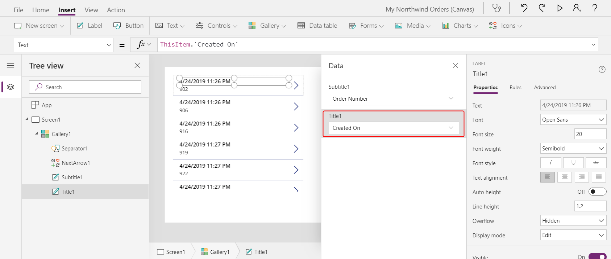

1. In the formula bar, enter this formula for the **Text** property:

	```powerapps-dot
	"Order" & ThisItem.'Order Number'
	```

	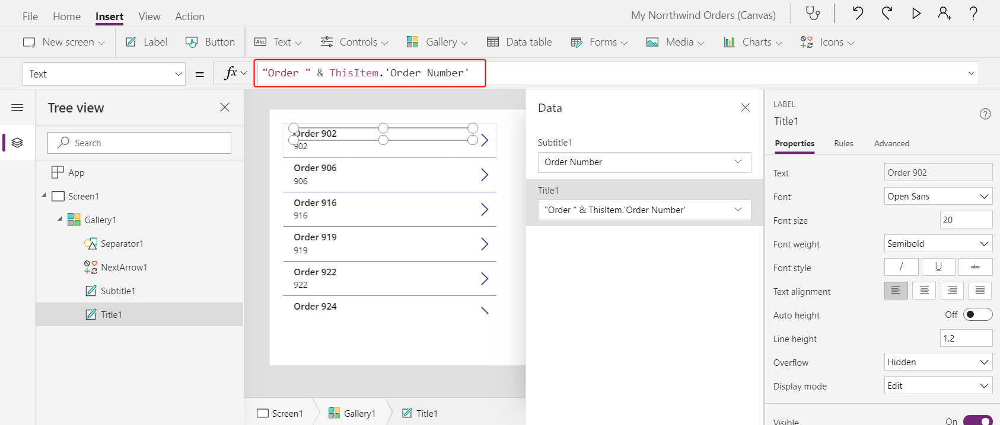

	This will display the Order number at the top of each gallery item.

1. Select **Subtitle11** in the Data pane:

	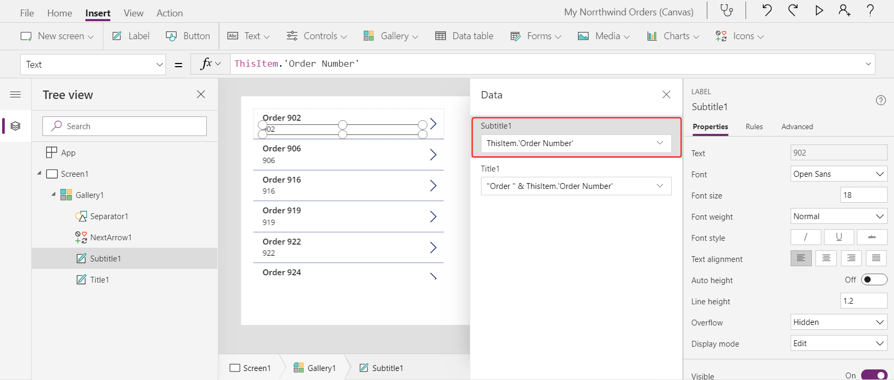

1. In the formula bar, enter this formula for the **Text** property:

	```powerapps-dot
	ThisItem.Customer.Company
	```

	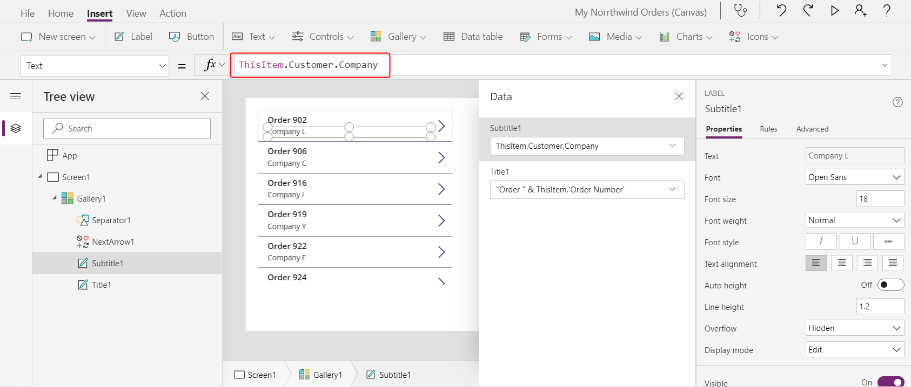

	With **ThisItem.Customer** this formula is walking across a Many-to-One relationship between the **Orders** entity and the **Csutomers** entity,  retrieving the **Customer** record that is associated with each **Order** in the gallery.  From this record, we are extracting the **Company** column to display.  

	If we look in the PowerApps portal we will see all the relationships from **Orders** to other entities, including the **Customer** entity:

	

## Using Option sets to display each Order's status

1. Let's make some space to include more information in the gallery.  Select the first label control, **Title1**, in the gallery and resize it to be narrower:

	

1. Do the same with the second label control, **Subtitle1**:

	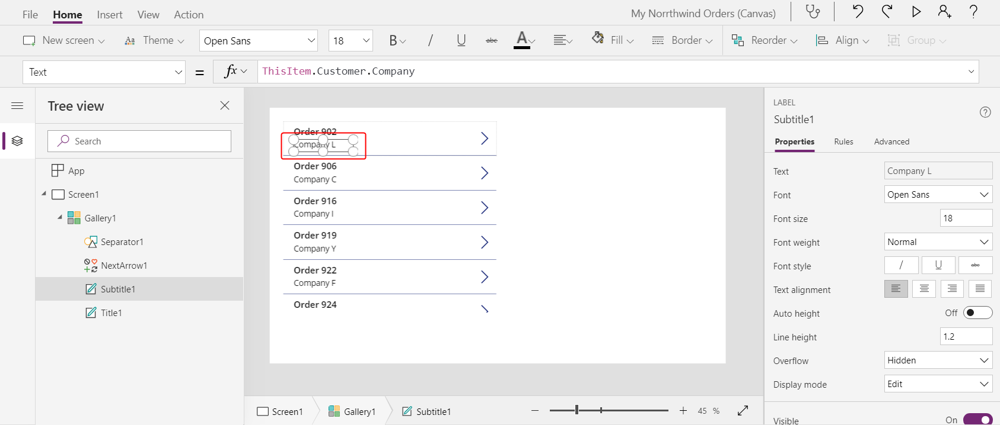

1. Using the **Insert** ribbon, insert a new **Label** control:

	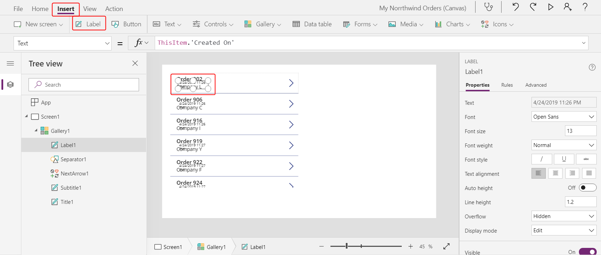

1. Resize and reposition this control pacing it to the right of the **Title1** label:

	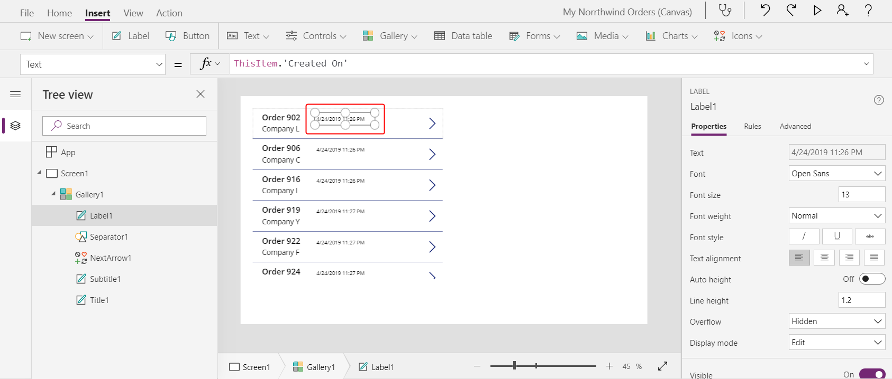

1. Set the **Text** property to the formula: 

	```powerapps-dot
	ThisItem.'Order Status'
	```
	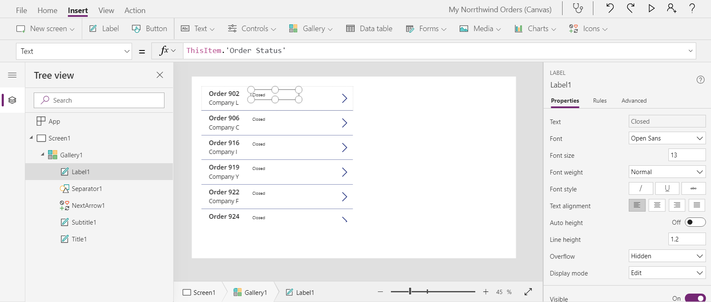

	'Order Status' is an Option set.  It has a fixed set of "options" that are defined in the database:

	

	We can view the Option set's label by using it in a string context, as we did by referencing it from the label's text property.  Option set labels can be localized so these strings may be different dependeing on the language of the app user.

1. Let's use the Option set to conditionally color the status text.  Using the **Home** ribbon, increase the font size of the label to 20 points and right align the text:

	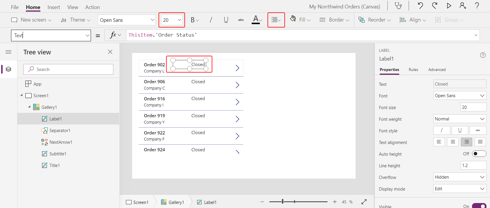

1. Set the **Color** property of the label control to this formula:

	```powerapps-dot
	Switch( ThisItem.'Order Status', 
    	'Orders Status'.Closed, Green, 
	    'Orders Status'.New, Black, 
    	'Orders Status'.Invoiced, Blue, 
    	'Orders Status'.Shipped, Purple 
	)
	```

	

	Note that we did not compare **ThisItem.'Order Status'** to the label strings, instead we used the 'Orders Status' enumeration.  This is important as the label can change depending on the language of the app user.  The enumeration values will always be the same.

	With this in place, scroll down the list of orders and see how different status values are colored:

	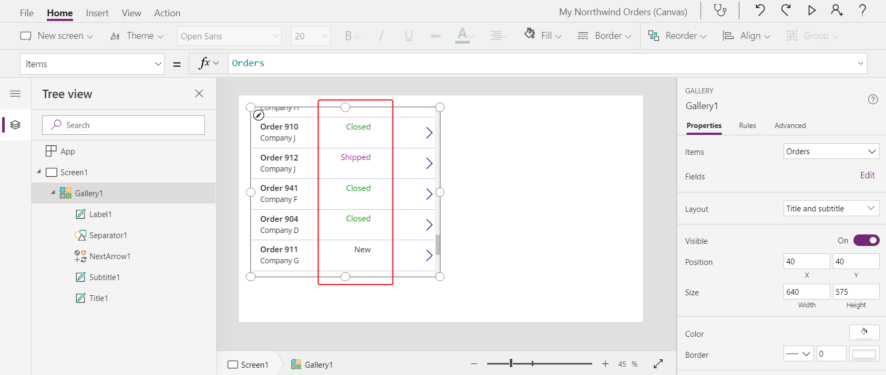

## Use aggregate functions to display each Order's total

1. Let's display each Order's total in the gallery. Scroll back to the top of the gallery and select the first item which is the gallery's template:

	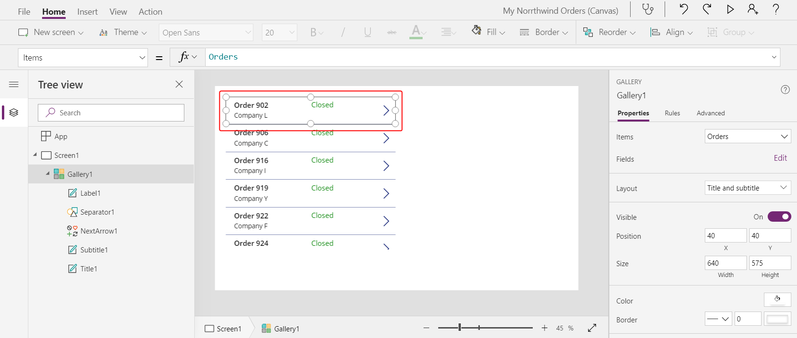

1. Use the **Insert** ribbon to add one more label control.  Resize and position this control to the right of the customer label:

	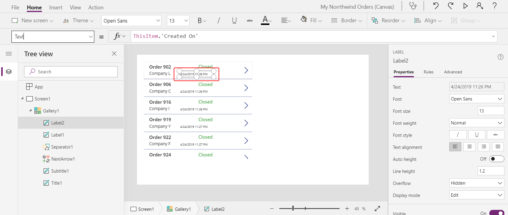

1. Set the **Text** property to this formula in the formula bar:

	```powerapps-dot
	Text( Sum( ThisItem.'Order Details', Quantity * 'Unit Price' ), "[$-en-US]$ #,###.00" )
	```
	The **$** in the format will be translated to the curency symbol of the app user. 

	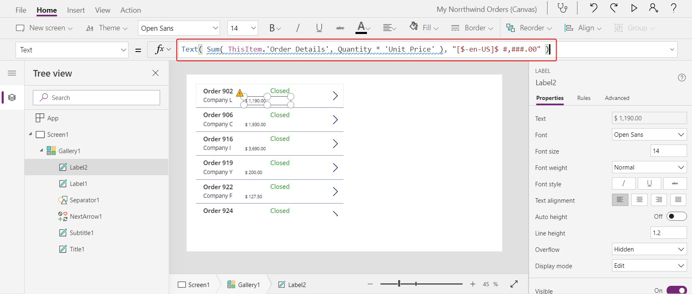

	This formula is performing an aggregate sum of the 'Order Details' records related to each Order, adding up the result of Quantity * 'Unit Price'.

	You will notice that there is a blue underline and a delegation warning on this formula.  Aggregate functions currenctly cannot be delegated to CDS if they are complex, in this case the sum of a multiplication.  This is OK for our app, we do not expect any single Order to have more than 500 items and this number can be increased in the App settings if necessary.  

	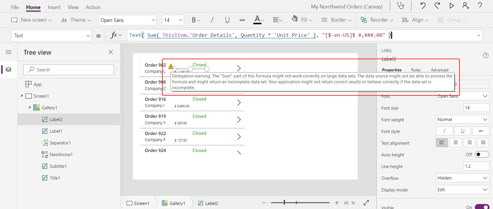

1. Using the **Home** ribbon, change the font size to 20 points and right justify the label:
	
	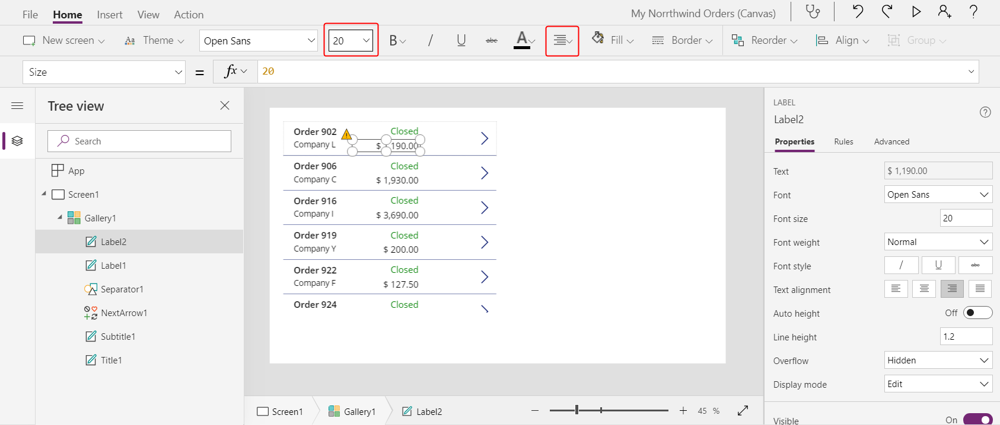

1. Resize the width of the gallery to close up some space, and move and resize the height of the gallery to fill the left hand side of the screen, with a small buffer at the top for our next part:

	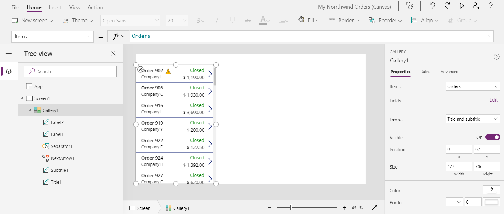

## On to Part 2

To recap, we just built a single screen Canvas app that shows the list of Orders.  This list includes:
- A formula to format the Order Number: `"Orders " & ThisItem.OrderNumber`
- A field in a Many-to-One relationship: `ThisItem.Customer.Company`
- An Option set label: `ThisItem.'Order Status'`
- Conditional formatting for the status: `Switch( ThisItem.'Order Status', 'Orders Status'.Closed, Green, ...`
- An aggregate function over a One-to-Many relationship: `Sum( ThisItem.'Order Details', Quantity * 'Unit Price' )`

In the next part, we'll add an [**Edit form** control](controls/control-form-detail.md) to display and edit more information about the order in a form.


	


