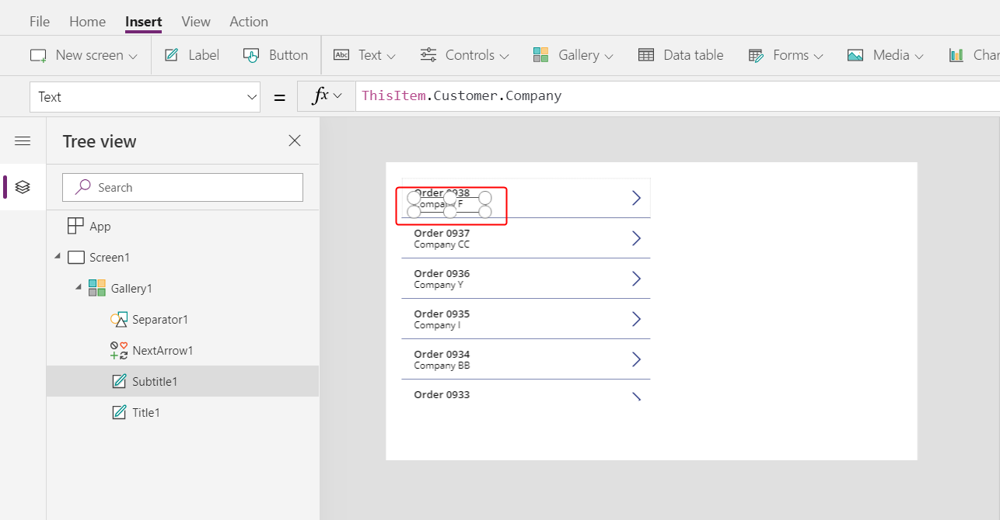
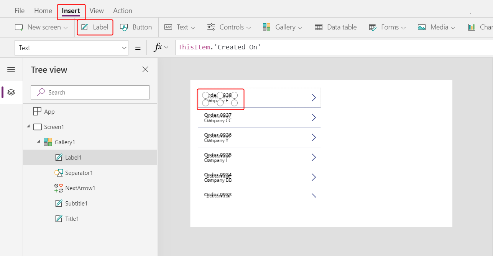
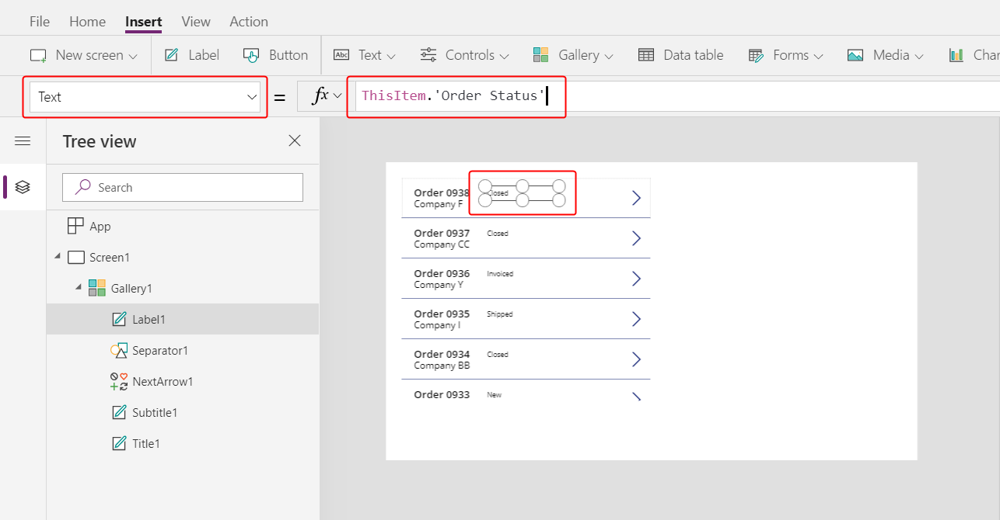
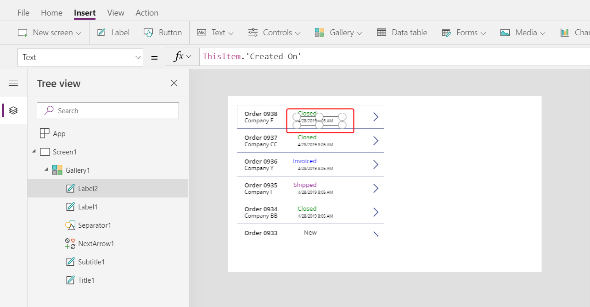
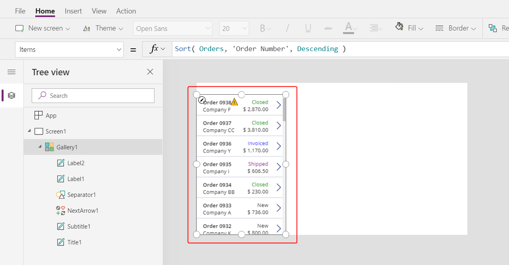

# Create an order gallery in a canvas app

Follow step-by-step instructions to create an order gallery in a canvas app for managing fictitious data in the Northwind Traders database. This topic is part of a series that explains how to build a business app on relational data in Microsoft Dataverse. For best results, explore these topics in this sequence:

1. Create an order gallery (**this topic**).
1. [Create a summary form](northwind-orders-canvas-part2.md).
1. [Create a detail gallery](northwind-orders-canvas-part3.md).

> [!div class="mx-imgBorder"]
> 

## Prerequisites

- [Install the Northwind Traders database and apps](northwind-install.md).
- Read through the [overview of the canvas app](northwind-orders-canvas-overview.md) for Northwind Traders.

## Create a blank app

1. [Sign in to Power Apps](https://make.powerapps.com?utm_source=padocs&utm_medium=linkinadoc&utm_campaign=referralsfromdoc), and then create a blank tablet app.

    > [!div class="mx-imgBorder"]
    > 

1. Name your app whatever you like, and then select **Create**.

    > [!div class="mx-imgBorder"]
    > 

    Power Apps Studio opens so that you can add data sources and controls to your app:

    > [!div class="mx-imgBorder"]
    > 

## Add the data

1. On the left-pane, select **Data** > **Add data** > search for, and select **Orders** table.

    

    The **Orders** table contains many fields of various types:

    

    Each field has a **Display name** and a **Name**, which is sometimes called the logical name. Both names refer to the same thing. In general, you'll use the display name when you build an app, but some cases require the more cryptic **Name**, as noted in a procedure.

1. As we will be working with screens and controls next, in Power Apps Studio switch back to the **Tree View** on the left hand side by pressing the three stacked squares icon. You can return to the **Data Sources** at any time by pressing the cylinder icon.

## Create the order gallery

1. On the **Insert** tab, select **Gallery** > **Blank vertical** to add a [**Gallery**](controls/control-gallery.md) control, which will show the orders.

    > [!div class="mx-imgBorder"]
    > 

	The control will be placed on the canvas and a fly out dialog will appear asking which data source to connect to.  

1. We could connect it directly to **Orders** here, but instead we'd like to control the sort order of the gallery.  Ignore the fly out dialog and in the formula bar set the gallery's **Items** property to this formula:

    ```powerapps-dot
    Sort( Orders, 'Order Number', Descending )
    ```

    The [**Sort**](functions/function-sort.md) function orders the list so that the newest order (which has the highest order number) appears first.

    > [!div class="mx-imgBorder"]
    > 

1. After a few moments the Result View will appear below the formula bar.  Pull down on the arrow at the left to see the result of our formula.  Scroll to the right to see the **Order Number** column and ensure it is sorted the way want (highest to lowest).  

    > [!div class="mx-imgBorder"]
    > 

1. In the **Properties** tab near the right edge, open the **Layout** list:

    > [!div class="mx-imgBorder"]
    > 

1. In the list of options, select **Title and subtitle**:

    > [!div class="mx-imgBorder"]
    > 

    Two [**Label**](controls/control-text-box.md) controls are added in the gallery's template. By default, these controls show two columns of the **Orders** table, which you'll change next. The gallery's template is replicated vertically for each record in the table.

1. Select **Edit** (next to **Fields**) in the **Properties** tab near the right edge.

    > [!div class="mx-imgBorder"]
    > 

1. In the **Data** pane, select **Title1** (or select the upper label in the gallery's template).

1. In the formula bar, set the label's **Text** property to this expression:

    ```powerapps-dot
    "Order " & ThisItem.'Order Number'
    ```

    > [!div class="mx-imgBorder"]
    > 

    The order number appears at the top of each gallery item. In the gallery template, **ThisItem** grants access to all fields in the **Order** table.

1. In the **Data** pane, select **Subtitle1** (or select the lower label in the gallery's template):

    > [!div class="mx-imgBorder"]
    > 

1. In the formula bar, set the label's **Text** property to this expression:

    ```powerapps-dot
    ThisItem.Customer.Company
    ```

    > [!div class="mx-imgBorder"]
    > 

    After you enter this formula, it may show a red squiggly error for a moment. The error should clear if you select anything outside the formula bar and then return the cursor to the formula bar. If the error persists or you don't see a value, select the **View** tab, select **Data sources**, and then refresh the **Orders** table by selecting the ellipsis (...) to the right of the data-source name.

    When you specify **ThisItem.Customer**, you're leveraging a many-to-one relationship between the **Orders** and **Customers** tables and retrieving the customer record that's associated with each order. From the customer record, you're extracting data in the **Company** column for display.

    You can show all the relationships from the **Orders** table to other tables, including the **Customer** table:

    

1. Close the **Data** pane by selecting the close icon (x) in its upper-right corner.

## Show each order's status

In this procedure, you'll add space in the gallery for a label and configure it to show each order's status in a different color based on the data.

1. In the gallery's template, reduce the width of the first label, **Title1**:

    > [!div class="mx-imgBorder"]
    > 

1. Repeat the previous step with the second label, **Subtitle1**:

    > [!div class="mx-imgBorder"]
    > 

1. With the gallery template (or a control in the template) selected, select **Label** on the **Insert** tab:

    > [!div class="mx-imgBorder"]
    > 

1. Move the new label to the right of the **Title1** label:

    > [!div class="mx-imgBorder"]
    > 

1. Set the **Text** property of the new label to this expression:

    ```powerapps-dot
    ThisItem.'Order Status'
    ```

    > [!div class="mx-imgBorder"]
    > 

    In the **Orders** table, the **Order Status** field holds a value from the **Orders Status** choice. A choice is similar to an enumeration in other programming tools. Each set of options is defined in the database, so users can specify only those options that are in the set. The **Orders Status** choice is also global, not local, so you can use it in other tables:

    

    Each option in a set has a name that appears if you show it in a label. These names can be localized, and the app recognizes the same option whether an English user selects **Apple**, a French user selects **Pomme**, or a Spanish user selects **Manzana**. For this reason, you can't create a formula that relies on a hard-coded string for an option, as this topic demonstrates later.

    In formulas, you must surround **Order Status** with single quotation marks because it contains a space. However, that name functions the same way as any other name in Power Apps, such as **Customer** or **Company**, does.

1. On the **Home** tab, increase the font size of the status label to 20 points, and right align the text:

    > [!div class="mx-imgBorder"]
    > 

1. In the formula bar, set the **Color** property of the status label to this formula:

    ```powerapps-dot
    Switch( ThisItem.'Order Status',
        'Orders Status'.Closed, Green,
        'Orders Status'.New, Black,
        'Orders Status'.Invoiced, Blue,
        'Orders Status'.Shipped, Purple
    )
    ```

    > [!div class="mx-imgBorder"]
    > 

    Power Apps prevents you from creating a formula that relies on a hard-coded string for each option in a set because such formulas could produce inappropriate results if the option names are localized. Instead, the **Switch** function determines the color based on whatever string appears in the label based on the user's settings.

    With this formula in place, different status values appear in different colors, as the previous graphic shows.

## Display each order's total

1. Select the first item in the gallery, which is the gallery's template:

    > [!div class="mx-imgBorder"]
    > 

1. On the **Insert** tab, select **Label** to add another label:

    > [!div class="mx-imgBorder"]
    > 

1. Move the new label so that it appears under the status label:

    > [!div class="mx-imgBorder"]
    > 

1. In the formula bar, set the new label's **Text** property to this formula:

    ```powerapps-dot
    Text( Sum( ThisItem.'Order Details', Quantity * 'Unit Price' ), "[$-en-US]$ #,###.00" )
    ```

    > [!div class="mx-imgBorder"]
    > 

    In this formula, the [**Sum**](functions/function-aggregates.md)  function adds up the records in the **Order Details** table that are associated with each record in the **Order** table through a one-to-many relationship. These line items make up each order, and you'll use the same one-to-many relationship to show and edit the line items in the lower-right area of the screen.

    This formula shows a blue underline and a [delegation warning](delegation-overview.md) because Dataverse doesn't support delegation of complex aggregate functions (for example, the sum of a multiplication). You can ignore this information because no order in this example will contain more than 500 line items. If necessary for a different app, you can increase that limit in **App settings**.

    The [**Text**](functions/function-text.md) function in this formula adds a currency symbol and formats the result with thousands and decimal separators. As written, the formula includes the language tag for U.S. English (**[$-en-US]**) and a dollar symbol (**$**). If you remove the language tag, it will be replaced with one based on your language settings, and the label will show the appropriate formats for that tag. If you leave the dollar symbol, the label will show the appropriate currency symbol based on the user's settings. However, you can force a different symbol to appear by replacing the dollar symbol with the one that you prefer.

1. On the **Home** tab, change the font size of the newest label to 20 points, and right align its text:

    > [!div class="mx-imgBorder"]
    > 

1. Move the gallery to the left edge of the screen, and decrease the gallery's width to close up some space.

1. Increase the gallery's height so that it's almost as tall as the screen, but leave a little room at the top for a title bar, which you'll add at the start of the next topic:

    > [!div class="mx-imgBorder"]
    > 

## Summary

To recap, you started to build a single-screen canvas app by adding the order gallery, which includes these elements:

- An expression to show the order number: `"Orders " & ThisItem.OrderNumber`
- A field in a many-to-one relationship: `ThisItem.Customer.Company`
- A label that shows the name of an option in a set: `ThisItem.'Order Status'`
- A label that changes format based on which option in a set the label shows: `Switch( ThisItem.'Order Status', 'Orders Status'.Closed, Green, ...`
- A complex aggregate function over a one-to-many relationship: `Sum( ThisItem.'Order Details', Quantity * 'Unit Price' )`

## Next topic

In the next topic, you'll add an [**Edit form**](controls/control-form-detail.md) control to display and edit an summary of whatever order the user selects in the gallery that you just created.

> [!div class="nextstepaction"]
> [Create the summary form](northwind-orders-canvas-part2.md)


[!INCLUDE[footer-include](../../includes/footer-banner.md)]