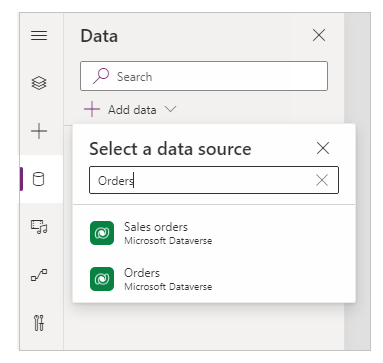
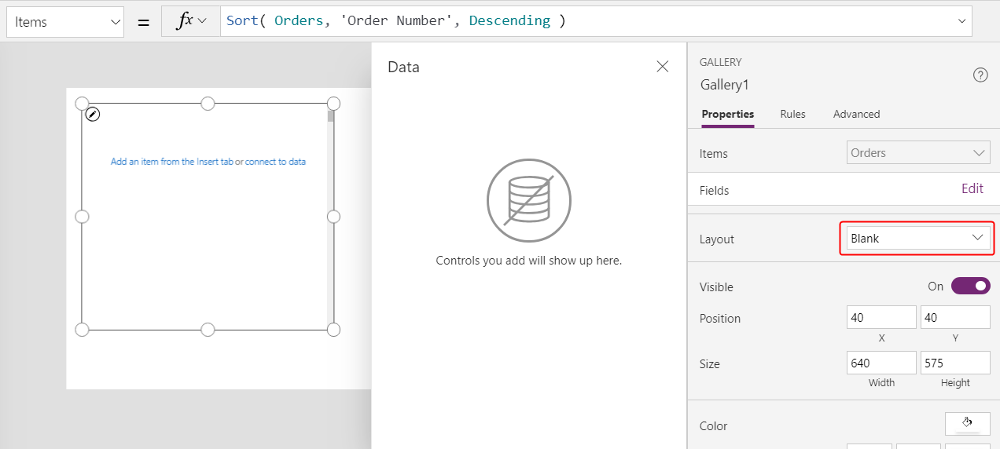
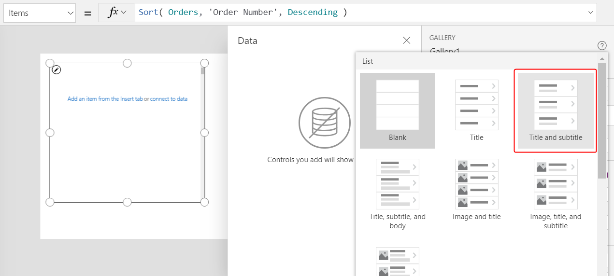
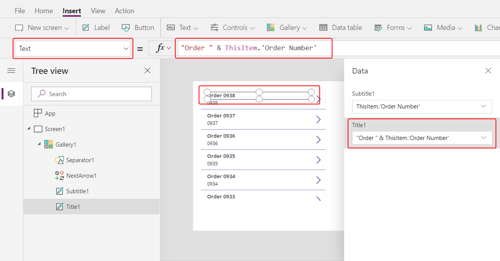
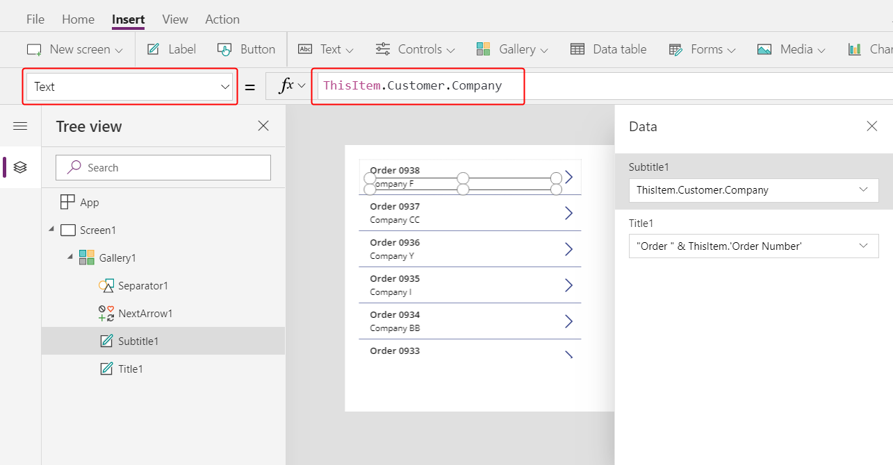
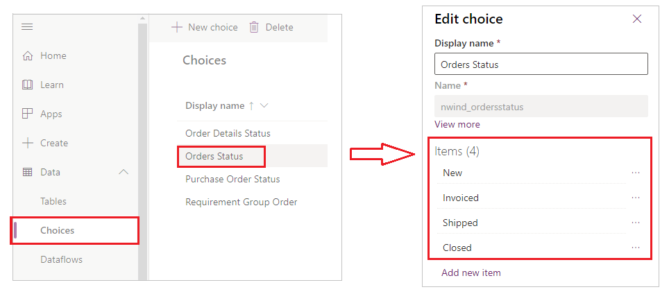
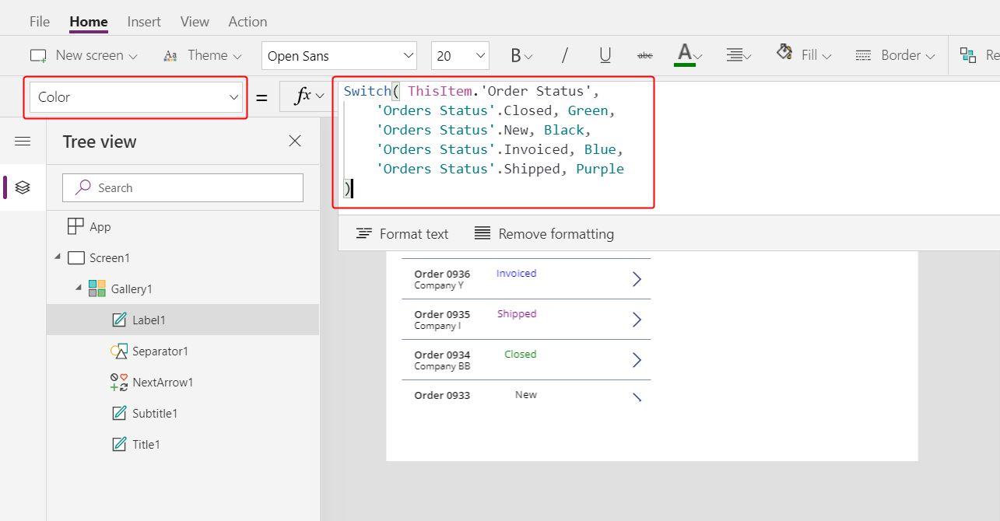
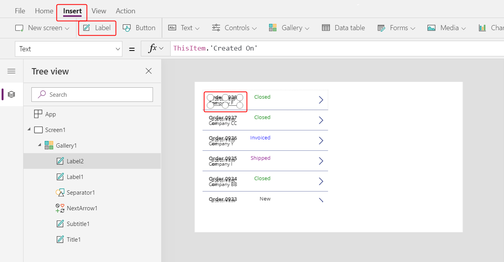
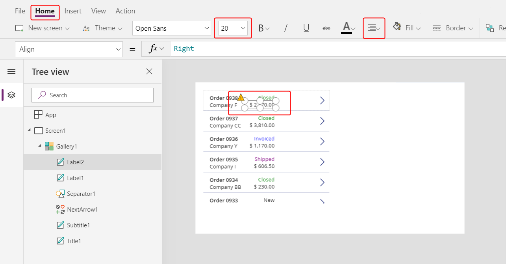

# Create a list of orders in a canvas app

Follow the steps in this topic to create a list of orders in a canvas app based on sample data in Common Data Service. The sample data is for a fictitious organization named Northwind Traders, and the app shows the types, quantities, and prices of various products that Northwind sells and ships to other fictitious companies.

This single-screen app is designed to run on tablets. In other topics, you'll add more UI until the app resembles this graphic:


This app will showcase these concepts:

- **Many-to-one relationships.** Each customer can place multiple orders, but each order is placed by only one customer. In the database, the **Orders** entity is related to the **Customers** entity so that the list can show which customer placed each order. The list shows the name of the customer, but it could show data from any column in the **Customers** entity.
- **One-to-many relationships.** Each order can contain multiple products, which appear as line items in the Order Details list. Each order detail is contained in only one order.
- **Option sets.**  A set of named choices defined in the database and shared across apps. 
- **Gallery and form interactions.**  The gallery provides the list of orders to choose from, and the rest of the app responds to changes in the gallery's selection.

The instructions for building the app are broken into three parts:


- **Part 1, Orders list**:  Displays the list of orders.  Selection in this list determines which order is being edited on the rest of the screen.  You are here.
- [**Part 2, Order form**](northwind-orders-canvas-part2.md):  View and edit information about the order.  Here new orders can be created and existing orders deleted.
- [**Part 3, Order details**](northwind-orders-canvas-part3.md):  View and edit the product line items that are associated with the order.  

## Getting started

1. Sign in to PowerApps.

1. [Install the Northwind Traders sample database and apps](northwind-install.md).  This will install all the entities that we need and a completed version of the app we are about to build.

1. Create a blank tablet app:

	

	Name your app whatever you like, and then select **Create**:

	

1. You are now in PowerApps Studio, ready to add data sources and controls to your app:

	

1. Before moving on, let's enable a useful feature for seeing the results of formulas directly from the formula bar. On the **File** menu, select **App settings**, then select **Advanced settings**, scroll to the very bottom of the list on the right of the screen, and then turn on **Enable formula bar result view**:

	

	This experimental feature will be turned on by default soon.

## Adding the Orders data source
1. Let's add the **Orders** entity as a data source.  Select **View**, then **Data sources**, and then **+ Add data source**:
 
	

1. Select **Common Data Service**.  If **Common Data Service** does not already exist as a connection, select **+ New connection** and add it.

	

1. Type **orders** in the entity search box, check the **Orders** entity, and select **Connect**:

	

1. You have now added the **Orders** data source to your app:

	

1. We can see the columns of the **Orders** entity in the PowerApps portal:

	

	Note that there are two names shown for each column the **Display name** and the **Name** which we sometimes call the "Logical name."  Both names refer to the same thing.  In general, we use the **Display name** when building apps, but in some cases the more cryptic **Name** will be shown and required.  Long term, we are moving all parts of PowerApps to use display names.

## Displaying the list of Orders with a Many-to-One relationship
1. Let's add a [**Gallery** control](controls/control-gallery.md) to view the list of **Orders**.  Select **Insert**, then **Gallery**, and then **Blank vertical**:

	

1. In the formula bar, set the **Items** property to:

	```powerapps-dot
	Sort( Orders, 'Order Number', Descending )
	```

	We are using the [**Sort** function](functions/function-sort.md) to display the list of **Orders** with the most recently added order first (highest **Order number**).

	

1. In the Properties panel, pull down the **Layout**:

	

	and select **Title and subtitle**:

	

	This will insert two label controls into the gallery's template.  These controls will default to two columns of the **Orders** entity which we will change next.  The gallery's template is replicated vertically for each **Order**.

1. In the Data panel select **Title1** or select the upper control in the gallery's template:

	

1. Using the formula bar, set the **Text** property to this formula:

	```powerapps-dot
	"Order " & ThisItem.'Order Number'
	```

	

	This will display the Order number at the top of each gallery item.  **ThisItem** gives us access to all the columns of each **Order** within the template of the gallery.

1. In the Data panel select **Subtitle1** or select the lower control in the gallery's template:

	

1. Using the formula bar, set the **Text** property to this formula:

	```powerapps-dot
	ThisItem.Customer.Company
	```

	

	After entering this formula, it may show a red squiggly error for a moment.  If you leave the formula bar and return it should clear.  If the error persists or you don't see a value, from the **View** ribbon, select **Data sources**, and refresh the **Orders** entity with the three elipses to the right of the data source name.  This is a short term bug with how we dynamncally fetch entity metadata.

	With **ThisItem.Customer** we are walking across a Many-to-One relationship between the **Orders** entity and the **Csutomers** entity,  retrieving the **Customer** record that is associated with each **Order**.  From this record, we are extracting the **Company** column to display.  

	If we look in the PowerApps portal we will see all the relationships from **Orders** to other entities, including the **Customer** entity:

	

## Using option sets to display each Order's status

1. Let's make some space to include more information about each order in the gallery.  Select the first label control, **Title1**, in the gallery's template and re-size it to be narrower:

	

1. Do the same with the second label control, **Subtitle1**:

	

1. Let's display the order status directly in the gallery.  Using the **Insert** ribbon, insert a new **Label** control:

	

1. Re-size and re-position this control to the right of the **Title1** label:

	

1. Set the **Text** property to this formula: 

	```powerapps-dot
	ThisItem.'Order Status'
	```

	

	**'Order Status'** is a column an **Order** that holds an option set value, one of the values from the **Orders Status** option set.  It is similar to an enumeration in other programming tools.  **Orders Status** is a global option set with a fixed set of options that are defined in the database:

	

	Using the column **'Order Status'** in a string context, as we did in the **Text** property of the label control, will display the app user friendly label for the option.  Option set labels can be localized so these strings may appear differently dependeing on the language of the app user.

	**'Order Status'** is like any other name in PowerApps, such as **Customer** or **Copmany**.  The single quotes are required here because of the space in the name. 

1. Let's use the option set's value to conditionally color the status text.  Using the **Home** ribbon, increase the font size of the label to 20 points and right align the text:

	

1. Using the formula bar, set the **Color** property of the label control to this formula:

	```powerapps-dot
	Switch( ThisItem.'Order Status', 
        'Orders Status'.Closed, Green, 
        'Orders Status'.New, Black, 
        'Orders Status'.Invoiced, Blue, 
        'Orders Status'.Shipped, Purple 
	)
	```

	

	Note that we did not compare **ThisItem.'Order Status'** to a text string, instead we used **'Orders Status'** enumeration.  In fact text string comparisons are disallowed.  Using the enumeration is important as the label can change depending on the language of the app user while the numetical values of the enumeration will always be the same.

	With this formula in place, we can see how different status values are colored in the bottom of the portion of the gallery pictured above.

## Use aggregate functions to display each Order's total

1. Let's display each Order's total in the gallery. Select the first item which is the gallery's template:

	

1. Use the **Insert** ribbon to add one more label control:  

	

1. Re-size and re-position this control to the right of the customer label:

	

1. Set the **Text** property to this formula in the formula bar:

	```powerapps-dot
	Text( Sum( ThisItem.'Order Details', Quantity * 'Unit Price' ), "[$-en-US]$ #,###.00" )
	```

	

	This formula is using the [**Sum** function](functions/function-aggregates.md) to add up the records in the **Order Details** entity that are associated with each **Order** through a One-to-Many relationship.  These are the line items of products that make up each order.  We'll us this same One-to-Many relationship to show and edit the line items in Part 3.  
	
	You will notice that there is a blue underline and a delegation warning on this formula.  Aggregate functions currenctly cannot be delegated to CDS if they are complex, in this case the sum of a multiplication.  This is OK for our app, we do not expect any single Order to have more than 500 items and this number can be increased in the App settings if necessary.  

	This formula also uses the [**Text** function](functions/function-text.md) to add a currency symbol and format with thousands and decimal seperators.  The **$** in the format will be translated to the curency symbol of the app user.  If you don't include the language tag (**[$-en-US]**) it will be added for you based on your language and region.  If it is different, you will want to use your own currency symbol instead of the **$** shown here just before the first **#**.

1. Using the **Home** ribbon, change the font size to 20 points and right justify the label:
	
	

1. In preperation for the next part, re-size the width of the gallery to close up some space, and re-size and re-position the gallery to fill the left hand side of the screen, with a small buffer at the top for a title bar which we'll add next:

	

## On to Part 2

To recap, we just built a single screen Canvas app that shows the list of Orders.  This list includes:
- A formula to format the Order Number: `"Orders " & ThisItem.OrderNumber`
- A field in a Many-to-One relationship: `ThisItem.Customer.Company`
- An option set label, for display to the app user: `ThisItem.'Order Status'`
- An option set value, for conditional formatting of the status: `Switch( ThisItem.'Order Status', 'Orders Status'.Closed, Green, ...`
- An aggregate function over a One-to-Many relationship: `Sum( ThisItem.'Order Details', Quantity * 'Unit Price' )`

In the next part, we'll add an [**Edit form** control](controls/control-form-detail.md) to display and edit more information about each order.
